Title: My First Post
Date: 2022-02-25 15:13
Category: General

# Review of charges and diagnosis for Hospitals in Hillsborough County

The purpose of this document is to analyze how the different billing codes (DRGs) , diagnosis and other features affect charges accross Hospitals in Hillsborough County (Tampa, FL). The analysis will focus on DRGs that occur 1000 or more times in a Dataset of close to 200,000 records procured for the Agency of Healthcare Administration in Florida.  Views of this dataset are available through the official website:
https://www.floridahealthfinder.gov/QueryTool/QTResults.aspx?T=I

Each cell containing code will contain comments explaining the procedures. Any items that have to be highlithed in more detail will have a dedicated section/paragraph.


```python
#forcing installing packages python -m pip install statsmodels==0.13.2 --upgrade --force
#conda create -n py39 python=3.9 anaconda
#try with 3.9.2
#for enabling in Jupyter
#conda install -c anaconda ipykernel
#python -m ipykernel install --user --name=firstEnv
#python -m pip install ipykernel --upgrade --force --user --name=py38

#Import Libraries and local copy of data set
import pandas as pd

df = pd.read_csv("C:/Users/figue/Documents/MIT_Data_Formats/Healthcare/Step_1_Parse/data/Florida_Healthcare_Data_Official/Hillsborough_Inp_Discharges_Loc.tsv",sep="\t",low_memory=False)
```

    C:\ProgramData\Anaconda3\lib\site-packages\numpy\_distributor_init.py:30: UserWarning: loaded more than 1 DLL from .libs:
    C:\ProgramData\Anaconda3\lib\site-packages\numpy\.libs\libopenblas.PYQHXLVVQ7VESDPUVUADXEVJOBGHJPAY.gfortran-win_amd64.dll
    C:\ProgramData\Anaconda3\lib\site-packages\numpy\.libs\libopenblas.XWYDX2IKJW2NMTWSFYNGFUWKQU3LYTCZ.gfortran-win_amd64.dll
      warnings.warn("loaded more than 1 DLL from .libs:"
    


```python
# Will do basic Analysis Counts and Charts to gain better understanding of data

ListDRG = df[["Facility_Name","MSDRG"]].groupby("MSDRG").count()

# convert index to column

ListDRG.reset_index(inplace=True)

#The following is the list of DRGs that occur more than 1000 times. This will be used as reference for statistics significance
ListDRG.loc[ListDRG["Facility_Name"]>1000]
```


<div>
<style scoped>
    .dataframe tbody tr th:only-of-type {
        vertical-align: middle;
    }

    .dataframe tbody tr th {
        vertical-align: top;
    }

    .dataframe thead th {
        text-align: right;
    }
</style>
<table border="1" class="dataframe">
  <thead>
    <tr style="text-align: right;">
      <th></th>
      <th>MSDRG</th>
      <th>Facility_Name</th>
    </tr>
  </thead>
  <tbody>
    <tr>
      <th>51</th>
      <td>64</td>
      <td>1008</td>
    </tr>
    <tr>
      <th>52</th>
      <td>65</td>
      <td>1110</td>
    </tr>
    <tr>
      <th>140</th>
      <td>177</td>
      <td>5518</td>
    </tr>
    <tr>
      <th>141</th>
      <td>178</td>
      <td>1068</td>
    </tr>
    <tr>
      <th>152</th>
      <td>189</td>
      <td>1391</td>
    </tr>
    <tr>
      <th>200</th>
      <td>247</td>
      <td>1179</td>
    </tr>
    <tr>
      <th>228</th>
      <td>280</td>
      <td>1034</td>
    </tr>
    <tr>
      <th>239</th>
      <td>291</td>
      <td>3591</td>
    </tr>
    <tr>
      <th>271</th>
      <td>330</td>
      <td>1088</td>
    </tr>
    <tr>
      <th>310</th>
      <td>378</td>
      <td>1178</td>
    </tr>
    <tr>
      <th>324</th>
      <td>392</td>
      <td>2889</td>
    </tr>
    <tr>
      <th>380</th>
      <td>470</td>
      <td>1280</td>
    </tr>
    <tr>
      <th>491</th>
      <td>603</td>
      <td>1766</td>
    </tr>
    <tr>
      <th>503</th>
      <td>621</td>
      <td>1395</td>
    </tr>
    <tr>
      <th>514</th>
      <td>638</td>
      <td>1470</td>
    </tr>
    <tr>
      <th>516</th>
      <td>640</td>
      <td>1253</td>
    </tr>
    <tr>
      <th>517</th>
      <td>641</td>
      <td>1063</td>
    </tr>
    <tr>
      <th>548</th>
      <td>682</td>
      <td>1555</td>
    </tr>
    <tr>
      <th>549</th>
      <td>683</td>
      <td>1527</td>
    </tr>
    <tr>
      <th>555</th>
      <td>690</td>
      <td>1508</td>
    </tr>
    <tr>
      <th>619</th>
      <td>787</td>
      <td>1948</td>
    </tr>
    <tr>
      <th>620</th>
      <td>788</td>
      <td>2440</td>
    </tr>
    <tr>
      <th>625</th>
      <td>793</td>
      <td>1418</td>
    </tr>
    <tr>
      <th>626</th>
      <td>794</td>
      <td>7971</td>
    </tr>
    <tr>
      <th>627</th>
      <td>795</td>
      <td>7366</td>
    </tr>
    <tr>
      <th>638</th>
      <td>806</td>
      <td>2716</td>
    </tr>
    <tr>
      <th>639</th>
      <td>807</td>
      <td>7303</td>
    </tr>
    <tr>
      <th>644</th>
      <td>812</td>
      <td>1306</td>
    </tr>
    <tr>
      <th>682</th>
      <td>853</td>
      <td>1407</td>
    </tr>
    <tr>
      <th>697</th>
      <td>871</td>
      <td>8105</td>
    </tr>
    <tr>
      <th>698</th>
      <td>872</td>
      <td>2488</td>
    </tr>
    <tr>
      <th>705</th>
      <td>885</td>
      <td>5052</td>
    </tr>
    <tr>
      <th>711</th>
      <td>897</td>
      <td>1308</td>
    </tr>
  </tbody>
</table>
</div>


```python
#this is a list and will focus on Total charges  TCHGS

Rel_DRGs = ListDRG.loc[ListDRG["Facility_Name"]>1000]["MSDRG"]
#The List is used to obtain only two columns from the original df. More than 84,000 records return

DRG_Charges = df[df["MSDRG"].isin(Rel_DRGs)][["MSDRG","TCHGS"]]

```


```python
#Calculate basic statistics mean and standard deviation of Price by DRG
#Then calculate which ones have the greatest relative variance. Pick the top 10.

DRG_Charges_grp = DRG_Charges.groupby("MSDRG").agg(["mean","std"])

#rest the index
DRG_Charges_grp.reset_index(inplace=True)

#Create column by relative variance

DRG_Charges_grp['Relative_Variance'] = DRG_Charges_grp['TCHGS']['std'] / DRG_Charges_grp['TCHGS']['mean']
#top ten with higher variance
Top10 = DRG_Charges_grp.sort_values('Relative_Variance',ascending=False).head(10)
Top10["MSDRG"]
```


    22    793
    31    885
    23    794
    4     189
    15    640
    17    682
    28    853
    2     177
    16    641
    7     291
    Name: MSDRG, dtype: int64


```python
#obtain df with

Top_10_DRG_Charges = df[df["MSDRG"].isin(Top10["MSDRG"])][["MSDRG","TCHGS"]]
Top_10_DRG_Charges
#30,000+ records
```


<div>
<style scoped>
    .dataframe tbody tr th:only-of-type {
        vertical-align: middle;
    }

    .dataframe tbody tr th {
        vertical-align: top;
    }

    .dataframe thead th {
        text-align: right;
    }
</style>
<table border="1" class="dataframe">
  <thead>
    <tr style="text-align: right;">
      <th></th>
      <th>MSDRG</th>
      <th>TCHGS</th>
    </tr>
  </thead>
  <tbody>
    <tr>
      <th>0</th>
      <td>177</td>
      <td>27740.0</td>
    </tr>
    <tr>
      <th>2</th>
      <td>641</td>
      <td>12588.0</td>
    </tr>
    <tr>
      <th>11</th>
      <td>682</td>
      <td>41268.0</td>
    </tr>
    <tr>
      <th>12</th>
      <td>177</td>
      <td>35161.0</td>
    </tr>
    <tr>
      <th>19</th>
      <td>177</td>
      <td>14243.0</td>
    </tr>
    <tr>
      <th>...</th>
      <td>...</td>
      <td>...</td>
    </tr>
    <tr>
      <th>197153</th>
      <td>640</td>
      <td>73444.0</td>
    </tr>
    <tr>
      <th>197159</th>
      <td>291</td>
      <td>35091.0</td>
    </tr>
    <tr>
      <th>197183</th>
      <td>853</td>
      <td>156346.0</td>
    </tr>
    <tr>
      <th>197188</th>
      <td>853</td>
      <td>368440.0</td>
    </tr>
    <tr>
      <th>197198</th>
      <td>291</td>
      <td>83737.0</td>
    </tr>
  </tbody>
</table>
<p>30219 rows × 2 columns</p>
</div>


```python
#Create a couple of Density function to visualize distribution
#The analysis will focus on explaining the variance. Type of Payer will be important
#Import graphing libraries
import matplotlib.pyplot as plt
import seaborn as sns
# as an example use MSDRG 871
Subset = Top_10_DRG_Charges[Top_10_DRG_Charges['MSDRG']==871]
sns.displot(Subset['TCHGS'], kind='kde')
```

    <frozen importlib._bootstrap>:219: RuntimeWarning: scipy._lib.messagestream.MessageStream size changed, may indicate binary incompatibility. Expected 56 from C header, got 64 from PyObject
    


    <seaborn.axisgrid.FacetGrid at 0x17627f4c460>


    
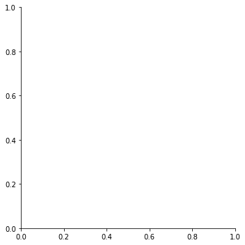
    


```python
#Use Facet to review which variables have a largest effects. Continue using MSDRG = 177
#Understand whether we are dealing with different distributions
Subset_facet = df[df["MSDRG"]==871][["MSDRG","TCHGS","PAYER","PRINDIAG"]]

#https://seaborn.pydata.org/generated/seaborn.FacetGrid.html
# Facet Grid is based on Payer type  A is Medicare E is Private. Distributions look similar.
g = sns.FacetGrid(Subset_facet, col="PAYER", height=2.5, col_wrap=5)

#copy to variable to adjust axis
a_plot = g.map_dataframe(sns.histplot, x="TCHGS")

#Limit axis to $400,000 to make it easier to read
a_plot.set(xlim=(0, 400000))

```


    <seaborn.axisgrid.FacetGrid at 0x1761ed388b0>


    
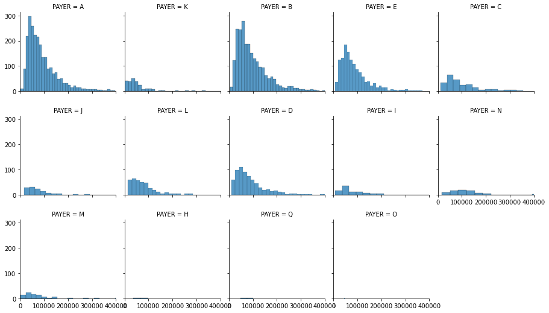
    


```python

# Facet Grid is based on Principal Diagnosis for MSDRG 871. It looks like the primary diagnosis is U07.01 followed by J69.01
#A lot of variance with principal diagnosis kept the same. Other factors at play

g = sns.FacetGrid(Subset_facet, col="PRINDIAG", height=2.5, col_wrap=5)

#copy to variable to adjust axis
a_plot = g.map_dataframe(sns.histplot, x="TCHGS")

#Limit axis to $400,000 to make it easier to read
a_plot.set(xlim=(0, 400000))

# As of now it does not seem like there are different distributions. Will continue analysis with MSDRG 177
```


    <seaborn.axisgrid.FacetGrid at 0x1762a110940>


    
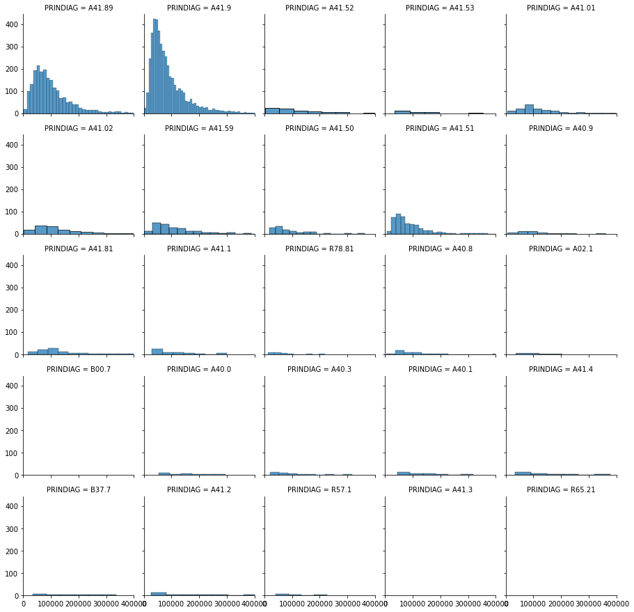
    


```python
# Will prepare data for Analysis by different statistical and machine learning methods.
#Will continue working with MSDRG 871 and specific Fields
data_analysis = df[df["MSDRG"]==871][["Facility_Name","SEX","ETHNICITY","RACE","AGE","CONDTN","PAYER","LOSDAYS","MSDRG","ADMITDIAG","PRINDIAG","OTHDIAG1","OTHDIAG2","OTHDIAG3","OTHDIAG4","OTHDIAG5","OTHDIAG6","OTHDIAG7","OTHDIAG8","OTHDIAG9","OTHDIAG10","OTHDIAG11","OTHDIAG12","OTHDIAG13","OTHDIAG14","OTHDIAG15","OTHDIAG16","OTHDIAG17","OTHDIAG18","OTHDIAG19","OTHDIAG20","OTHDIAG21","OTHDIAG22","OTHDIAG23","OTHDIAG24","OTHDIAG25","OTHDIAG26","OTHDIAG27","OTHDIAG28","OTHDIAG29","OTHDIAG30","ECMORB1","ECMORB2","ECMORB3","PRINPROC","OTHPROC1","OTHPROC2","OTHPROC3","OTHPROC4","OTHPROC5","OTHPROC6","OTHPROC7","OTHPROC8","OTHPROC9","OTHPROC10","OTHPROC11","OTHPROC12","OTHPROC13","OTHPROC14","OTHPROC15","OTHPROC16","OTHPROC17","OTHPROC18","OTHPROC19","OTHPROC20","OTHPROC21","OTHPROC22","OTHPROC23","OTHPROC24","OTHPROC25","OTHPROC26","OTHPROC27","OTHPROC28","OTHPROC29","OTHPROC30","DAYSPROC","DAYS_PROC1","DAYS_PROC2","DAYS_PROC3","DAYS_PROC4","DAYS_PROC5","DAYS_PROC6","DAYS_PROC7","DAYS_PROC8","DAYS_PROC9","DAYS_PROC10","DAYS_PROC11","DAYS_PROC12","DAYS_PROC13","DAYS_PROC14","DAYS_PROC15","DAYS_PROC16","DAYS_PROC17","DAYS_PROC18","DAYS_PROC19","DAYS_PROC20","DAYS_PROC21","DAYS_PROC22","DAYS_PROC23","DAYS_PROC24","DAYS_PROC25","DAYS_PROC26","DAYS_PROC27","DAYS_PROC28","DAYS_PROC29","DAYS_PROC30","TCHGS","ATTEN_PHYID","ATTEN_PHYNPI","OPER_PHYID","OPER_PHYNPI","OTHOPER_PHYID","OTHOPER_PHYNPI"]]
```


```python
# have to prepare data. Have to start with Admitdiag and prindiag.Have to to summarize data. Create columns with
#names of diagnosis and then do counts or dummies
data_analysis[["ADMITDIAG","Facility_Name"]].groupby("ADMITDIAG").count() #224 rows... too many
data_analysis[["PRINDIAG","Facility_Name"]].groupby("PRINDIAG").count() #About 30 more manageable
data_analysis[["OTHDIAG1","Facility_Name"]].groupby("OTHDIAG1").count() #About 151 differennt values
data_analysis[["OTHDIAG2","Facility_Name"]].groupby("OTHDIAG2").count() #About 459 differennt values
data_analysis[["OTHDIAG3","Facility_Name"]].groupby("OTHDIAG3").count() #About 870 differennt values
#It will become an overspecified problem if all values are used. For example A08 in A08.39 and A08.4
#Maybe use only classification prior to dot as initial reference.
```


<div>
<style scoped>
    .dataframe tbody tr th:only-of-type {
        vertical-align: middle;
    }

    .dataframe tbody tr th {
        vertical-align: top;
    }

    .dataframe thead th {
        text-align: right;
    }
</style>
<table border="1" class="dataframe">
  <thead>
    <tr style="text-align: right;">
      <th></th>
      <th>Facility_Name</th>
    </tr>
    <tr>
      <th>OTHDIAG3</th>
      <th></th>
    </tr>
  </thead>
  <tbody>
    <tr>
      <th></th>
      <td>9</td>
    </tr>
    <tr>
      <th>A02.0</th>
      <td>1</td>
    </tr>
    <tr>
      <th>A04.4</th>
      <td>1</td>
    </tr>
    <tr>
      <th>A04.5</th>
      <td>1</td>
    </tr>
    <tr>
      <th>A04.71</th>
      <td>1</td>
    </tr>
    <tr>
      <th>...</th>
      <td>...</td>
    </tr>
    <tr>
      <th>Z94.2</th>
      <td>1</td>
    </tr>
    <tr>
      <th>Z94.81</th>
      <td>2</td>
    </tr>
    <tr>
      <th>Z94.84</th>
      <td>1</td>
    </tr>
    <tr>
      <th>Z95.5</th>
      <td>1</td>
    </tr>
    <tr>
      <th>Z99.2</th>
      <td>1</td>
    </tr>
  </tbody>
</table>
<p>870 rows × 1 columns</p>
</div>


```python
#Split by dot and keep first part
diag_list =["ADMITDIAG","PRINDIAG","OTHDIAG1","OTHDIAG2","OTHDIAG3","OTHDIAG4","OTHDIAG5","OTHDIAG6","OTHDIAG7","OTHDIAG8","OTHDIAG9","OTHDIAG10","OTHDIAG11","OTHDIAG12","OTHDIAG13","OTHDIAG14","OTHDIAG15","OTHDIAG16","OTHDIAG17","OTHDIAG18","OTHDIAG19","OTHDIAG20","OTHDIAG21","OTHDIAG22","OTHDIAG23","OTHDIAG24","OTHDIAG25","OTHDIAG26","OTHDIAG27","OTHDIAG28","OTHDIAG29","OTHDIAG30"]

for label in diag_list:
    newcolumn = label + "_red"
    data_analysis[newcolumn]=data_analysis[label].apply(lambda x: x.split(".")[0])
```


```python
#checking counts
data_analysis[["ADMITDIAG_red","Facility_Name"]].groupby("ADMITDIAG_red").count() #141 rows... more manageable
data_analysis[["OTHDIAG3_red","Facility_Name"]].groupby("OTHDIAG3_red").count() #About 412 differennt values

data_analysis[["OTHDIAG4_red","Facility_Name"]].groupby("OTHDIAG4_red").count() #About 460 differennt values
#still a large number. Probably initially only count number of diagnosis, length of stay and use primary diagnosis
#and whether it was equal to initial diagnosis
```


<div>
<style scoped>
    .dataframe tbody tr th:only-of-type {
        vertical-align: middle;
    }

    .dataframe tbody tr th {
        vertical-align: top;
    }

    .dataframe thead th {
        text-align: right;
    }
</style>
<table border="1" class="dataframe">
  <thead>
    <tr style="text-align: right;">
      <th></th>
      <th>Facility_Name</th>
    </tr>
    <tr>
      <th>OTHDIAG4_red</th>
      <th></th>
    </tr>
  </thead>
  <tbody>
    <tr>
      <th></th>
      <td>27</td>
    </tr>
    <tr>
      <th>A04</th>
      <td>20</td>
    </tr>
    <tr>
      <th>A08</th>
      <td>10</td>
    </tr>
    <tr>
      <th>A09</th>
      <td>3</td>
    </tr>
    <tr>
      <th>A15</th>
      <td>1</td>
    </tr>
    <tr>
      <th>...</th>
      <td>...</td>
    </tr>
    <tr>
      <th>Z93</th>
      <td>3</td>
    </tr>
    <tr>
      <th>Z94</th>
      <td>15</td>
    </tr>
    <tr>
      <th>Z96</th>
      <td>3</td>
    </tr>
    <tr>
      <th>Z98</th>
      <td>2</td>
    </tr>
    <tr>
      <th>Z99</th>
      <td>6</td>
    </tr>
  </tbody>
</table>
<p>460 rows × 1 columns</p>
</div>


```python
#Check comorbidities and principal procedire

#"ECMORB1","ECMORB2","ECMORB3","PRINPROC"

data_analysis[["ECMORB1","Facility_Name"]].groupby("ECMORB1").count()# about 40
data_analysis[["ECMORB2","Facility_Name"]].groupby("ECMORB2").count()#about 30
data_analysis[["ECMORB3","Facility_Name"]].groupby("ECMORB3").count()#about 10

data_analysis[["PRINPROC","Facility_Name"]].groupby("PRINPROC").count()#430 too many... but probably useful
```


<div>
<style scoped>
    .dataframe tbody tr th:only-of-type {
        vertical-align: middle;
    }

    .dataframe tbody tr th {
        vertical-align: top;
    }

    .dataframe thead th {
        text-align: right;
    }
</style>
<table border="1" class="dataframe">
  <thead>
    <tr style="text-align: right;">
      <th></th>
      <th>Facility_Name</th>
    </tr>
    <tr>
      <th>PRINPROC</th>
      <th></th>
    </tr>
  </thead>
  <tbody>
    <tr>
      <th></th>
      <td>2313</td>
    </tr>
    <tr>
      <th>009U30Z</th>
      <td>1</td>
    </tr>
    <tr>
      <th>009U3ZX</th>
      <td>64</td>
    </tr>
    <tr>
      <th>009U3ZZ</th>
      <td>1</td>
    </tr>
    <tr>
      <th>009X3ZX</th>
      <td>2</td>
    </tr>
    <tr>
      <th>...</th>
      <td>...</td>
    </tr>
    <tr>
      <th>XW033N5</th>
      <td>4</td>
    </tr>
    <tr>
      <th>XW043E5</th>
      <td>8</td>
    </tr>
    <tr>
      <th>XW0DXR5</th>
      <td>1</td>
    </tr>
    <tr>
      <th>XW13325</th>
      <td>131</td>
    </tr>
    <tr>
      <th>XW14325</th>
      <td>3</td>
    </tr>
  </tbody>
</table>
<p>430 rows × 1 columns</p>
</div>


```python
#Add columns.
#Start with "ADMITDIAG","PRINDIAG" are the the same?
#Use lambda if it is the same 1 if not 0
#cannot upack tupler, so have to use indexing
data_analysis["Same_Diag"] = data_analysis[["ADMITDIAG","PRINDIAG"]].apply(lambda x: 1 if x["ADMITDIAG"]==x["PRINDIAG"] else 0 , axis = 1)

# About half is same diagnois as definitive principal diagnosis
#data_analysis[["Facility_Name","Same_Diag"]].groupby("Same_Diag").count()
```


```python
# Create columns for the 200 diagnosis  "PRINDIAG"
# First summarize all values, then create columns and set all of them initially to 0
# Then sweep all records to flag to 1 the corresponding diagnosis
#this provides the list of names
list_princ_diag = data_analysis.groupby("PRINDIAG",as_index=False).agg({"Facility_Name":"count"})["PRINDIAG"]
```


```python
#list_princ_diag  contains the values of the diagnosis... now create columns and intialize to 0
#list_princ_diag[0]

for diag in list_princ_diag:
    data_analysis[diag]=0
```


```python
data_analysis.describe()
#data_analysis["PRINDIAG"].iat[0,]
#position[0]
```


<div>
<style scoped>
    .dataframe tbody tr th:only-of-type {
        vertical-align: middle;
    }

    .dataframe tbody tr th {
        vertical-align: top;
    }

    .dataframe thead th {
        text-align: right;
    }
</style>
<table border="1" class="dataframe">
  <thead>
    <tr style="text-align: right;">
      <th></th>
      <th>RACE</th>
      <th>AGE</th>
      <th>LOSDAYS</th>
      <th>MSDRG</th>
      <th>DAYSPROC</th>
      <th>DAYS_PROC1</th>
      <th>DAYS_PROC2</th>
      <th>DAYS_PROC3</th>
      <th>DAYS_PROC4</th>
      <th>DAYS_PROC5</th>
      <th>...</th>
      <th>A41.53</th>
      <th>A41.59</th>
      <th>A41.81</th>
      <th>A41.89</th>
      <th>A41.9</th>
      <th>B00.7</th>
      <th>B37.7</th>
      <th>R57.1</th>
      <th>R65.21</th>
      <th>R78.81</th>
    </tr>
  </thead>
  <tbody>
    <tr>
      <th>count</th>
      <td>8105.000000</td>
      <td>8105.000000</td>
      <td>8105.000000</td>
      <td>8105.0</td>
      <td>5792.000000</td>
      <td>4057.000000</td>
      <td>2688.000000</td>
      <td>1774.000000</td>
      <td>1193.000000</td>
      <td>822.000000</td>
      <td>...</td>
      <td>8105.0</td>
      <td>8105.0</td>
      <td>8105.0</td>
      <td>8105.0</td>
      <td>8105.0</td>
      <td>8105.0</td>
      <td>8105.0</td>
      <td>8105.0</td>
      <td>8105.0</td>
      <td>8105.0</td>
    </tr>
    <tr>
      <th>mean</th>
      <td>4.737940</td>
      <td>68.466379</td>
      <td>7.156693</td>
      <td>871.0</td>
      <td>2.048170</td>
      <td>2.526744</td>
      <td>2.820685</td>
      <td>3.010147</td>
      <td>3.414920</td>
      <td>3.721411</td>
      <td>...</td>
      <td>0.0</td>
      <td>0.0</td>
      <td>0.0</td>
      <td>0.0</td>
      <td>0.0</td>
      <td>0.0</td>
      <td>0.0</td>
      <td>0.0</td>
      <td>0.0</td>
      <td>0.0</td>
    </tr>
    <tr>
      <th>std</th>
      <td>0.965686</td>
      <td>58.244079</td>
      <td>6.454440</td>
      <td>0.0</td>
      <td>3.528936</td>
      <td>4.389374</td>
      <td>4.542221</td>
      <td>4.856417</td>
      <td>5.449864</td>
      <td>6.293395</td>
      <td>...</td>
      <td>0.0</td>
      <td>0.0</td>
      <td>0.0</td>
      <td>0.0</td>
      <td>0.0</td>
      <td>0.0</td>
      <td>0.0</td>
      <td>0.0</td>
      <td>0.0</td>
      <td>0.0</td>
    </tr>
    <tr>
      <th>min</th>
      <td>1.000000</td>
      <td>0.000000</td>
      <td>0.000000</td>
      <td>871.0</td>
      <td>-4.000000</td>
      <td>-5.000000</td>
      <td>-3.000000</td>
      <td>-3.000000</td>
      <td>-4.000000</td>
      <td>-3.000000</td>
      <td>...</td>
      <td>0.0</td>
      <td>0.0</td>
      <td>0.0</td>
      <td>0.0</td>
      <td>0.0</td>
      <td>0.0</td>
      <td>0.0</td>
      <td>0.0</td>
      <td>0.0</td>
      <td>0.0</td>
    </tr>
    <tr>
      <th>25%</th>
      <td>5.000000</td>
      <td>53.000000</td>
      <td>3.000000</td>
      <td>871.0</td>
      <td>0.000000</td>
      <td>0.000000</td>
      <td>0.000000</td>
      <td>0.000000</td>
      <td>0.000000</td>
      <td>0.000000</td>
      <td>...</td>
      <td>0.0</td>
      <td>0.0</td>
      <td>0.0</td>
      <td>0.0</td>
      <td>0.0</td>
      <td>0.0</td>
      <td>0.0</td>
      <td>0.0</td>
      <td>0.0</td>
      <td>0.0</td>
    </tr>
    <tr>
      <th>50%</th>
      <td>5.000000</td>
      <td>68.000000</td>
      <td>5.000000</td>
      <td>871.0</td>
      <td>1.000000</td>
      <td>1.000000</td>
      <td>1.000000</td>
      <td>1.000000</td>
      <td>1.000000</td>
      <td>1.000000</td>
      <td>...</td>
      <td>0.0</td>
      <td>0.0</td>
      <td>0.0</td>
      <td>0.0</td>
      <td>0.0</td>
      <td>0.0</td>
      <td>0.0</td>
      <td>0.0</td>
      <td>0.0</td>
      <td>0.0</td>
    </tr>
    <tr>
      <th>75%</th>
      <td>5.000000</td>
      <td>79.000000</td>
      <td>9.000000</td>
      <td>871.0</td>
      <td>3.000000</td>
      <td>3.000000</td>
      <td>4.000000</td>
      <td>4.000000</td>
      <td>5.000000</td>
      <td>5.000000</td>
      <td>...</td>
      <td>0.0</td>
      <td>0.0</td>
      <td>0.0</td>
      <td>0.0</td>
      <td>0.0</td>
      <td>0.0</td>
      <td>0.0</td>
      <td>0.0</td>
      <td>0.0</td>
      <td>0.0</td>
    </tr>
    <tr>
      <th>max</th>
      <td>7.000000</td>
      <td>999.000000</td>
      <td>128.000000</td>
      <td>871.0</td>
      <td>77.000000</td>
      <td>77.000000</td>
      <td>39.000000</td>
      <td>39.000000</td>
      <td>65.000000</td>
      <td>65.000000</td>
      <td>...</td>
      <td>0.0</td>
      <td>0.0</td>
      <td>0.0</td>
      <td>0.0</td>
      <td>0.0</td>
      <td>0.0</td>
      <td>0.0</td>
      <td>0.0</td>
      <td>0.0</td>
      <td>0.0</td>
    </tr>
  </tbody>
</table>
<p>8 rows × 63 columns</p>
</div>


```python
#Now go through PRINDIAG and find the record that matches the column, for example J69.8
N = len(data_analysis)
#Save list of columns to use as reference
list_columns = data_analysis.columns
#assign 1 to the relevant columns
for i in range(N):
    # The column prindiag will contain the value of the column to update
    #at is used instead of loc to allow to update a single item/cell value
    #position 
    position = [y for y,x in enumerate(list_columns) if x == data_analysis["PRINDIAG"].iat[i,]]
    #position returns a list, this is why have to find only match with index [0]
    data_analysis.iat[i,position[0]]=1

#iat is like iloc, work with location, but applies to only one cell at a time, it allows to do updates
```


```python
# do something similar for ECMORB1, ECMORB2, ECMORB3
list_ECMMORB = data_analysis.groupby("ECMORB1",as_index=False).agg({"Facility_Name":"count"})["ECMORB1"]
list_ECMMORB
type(list_ECMMORB)
#it is a series.. not a list
#conver to list
list_ECMMORB=list_ECMMORB.to_list()
```


```python
#it includes blank... this will be dropped
#store items in ECMORB2 and then append.
#appen only  adds one items as a time, so jave to use slicing
temp = data_analysis.groupby("ECMORB2",as_index=False).agg({"Facility_Name":"count"})["ECMORB2"]
temp.to_list()
#list_ECMMORB.append(temp)  this does not work, append adds one item at a time. Extend adds multiple items
list_ECMMORB.extend(temp)


temp = data_analysis.groupby("ECMORB3",as_index=False).agg({"Facility_Name":"count"})["ECMORB3"]
temp.to_list()
list_ECMMORB.extend(temp)

#list_ECMMORB
temp
len(list_ECMMORB)
#eliminate duplicates from list and the blank items
#list comprenhension to remove what has already been in the list. This does not work
#list_ECMMORB = [i for n, i in enumerate(list_ECMMORB) if i not in list_ECMMORB[:n]]

#this works conver to dictionary first and then conver back to list
list_ECMMORB  = list( dict.fromkeys(list_ECMMORB) )

#now remove blank element
list_ECMMORB.remove(' ')
list_ECMMORB
```


    ['V00.148A',
     'V03.10XA',
     'V13.4XXA',
     'V18.0XXA',
     'V18.4XXA',
     'V19.9XXA',
     'V29.9XXA',
     'V29.9XXS',
     'V49.9XXS',
     'V86.55XS',
     'V86.99XS',
     'V89.2XXA',
     'W01.0XXA',
     'W01.198A',
     'W05.0XXA',
     'W06.XXXA',
     'W07.XXXA',
     'W10.9XXA',
     'W10.9XXD',
     'W11.XXXA',
     'W11.XXXD',
     'W13.1XXD',
     'W14.XXXA',
     'W17.89XD',
     'W18.09XA',
     'W18.11XA',
     'W18.12XA',
     'W18.2XXA',
     'W18.30XA',
     'W18.30XD',
     'W18.39XA',
     'W19.XXXA',
     'W19.XXXD',
     'W22.8XXA',
     'W25.XXXA',
     'W31.9XXA',
     'W34.00XS',
     'W45.8XXA',
     'W46.0XXA',
     'W54.0XXA',
     'W55.01XA',
     'W55.03XA',
     'W57.XXXA',
     'W88.1XXA',
     'X10.1XXA',
     'X19.XXXA',
     'X30.XXXA',
     'X58.XXXA',
     'X58.XXXD',
     'X58.XXXS',
     'X95.9XXD',
     'X95.9XXS',
     'Y08.89XA',
     'Y09',
     'Y65.8',
     'Y71.1',
     'Y71.2',
     'Y71.3',
     'Y71.8',
     'Y73.1',
     'Y73.2',
     'Y73.8',
     'Y79.1',
     'Y81.1',
     'Y82.8',
     'Y82.9',
     'Y83.0',
     'Y83.1',
     'Y83.2',
     'Y83.3',
     'Y83.5',
     'Y83.6',
     'Y83.8',
     'Y83.9',
     'Y84.0',
     'Y84.1',
     'Y84.2',
     'Y84.4',
     'Y84.6',
     'Y84.8',
     'Y84.9',
     'Y90.0',
     'Y90.1',
     'Y90.3',
     'Y90.5',
     'Y90.6',
     'Y90.7',
     'Y90.8',
     'Y90.9',
     'Y92.009',
     'Y92.012',
     'Y92.018',
     'Y92.038',
     'Y92.129',
     'Y92.230',
     'Y92.234',
     'Y92.238',
     'Y92.239',
     'Y92.410',
     'Y92.59',
     'Y92.89',
     'Y92.9',
     'Y93.89',
     'Y95',
     'V43.62XA',
     'V89.2XXS',
     'W17.89XA',
     'W23.0XXA',
     'X50.1XXA',
     'Y08.02XA',
     'Y73.3',
     'Y74.2',
     'Y79.8',
     'Y83.4',
     'Y92.000',
     'Y92.002',
     'Y92.003',
     'Y92.007',
     'Y92.008',
     'Y92.015',
     'Y92.019',
     'Y92.039',
     'Y92.091',
     'Y92.092',
     'Y92.099',
     'Y92.122',
     'Y92.199',
     'Y92.231',
     'Y92.480',
     'Y92.481',
     'Y92.538',
     'Y93.01',
     'Y93.55',
     'Y93.9',
     'Y93.E1',
     'Y93.G1',
     'Y07.01',
     'Y92.030',
     'Y92.128',
     'Y92.531',
     'Y99.8']


```python
#initialize new columns to 0 in data abalysis

for MORB in list_ECMMORB:
    data_analysis[MORB]=0
```


```python
#now do for to add a 1 if a value is found in either one of the columns ECMORB1, ECMORB2, ECMORB3


N = len(data_analysis)
#Save list of columns to use as reference
list_columns = data_analysis.columns

#assign 1 to the relevant columns, do the 3 columns at once and skip if there is no value in it
for i in range(N):
    #have to check whether there is a comorbidity. If there is find the right column to update
    if data_analysis["ECMORB1"].iat[i,] != ' ':
        position = [y for y,x in enumerate(list_columns) if x == data_analysis["ECMORB1"].iat[i,]]
        data_analysis.iat[i,position[0]]=1
    if data_analysis["ECMORB2"].iat[i,] != ' ':
        position = [y for y,x in enumerate(list_columns) if x == data_analysis["ECMORB2"].iat[i,]]
        data_analysis.iat[i,position[0]]=1
    if data_analysis["ECMORB3"].iat[i,] != ' ':
        position = [y for y,x in enumerate(list_columns) if x == data_analysis["ECMORB3"].iat[i,]]
        data_analysis.iat[i,position[0]]=1 
#Up to this point good
data_analysis
#but the indexes are not aligned
data_analysis.reset_index(inplace=True)
data_analysis
```


<div>
<style scoped>
    .dataframe tbody tr th:only-of-type {
        vertical-align: middle;
    }

    .dataframe tbody tr th {
        vertical-align: top;
    }

    .dataframe thead th {
        text-align: right;
    }
</style>
<table border="1" class="dataframe">
  <thead>
    <tr style="text-align: right;">
      <th></th>
      <th>index</th>
      <th>Facility_Name</th>
      <th>SEX</th>
      <th>ETHNICITY</th>
      <th>RACE</th>
      <th>AGE</th>
      <th>CONDTN</th>
      <th>PAYER</th>
      <th>LOSDAYS</th>
      <th>MSDRG</th>
      <th>...</th>
      <th>Y93.01</th>
      <th>Y93.55</th>
      <th>Y93.9</th>
      <th>Y93.E1</th>
      <th>Y93.G1</th>
      <th>Y07.01</th>
      <th>Y92.030</th>
      <th>Y92.128</th>
      <th>Y92.531</th>
      <th>Y99.8</th>
    </tr>
  </thead>
  <tbody>
    <tr>
      <th>0</th>
      <td>3</td>
      <td>ST JOSEPHS HOSPITAL NORTH Facility Profile</td>
      <td>M</td>
      <td>E2</td>
      <td>3</td>
      <td>82</td>
      <td>P7</td>
      <td>A</td>
      <td>1</td>
      <td>871</td>
      <td>...</td>
      <td>0</td>
      <td>0</td>
      <td>0</td>
      <td>0</td>
      <td>0</td>
      <td>0</td>
      <td>0</td>
      <td>0</td>
      <td>0</td>
      <td>0</td>
    </tr>
    <tr>
      <th>1</th>
      <td>24</td>
      <td>ST JOSEPHS HOSPITAL NORTH Facility Profile</td>
      <td>F</td>
      <td>E2</td>
      <td>5</td>
      <td>93</td>
      <td>P7</td>
      <td>A</td>
      <td>4</td>
      <td>871</td>
      <td>...</td>
      <td>0</td>
      <td>0</td>
      <td>0</td>
      <td>0</td>
      <td>0</td>
      <td>0</td>
      <td>0</td>
      <td>0</td>
      <td>0</td>
      <td>0</td>
    </tr>
    <tr>
      <th>2</th>
      <td>36</td>
      <td>ST JOSEPHS HOSPITAL NORTH Facility Profile</td>
      <td>F</td>
      <td>E2</td>
      <td>5</td>
      <td>90</td>
      <td>P7</td>
      <td>K</td>
      <td>5</td>
      <td>871</td>
      <td>...</td>
      <td>0</td>
      <td>0</td>
      <td>0</td>
      <td>0</td>
      <td>0</td>
      <td>0</td>
      <td>0</td>
      <td>0</td>
      <td>0</td>
      <td>0</td>
    </tr>
    <tr>
      <th>3</th>
      <td>40</td>
      <td>ST JOSEPHS HOSPITAL NORTH Facility Profile</td>
      <td>M</td>
      <td>E1</td>
      <td>5</td>
      <td>69</td>
      <td>P7</td>
      <td>B</td>
      <td>4</td>
      <td>871</td>
      <td>...</td>
      <td>0</td>
      <td>0</td>
      <td>0</td>
      <td>0</td>
      <td>0</td>
      <td>0</td>
      <td>0</td>
      <td>0</td>
      <td>0</td>
      <td>0</td>
    </tr>
    <tr>
      <th>4</th>
      <td>42</td>
      <td>ST JOSEPHS HOSPITAL NORTH Facility Profile</td>
      <td>M</td>
      <td>E1</td>
      <td>5</td>
      <td>87</td>
      <td>P7</td>
      <td>A</td>
      <td>13</td>
      <td>871</td>
      <td>...</td>
      <td>0</td>
      <td>0</td>
      <td>0</td>
      <td>0</td>
      <td>0</td>
      <td>0</td>
      <td>0</td>
      <td>0</td>
      <td>0</td>
      <td>0</td>
    </tr>
    <tr>
      <th>...</th>
      <td>...</td>
      <td>...</td>
      <td>...</td>
      <td>...</td>
      <td>...</td>
      <td>...</td>
      <td>...</td>
      <td>...</td>
      <td>...</td>
      <td>...</td>
      <td>...</td>
      <td>...</td>
      <td>...</td>
      <td>...</td>
      <td>...</td>
      <td>...</td>
      <td>...</td>
      <td>...</td>
      <td>...</td>
      <td>...</td>
      <td>...</td>
    </tr>
    <tr>
      <th>8100</th>
      <td>197154</td>
      <td>SOUTH BAY HOSPITAL Facility Profile</td>
      <td>M</td>
      <td>E2</td>
      <td>5</td>
      <td>71</td>
      <td>P7</td>
      <td>J</td>
      <td>1</td>
      <td>871</td>
      <td>...</td>
      <td>0</td>
      <td>0</td>
      <td>0</td>
      <td>0</td>
      <td>0</td>
      <td>0</td>
      <td>0</td>
      <td>0</td>
      <td>0</td>
      <td>0</td>
    </tr>
    <tr>
      <th>8101</th>
      <td>197158</td>
      <td>SOUTH BAY HOSPITAL Facility Profile</td>
      <td>M</td>
      <td>E2</td>
      <td>5</td>
      <td>80</td>
      <td>P7</td>
      <td>A</td>
      <td>3</td>
      <td>871</td>
      <td>...</td>
      <td>0</td>
      <td>0</td>
      <td>0</td>
      <td>0</td>
      <td>0</td>
      <td>0</td>
      <td>0</td>
      <td>0</td>
      <td>0</td>
      <td>0</td>
    </tr>
    <tr>
      <th>8102</th>
      <td>197185</td>
      <td>SOUTH BAY HOSPITAL Facility Profile</td>
      <td>F</td>
      <td>E2</td>
      <td>5</td>
      <td>52</td>
      <td>P7</td>
      <td>E</td>
      <td>2</td>
      <td>871</td>
      <td>...</td>
      <td>0</td>
      <td>0</td>
      <td>0</td>
      <td>0</td>
      <td>0</td>
      <td>0</td>
      <td>0</td>
      <td>0</td>
      <td>0</td>
      <td>0</td>
    </tr>
    <tr>
      <th>8103</th>
      <td>197201</td>
      <td>SOUTH BAY HOSPITAL Facility Profile</td>
      <td>M</td>
      <td>E2</td>
      <td>5</td>
      <td>69</td>
      <td>P7</td>
      <td>B</td>
      <td>9</td>
      <td>871</td>
      <td>...</td>
      <td>0</td>
      <td>0</td>
      <td>0</td>
      <td>0</td>
      <td>0</td>
      <td>0</td>
      <td>0</td>
      <td>0</td>
      <td>0</td>
      <td>0</td>
    </tr>
    <tr>
      <th>8104</th>
      <td>197215</td>
      <td>SOUTH BAY HOSPITAL Facility Profile</td>
      <td>F</td>
      <td>E2</td>
      <td>5</td>
      <td>80</td>
      <td>P7</td>
      <td>A</td>
      <td>3</td>
      <td>871</td>
      <td>...</td>
      <td>0</td>
      <td>0</td>
      <td>0</td>
      <td>0</td>
      <td>0</td>
      <td>0</td>
      <td>0</td>
      <td>0</td>
      <td>0</td>
      <td>0</td>
    </tr>
  </tbody>
</table>
<p>8105 rows × 313 columns</p>
</div>


```python
#Try one One Hot Key for procedure encoding
#https://pbpython.com/categorical-encoding.html
# According to the article this is optimal
from sklearn.preprocessing import OneHotEncoder

oe_style = OneHotEncoder()
oe_results = oe_style.fit_transform(data_analysis[["PRINPROC"]])
temp_df = pd.DataFrame(oe_results.toarray(), columns=oe_style.categories_)

#the style categories are inserting multi index, I do not want that
#https://stackoverflow.com/questions/52489007/how-can-i-take-one-of-my-pandas-heirarchical-indexes-and-one-hot-encode-it
#https://www.guidodiepen.nl/2021/02/keeping-column-names-when-using-sklearn-onehotencoder-on-pandas-dataframe/
#create my own columns
#have to drop blank
temp_df.columns


#drop the blank column
temp_df.drop(axis=1, columns=" ", inplace=True)

temp_df
#this looks good with right number of columns and rows
#the columns are tuples for a reason

# have to use comprehension to obtain single level columns

proc_list = [a_tuple[0] for a_tuple in temp_df.columns]

#temp_df.columns = proc_list

temp_df.columns =  proc_list
temp_df

```


<div>
<style scoped>
    .dataframe tbody tr th:only-of-type {
        vertical-align: middle;
    }

    .dataframe tbody tr th {
        vertical-align: top;
    }

    .dataframe thead th {
        text-align: right;
    }
</style>
<table border="1" class="dataframe">
  <thead>
    <tr style="text-align: right;">
      <th></th>
      <th>009U30Z</th>
      <th>009U3ZX</th>
      <th>009U3ZZ</th>
      <th>009X3ZX</th>
      <th>00JU3ZZ</th>
      <th>02H633Z</th>
      <th>02HP32Z</th>
      <th>02HV33Z</th>
      <th>02PY33Z</th>
      <th>02PYX3Z</th>
      <th>...</th>
      <th>F00ZJWZ</th>
      <th>HZ2ZZZZ</th>
      <th>XW033E5</th>
      <th>XW033F6</th>
      <th>XW033H5</th>
      <th>XW033N5</th>
      <th>XW043E5</th>
      <th>XW0DXR5</th>
      <th>XW13325</th>
      <th>XW14325</th>
    </tr>
  </thead>
  <tbody>
    <tr>
      <th>0</th>
      <td>0.0</td>
      <td>0.0</td>
      <td>0.0</td>
      <td>0.0</td>
      <td>0.0</td>
      <td>0.0</td>
      <td>0.0</td>
      <td>0.0</td>
      <td>0.0</td>
      <td>0.0</td>
      <td>...</td>
      <td>0.0</td>
      <td>0.0</td>
      <td>0.0</td>
      <td>0.0</td>
      <td>0.0</td>
      <td>0.0</td>
      <td>0.0</td>
      <td>0.0</td>
      <td>0.0</td>
      <td>0.0</td>
    </tr>
    <tr>
      <th>1</th>
      <td>0.0</td>
      <td>0.0</td>
      <td>0.0</td>
      <td>0.0</td>
      <td>0.0</td>
      <td>0.0</td>
      <td>0.0</td>
      <td>0.0</td>
      <td>0.0</td>
      <td>0.0</td>
      <td>...</td>
      <td>0.0</td>
      <td>0.0</td>
      <td>0.0</td>
      <td>0.0</td>
      <td>0.0</td>
      <td>0.0</td>
      <td>0.0</td>
      <td>0.0</td>
      <td>0.0</td>
      <td>0.0</td>
    </tr>
    <tr>
      <th>2</th>
      <td>0.0</td>
      <td>0.0</td>
      <td>0.0</td>
      <td>0.0</td>
      <td>0.0</td>
      <td>0.0</td>
      <td>0.0</td>
      <td>0.0</td>
      <td>0.0</td>
      <td>0.0</td>
      <td>...</td>
      <td>0.0</td>
      <td>0.0</td>
      <td>0.0</td>
      <td>0.0</td>
      <td>0.0</td>
      <td>0.0</td>
      <td>0.0</td>
      <td>0.0</td>
      <td>0.0</td>
      <td>0.0</td>
    </tr>
    <tr>
      <th>3</th>
      <td>0.0</td>
      <td>0.0</td>
      <td>0.0</td>
      <td>0.0</td>
      <td>0.0</td>
      <td>0.0</td>
      <td>0.0</td>
      <td>0.0</td>
      <td>0.0</td>
      <td>0.0</td>
      <td>...</td>
      <td>0.0</td>
      <td>0.0</td>
      <td>0.0</td>
      <td>0.0</td>
      <td>0.0</td>
      <td>0.0</td>
      <td>0.0</td>
      <td>0.0</td>
      <td>0.0</td>
      <td>0.0</td>
    </tr>
    <tr>
      <th>4</th>
      <td>0.0</td>
      <td>0.0</td>
      <td>0.0</td>
      <td>0.0</td>
      <td>0.0</td>
      <td>0.0</td>
      <td>0.0</td>
      <td>0.0</td>
      <td>0.0</td>
      <td>0.0</td>
      <td>...</td>
      <td>0.0</td>
      <td>0.0</td>
      <td>0.0</td>
      <td>0.0</td>
      <td>0.0</td>
      <td>0.0</td>
      <td>0.0</td>
      <td>0.0</td>
      <td>0.0</td>
      <td>0.0</td>
    </tr>
    <tr>
      <th>...</th>
      <td>...</td>
      <td>...</td>
      <td>...</td>
      <td>...</td>
      <td>...</td>
      <td>...</td>
      <td>...</td>
      <td>...</td>
      <td>...</td>
      <td>...</td>
      <td>...</td>
      <td>...</td>
      <td>...</td>
      <td>...</td>
      <td>...</td>
      <td>...</td>
      <td>...</td>
      <td>...</td>
      <td>...</td>
      <td>...</td>
      <td>...</td>
    </tr>
    <tr>
      <th>8100</th>
      <td>0.0</td>
      <td>0.0</td>
      <td>0.0</td>
      <td>0.0</td>
      <td>0.0</td>
      <td>0.0</td>
      <td>0.0</td>
      <td>0.0</td>
      <td>0.0</td>
      <td>0.0</td>
      <td>...</td>
      <td>0.0</td>
      <td>0.0</td>
      <td>0.0</td>
      <td>0.0</td>
      <td>0.0</td>
      <td>0.0</td>
      <td>0.0</td>
      <td>0.0</td>
      <td>0.0</td>
      <td>0.0</td>
    </tr>
    <tr>
      <th>8101</th>
      <td>0.0</td>
      <td>0.0</td>
      <td>0.0</td>
      <td>0.0</td>
      <td>0.0</td>
      <td>0.0</td>
      <td>0.0</td>
      <td>0.0</td>
      <td>0.0</td>
      <td>0.0</td>
      <td>...</td>
      <td>0.0</td>
      <td>0.0</td>
      <td>0.0</td>
      <td>0.0</td>
      <td>0.0</td>
      <td>0.0</td>
      <td>0.0</td>
      <td>0.0</td>
      <td>0.0</td>
      <td>0.0</td>
    </tr>
    <tr>
      <th>8102</th>
      <td>0.0</td>
      <td>0.0</td>
      <td>0.0</td>
      <td>0.0</td>
      <td>0.0</td>
      <td>0.0</td>
      <td>0.0</td>
      <td>0.0</td>
      <td>0.0</td>
      <td>0.0</td>
      <td>...</td>
      <td>0.0</td>
      <td>0.0</td>
      <td>0.0</td>
      <td>0.0</td>
      <td>0.0</td>
      <td>0.0</td>
      <td>0.0</td>
      <td>0.0</td>
      <td>0.0</td>
      <td>0.0</td>
    </tr>
    <tr>
      <th>8103</th>
      <td>0.0</td>
      <td>0.0</td>
      <td>0.0</td>
      <td>0.0</td>
      <td>0.0</td>
      <td>0.0</td>
      <td>0.0</td>
      <td>0.0</td>
      <td>0.0</td>
      <td>0.0</td>
      <td>...</td>
      <td>0.0</td>
      <td>0.0</td>
      <td>0.0</td>
      <td>0.0</td>
      <td>0.0</td>
      <td>0.0</td>
      <td>0.0</td>
      <td>0.0</td>
      <td>0.0</td>
      <td>0.0</td>
    </tr>
    <tr>
      <th>8104</th>
      <td>0.0</td>
      <td>0.0</td>
      <td>0.0</td>
      <td>0.0</td>
      <td>0.0</td>
      <td>0.0</td>
      <td>0.0</td>
      <td>0.0</td>
      <td>0.0</td>
      <td>0.0</td>
      <td>...</td>
      <td>0.0</td>
      <td>0.0</td>
      <td>0.0</td>
      <td>0.0</td>
      <td>0.0</td>
      <td>0.0</td>
      <td>0.0</td>
      <td>0.0</td>
      <td>0.0</td>
      <td>0.0</td>
    </tr>
  </tbody>
</table>
<p>8105 rows × 429 columns</p>
</div>


```python
#Indexing is the problem ... the index foes not have any value

#data_analysis = data_analysis.join(temp_df)

df = pd.concat([data_analysis,temp_df], axis=1,ignore_index=False)
```


```python
df# Good, it is not easy to use concat and align columns... indexes are necessary if we are not doing joins
df.describe() #will keep using df to leave data_analysis intact
```


<div>
<style scoped>
    .dataframe tbody tr th:only-of-type {
        vertical-align: middle;
    }

    .dataframe tbody tr th {
        vertical-align: top;
    }

    .dataframe thead th {
        text-align: right;
    }
</style>
<table border="1" class="dataframe">
  <thead>
    <tr style="text-align: right;">
      <th></th>
      <th>index</th>
      <th>RACE</th>
      <th>AGE</th>
      <th>LOSDAYS</th>
      <th>MSDRG</th>
      <th>DAYSPROC</th>
      <th>DAYS_PROC1</th>
      <th>DAYS_PROC2</th>
      <th>DAYS_PROC3</th>
      <th>DAYS_PROC4</th>
      <th>...</th>
      <th>F00ZJWZ</th>
      <th>HZ2ZZZZ</th>
      <th>XW033E5</th>
      <th>XW033F6</th>
      <th>XW033H5</th>
      <th>XW033N5</th>
      <th>XW043E5</th>
      <th>XW0DXR5</th>
      <th>XW13325</th>
      <th>XW14325</th>
    </tr>
  </thead>
  <tbody>
    <tr>
      <th>count</th>
      <td>8105.000000</td>
      <td>8105.000000</td>
      <td>8105.000000</td>
      <td>8105.000000</td>
      <td>8105.0</td>
      <td>5792.000000</td>
      <td>4057.000000</td>
      <td>2688.000000</td>
      <td>1774.000000</td>
      <td>1193.000000</td>
      <td>...</td>
      <td>8105.000000</td>
      <td>8105.000000</td>
      <td>8105.000000</td>
      <td>8105.000000</td>
      <td>8105.000000</td>
      <td>8105.000000</td>
      <td>8105.000000</td>
      <td>8105.000000</td>
      <td>8105.000000</td>
      <td>8105.000000</td>
    </tr>
    <tr>
      <th>mean</th>
      <td>95065.638371</td>
      <td>4.737940</td>
      <td>68.466379</td>
      <td>7.156693</td>
      <td>871.0</td>
      <td>2.048170</td>
      <td>2.526744</td>
      <td>2.820685</td>
      <td>3.010147</td>
      <td>3.414920</td>
      <td>...</td>
      <td>0.000123</td>
      <td>0.002961</td>
      <td>0.086737</td>
      <td>0.000123</td>
      <td>0.001110</td>
      <td>0.000494</td>
      <td>0.000987</td>
      <td>0.000123</td>
      <td>0.016163</td>
      <td>0.000370</td>
    </tr>
    <tr>
      <th>std</th>
      <td>57502.536835</td>
      <td>0.965686</td>
      <td>58.244079</td>
      <td>6.454440</td>
      <td>0.0</td>
      <td>3.528936</td>
      <td>4.389374</td>
      <td>4.542221</td>
      <td>4.856417</td>
      <td>5.449864</td>
      <td>...</td>
      <td>0.011108</td>
      <td>0.054339</td>
      <td>0.281466</td>
      <td>0.011108</td>
      <td>0.033307</td>
      <td>0.022211</td>
      <td>0.031404</td>
      <td>0.011108</td>
      <td>0.126109</td>
      <td>0.019237</td>
    </tr>
    <tr>
      <th>min</th>
      <td>3.000000</td>
      <td>1.000000</td>
      <td>0.000000</td>
      <td>0.000000</td>
      <td>871.0</td>
      <td>-4.000000</td>
      <td>-5.000000</td>
      <td>-3.000000</td>
      <td>-3.000000</td>
      <td>-4.000000</td>
      <td>...</td>
      <td>0.000000</td>
      <td>0.000000</td>
      <td>0.000000</td>
      <td>0.000000</td>
      <td>0.000000</td>
      <td>0.000000</td>
      <td>0.000000</td>
      <td>0.000000</td>
      <td>0.000000</td>
      <td>0.000000</td>
    </tr>
    <tr>
      <th>25%</th>
      <td>45496.000000</td>
      <td>5.000000</td>
      <td>53.000000</td>
      <td>3.000000</td>
      <td>871.0</td>
      <td>0.000000</td>
      <td>0.000000</td>
      <td>0.000000</td>
      <td>0.000000</td>
      <td>0.000000</td>
      <td>...</td>
      <td>0.000000</td>
      <td>0.000000</td>
      <td>0.000000</td>
      <td>0.000000</td>
      <td>0.000000</td>
      <td>0.000000</td>
      <td>0.000000</td>
      <td>0.000000</td>
      <td>0.000000</td>
      <td>0.000000</td>
    </tr>
    <tr>
      <th>50%</th>
      <td>97010.000000</td>
      <td>5.000000</td>
      <td>68.000000</td>
      <td>5.000000</td>
      <td>871.0</td>
      <td>1.000000</td>
      <td>1.000000</td>
      <td>1.000000</td>
      <td>1.000000</td>
      <td>1.000000</td>
      <td>...</td>
      <td>0.000000</td>
      <td>0.000000</td>
      <td>0.000000</td>
      <td>0.000000</td>
      <td>0.000000</td>
      <td>0.000000</td>
      <td>0.000000</td>
      <td>0.000000</td>
      <td>0.000000</td>
      <td>0.000000</td>
    </tr>
    <tr>
      <th>75%</th>
      <td>145530.000000</td>
      <td>5.000000</td>
      <td>79.000000</td>
      <td>9.000000</td>
      <td>871.0</td>
      <td>3.000000</td>
      <td>3.000000</td>
      <td>4.000000</td>
      <td>4.000000</td>
      <td>5.000000</td>
      <td>...</td>
      <td>0.000000</td>
      <td>0.000000</td>
      <td>0.000000</td>
      <td>0.000000</td>
      <td>0.000000</td>
      <td>0.000000</td>
      <td>0.000000</td>
      <td>0.000000</td>
      <td>0.000000</td>
      <td>0.000000</td>
    </tr>
    <tr>
      <th>max</th>
      <td>197215.000000</td>
      <td>7.000000</td>
      <td>999.000000</td>
      <td>128.000000</td>
      <td>871.0</td>
      <td>77.000000</td>
      <td>77.000000</td>
      <td>39.000000</td>
      <td>39.000000</td>
      <td>65.000000</td>
      <td>...</td>
      <td>1.000000</td>
      <td>1.000000</td>
      <td>1.000000</td>
      <td>1.000000</td>
      <td>1.000000</td>
      <td>1.000000</td>
      <td>1.000000</td>
      <td>1.000000</td>
      <td>1.000000</td>
      <td>1.000000</td>
    </tr>
  </tbody>
</table>
<p>8 rows × 634 columns</p>
</div>


```python
#Correct Age 777 and 888 have to be converted to  valid numbers
#Age 777 = 29 to364 days
#Age 888 = 100 years and older
#Age 999 = Unknown

df['Age_Updated'] =  df['AGE'].apply(lambda x : 1 if (x==777) else x)
#now use the Age that it was already updated
df['Age_Updated'] =  df['Age_Updated'].apply(lambda x : 100 if (x==888) else x)
df['Age_Updated'] =  df['Age_Updated'].apply(lambda x : 40 if (x==999) else x)

```


```python
#count the number of diagnosis and procedures...
col_other_diag = ["OTHDIAG1","OTHDIAG2","OTHDIAG3","OTHDIAG4","OTHDIAG5","OTHDIAG6","OTHDIAG7","OTHDIAG8","OTHDIAG9","OTHDIAG10","OTHDIAG11","OTHDIAG12","OTHDIAG13","OTHDIAG14","OTHDIAG15","OTHDIAG16","OTHDIAG17","OTHDIAG18","OTHDIAG19","OTHDIAG20","OTHDIAG21","OTHDIAG22","OTHDIAG23","OTHDIAG24","OTHDIAG25","OTHDIAG26","OTHDIAG27","OTHDIAG28","OTHDIAG29","OTHDIAG30"]
#initialize new column in df as 0

df["Count_OTHDIAG"] = 0
#find its position, so it is not hard coded
position = [y for y,x in enumerate(df.columns) if x == "Count_OTHDIAG"]
#only count items that have a value in other words that are not equal to a space
for i in range(len(df)) :
    count = df[col_other_diag].iloc[i].apply(lambda x : 0 if x==' ' else 1).sum()
    df.iat[i,position[0]] = count
    

```


```python
#do the same for other procedures
col_other_proc = ["OTHPROC1","OTHPROC2","OTHPROC3","OTHPROC4","OTHPROC5","OTHPROC6","OTHPROC7","OTHPROC8","OTHPROC9","OTHPROC10","OTHPROC11","OTHPROC12","OTHPROC13","OTHPROC14","OTHPROC15","OTHPROC16","OTHPROC17","OTHPROC18","OTHPROC19","OTHPROC20","OTHPROC21","OTHPROC22","OTHPROC23","OTHPROC24","OTHPROC25","OTHPROC26","OTHPROC27","OTHPROC28","OTHPROC29","OTHPROC30"]

df["Count_PROC"] = 0
#find its position, so it is not hard coded
position = [y for y,x in enumerate(df.columns) if x == "Count_PROC"]
#only count items that have a value in other words that are not equal to a space
for i in range(len(df)) :
    count = df[col_other_proc].iloc[i].apply(lambda x : 0 if x==' ' else 1).sum()
    df.iat[i,position[0]] = count

#this count might not be correct ... at lease there should be 1 procedure
```


```python
#Choose subset of columns to create a linear regression against total cost
#Then create a pca to determine whether it is possible to find the hospital based on the first 2 or 3 principal components

#df_for_lm = df[["LOSDAYS","Same_Diag",list_princ_diag,list_ECMMORB,proc_list,"Age_Updated","Count_PROC","Count_OTHDIAG","TCHGS"]]
#proc_list
# will create a list first to pass as columns

columns_lm = ["LOSDAYS","Same_Diag"]

columns_lm.extend(list_princ_diag.to_list())
columns_lm.extend(list_ECMMORB)

columns_lm.extend(proc_list)
columns_lm.extend(["Age_Updated","Count_PROC","Count_OTHDIAG","TCHGS"])
df_for_lm = df[columns_lm]


```


```python
#Now that data is ready, create linear regression with the target TCHGS

import numpy as np
from sklearn.linear_model import LinearRegression
from sklearn import datasets, linear_model

#import statsmodels.api as sm
#from scipy import stats

X = df_for_lm.drop("TCHGS",axis=1)
y = df_for_lm["TCHGS"]


#est = sm.OLS(y, X)
#est2 = est.fit()
#print(est2.summary())

#The following is a basic linear regression only using sklearm
reg = LinearRegression().fit(X, y)
print(reg.score(X, y))

print(reg.coef_)

print(reg.intercept_)

#
reg.get_params()
#probabl will have to create a new version of Python and Anaconda.
```

    0.6827372409306309
    [ 7.49583498e+03  6.30201840e+03  1.07834727e+13  1.07834727e+13
      1.07834727e+13  1.07834727e+13  1.07834727e+13  1.07834727e+13
      1.07834727e+13  1.07834727e+13  1.07834727e+13  1.07834727e+13
      1.07834727e+13  1.07834727e+13  1.07834727e+13  1.07834727e+13
      1.07834727e+13  1.07834727e+13  1.07834727e+13  1.07834727e+13
      1.07834727e+13  1.07834727e+13  1.07834727e+13  1.07834727e+13
      1.07834726e+13  1.07834727e+13  1.07834727e+13 -2.03539371e+14
     -1.45569436e+04  4.21030508e+14 -1.28857977e+05  4.21030508e+14
     -9.26772788e+03  5.65832031e+03 -4.85977900e+04 -1.20361157e+05
     -7.13885312e+04 -3.47909375e+04  2.24079336e+04 -1.04462617e+04
     -1.09907021e+04 -1.38509840e+04 -2.31979883e+04  4.31247852e+04
      4.14585962e+03 -1.12906282e+04  2.23635633e+13 -4.44064199e+04
      1.26340986e+04  2.87085767e+04 -1.67491199e+04  1.11267336e+13
      2.87221055e+04 -4.34244722e+04  3.65885654e+04  1.59606094e+04
      3.65200781e+04 -8.43534766e+03  1.46439844e+03 -6.00422441e+04
     -4.28032812e+03  2.04257930e+04 -6.34619287e+03 -2.79979229e+04
     -1.24326670e+04 -4.06680566e+03  4.57990859e+04 -2.84757695e+04
     -8.70581250e+04 -2.55472295e+04 -9.09024133e+04 -3.52625604e+04
     -6.44934165e+04  4.14632812e+04  2.42955000e+04 -3.29570000e+04
     -4.31180938e+04  3.55920703e+03 -4.15004648e+04  7.68471658e+12
     -1.07909062e+04  1.02482275e+05 -5.77352390e+04  3.81698203e+04
     -6.17376719e+04  4.43918691e+04  1.78816406e+03 -3.18982988e+04
     -2.28090649e+04 -1.64598716e+13 -8.08573535e+03  2.95973438e+03
     -5.02353091e+04  2.90544043e+03  9.82315312e+04  5.16959375e+04
     -4.20042031e+04  2.40519805e+04 -4.24116094e+04  2.07154922e+04
     -1.70177969e+04 -2.59387129e+04  2.79297344e+04  2.92148438e+02
     -9.36204775e+04 -2.18070312e+03  1.69727207e+04 -1.05851953e+04
      1.74075781e+04  7.11892891e+04  2.52756797e+13 -1.59110176e+04
      2.03631621e+04  7.62705552e+04  1.16039150e+04 -8.99679492e+03
      2.13718750e+02 -1.54982354e+04 -1.33189883e+04  1.54719629e+04
     -1.25719209e+04 -2.92231133e+04  4.77276464e+04 -9.20211328e+03
     -3.11365312e+04  1.37254668e+04  2.52789895e+04  6.42460557e+04
      2.24239961e+04  2.34580664e+04 -1.29596250e+04  9.81268691e+04
     -6.82120486e+04  1.58131321e+05  5.53201516e+12 -6.57673618e+04
     -2.52756797e+13  8.83968750e+03 -3.82264199e+04  3.00554814e+04
      1.64598716e+13 -5.81300000e+03  2.58462012e+04  3.96976084e+04
     -5.60051074e+03 -1.44482891e+04  8.65897979e+04 -4.49689688e+04
     -1.90252961e+04 -3.32968145e+04 -1.57799382e+05 -1.51991641e+04
      1.11997162e+05  3.30275215e+04 -2.30978438e+04  2.41816406e+01
     -7.94259353e+12  2.26471670e+04  1.87848926e+04 -4.21030508e+14
      8.43555078e+03 -9.65224121e+03 -1.08362898e+13 -1.05073834e+05
      1.08362899e+13  1.30374762e+05 -4.91381738e+04 -5.02045459e+03
     -2.23635634e+13  5.98123047e+02 -3.50761172e+04 -1.92933984e+03
     -6.20273584e+03  1.93804004e+04  1.70463965e+04  1.02526426e+04
     -6.47582251e+04 -2.89271523e+04  8.58481641e+03  8.48902930e+04
      1.09271641e+04 -4.08136479e+04  1.80557891e+04 -2.35186953e+04
     -1.46458281e+04  2.18631133e+04 -5.44127734e+03  1.77617109e+04
      1.87927822e+04  1.36501392e+04 -6.09960938e+03  1.55973384e+04
      9.71151367e+02 -3.41524883e+04  7.74627234e+03  2.75474629e+04
     -2.44957959e+04  1.12182381e+05  2.23746973e+04  4.51206543e+03
     -3.05123955e+04 -4.25569092e+03  4.98041016e+03  1.61502344e+03
     -1.46013038e+05 -1.79235981e+04  4.04190791e+04  1.08521163e+05
     -6.91996904e+04 -2.93724878e+04 -1.02215049e+04 -5.30345430e+04
      5.39228008e+04 -5.39842148e+04 -1.98984375e+04  4.76964414e+04
      1.46652637e+03  4.13550222e+04  4.30635156e+03 -2.27832166e+04
     -2.81745000e+04  8.85415078e+04  7.21164062e+02  3.71433906e+04
     -1.91511934e+04 -2.74382812e+02  1.05788740e+04  2.66958184e+04
     -5.57925659e+04 -2.19166523e+04  4.37726953e+03 -1.08235605e+04
     -5.32455723e+04  3.13435249e+04  3.34186055e+04  1.98373438e+03
      8.27751484e+04  1.19901114e+05 -2.24723438e+03  3.68400234e+04
     -1.21933970e+04 -1.44295649e+04 -7.81074219e+02  9.01110605e+04
     -5.22355571e+04 -2.29405039e+04 -1.35400354e+04 -4.20395879e+04
      2.88621094e+04  1.88015625e+04  4.03242354e+04 -5.02353101e+04
     -3.07518950e+04 -6.72520698e+04 -4.05102559e+04 -3.52653535e+04
     -1.06461758e+04 -2.59153618e+04  3.39740122e+04 -2.89218325e+04
     -1.13109082e+03  6.76521265e+04  3.03753193e+04  2.54290198e+04
      2.21991592e+04  1.83000781e+03  4.50796348e+04 -2.10940156e+04
      2.35786335e+04 -1.97690273e+04 -6.23710742e+03  6.02146836e+04
      2.08603125e+04  5.56199824e+04  2.51092578e+03  1.15451943e+04
     -1.64598716e+13 -1.94282224e+04  6.11255283e+04 -4.95129590e+03
     -9.79183496e+03 -1.94826562e+03 -2.11663125e+04 -5.59906250e+04
     -3.89484521e+03  8.52593896e+03 -2.23085613e+04  1.24550000e+04
     -1.34350938e+04  1.76269517e+04 -1.01927002e+04 -2.00309326e+03
     -2.06457329e+04 -2.41122969e+04 -2.69337109e+04 -2.18371797e+04
      9.23411758e+04 -1.80471069e+04 -3.90004023e+04 -3.65972266e+03
     -4.73197119e+04  1.83977381e+05  9.89191602e+03 -9.10721875e+03
     -2.25739390e+04  7.57988672e+03 -9.52750220e+03 -3.52673467e+04
     -9.30935547e+03  4.85403984e+04 -5.60866504e+03  5.09809180e+04
     -1.76765146e+04  8.10374688e+04  1.40998457e+04 -1.05132012e+04
     -7.99274561e+03 -1.35341328e+04 -2.44620215e+03  6.43146256e+04
     -2.94784688e+04 -3.13261562e+04  4.56615581e+04  1.12129492e+04
      1.79710107e+03 -4.59994717e+04  4.41953496e+04  2.97947319e+04
     -2.30156445e+04  3.23358887e+02 -1.74130420e+04 -4.50885938e+03
     -2.15219502e+04 -1.02959111e+04  9.90105723e+04 -2.31954880e+04
      3.05328508e+04  9.52101694e+04  1.32879473e+04 -5.99467969e+03
     -6.56763320e+04 -5.53201519e+12 -1.61625283e+04 -2.55079121e+04
      3.63206401e+04 -3.33315233e+04 -8.65441992e+03 -1.44474658e+03
     -2.78369663e+04 -3.29780642e+04  2.03539371e+14 -1.01258498e+05
     -7.68471667e+12 -2.43583269e+04 -6.67502952e+04 -8.13743945e+04
     -1.10470342e+04 -2.71740869e+04 -1.11267334e+13 -3.27229492e+04
     -5.17915625e+04 -1.19470312e+04  1.14315679e+04 -3.55244111e+04
     -7.68139258e+03 -1.27433545e+04  6.91914434e+04 -1.45348594e+04
     -3.88977773e+04 -8.32734092e+04 -8.87117480e+03 -4.57143833e+04
      2.28517920e+03  4.53544390e+04  5.00850996e+04 -4.95613921e+04
     -2.93174688e+04  8.33910645e+04 -2.03166338e+04 -5.38414243e+04
     -5.54003516e+03 -3.80650762e+04 -1.88593540e+04 -7.73994141e+03
      8.36222656e+02  4.91755293e+04 -7.85271797e+04  1.08043188e+03
     -6.33663267e+04  3.71355381e+04 -2.30210938e+04  4.64072026e+04
      3.48116667e+04 -1.82863542e+04  3.92472266e+03 -3.66003975e+04
      1.73292246e+04  1.12759375e+04 -2.03209512e+04 -6.88735547e+03
      2.33619082e+04  7.14832568e+04 -1.13867109e+04 -1.16033730e+04
     -6.33925781e+03  4.11472798e+04 -7.27836226e+04  2.13605781e+04
     -9.65252539e+03 -1.62240605e+04 -3.70579722e+04 -5.86106631e+04
     -4.48650576e+04 -2.09697803e+04  2.00956865e+04  2.73974297e+04
     -3.55639502e+03  5.80405469e+03  3.02444258e+04 -2.04744541e+04
      1.75660293e+04  8.39882422e+03 -3.78150938e+04 -2.56429805e+04
      1.44054594e+05 -3.72967383e+03 -2.10738281e+02  5.96668750e+03
      9.48503286e+04 -5.03666016e+04 -3.33611523e+04 -1.47677188e+04
      3.39990195e+04  4.18773560e+04 -3.00075933e+04  1.26674761e+04
      9.02458911e+03  4.69425508e+04 -6.89908047e+04  7.94259352e+12
      6.51593262e+02 -2.49492148e+04  1.36449912e+04 -1.66341797e+04
     -7.88648633e+03  1.14493555e+04  8.02768750e+03 -2.89523774e+04
     -4.61797246e+04 -1.50182334e+04 -7.08396680e+03 -2.88259580e+04
     -1.22079512e+04  3.41282876e+04 -2.87509023e+04  2.31039844e+03
     -9.76549463e+03  1.07629688e+03  4.80757289e+05 -1.03358477e+04
     -5.47158438e+04  1.92745547e+04 -1.55811484e+04 -3.72470547e+04
      1.41769523e+05 -3.36028379e+04 -2.69416309e+03 -5.47597070e+04
     -1.86249667e+04 -2.63093242e+04 -5.14584839e+03 -1.08220420e+04
     -1.55344033e+04 -1.35249863e+04 -3.55803906e+03 -4.65082354e+04
      1.16958145e+04  2.20305488e+04 -2.34508086e+04 -2.31054395e+03
      1.42118750e+04  1.16474631e+04  1.20256134e+05  8.23361035e+04
     -2.15846055e+04  1.45867754e+04  7.84391992e+03  6.83827324e+04
     -4.20258203e+03 -3.63561460e+04  2.45311719e+04  3.29386641e+04
      4.37133066e+04  1.70162109e+04  7.57435391e+04 -9.09440234e+03
      6.16200527e+04  1.06300781e+03 -2.68686978e+04  5.21013867e+04
     -6.23937500e+02  2.17166797e+04 -1.39540449e+04  5.81662930e+04
     -1.03494109e+04 -1.72442812e+04  7.51538022e+04 -5.23583979e+04
      6.21336372e+04 -2.20723926e+04 -1.98788828e+04  4.86547656e+04
     -3.59549727e+04 -1.05511741e+04 -5.31581680e+04  8.70072007e+04
      9.46578906e+03  8.03471289e+03  1.19624365e+04 -7.60890430e+03
      1.85727334e+04 -1.38961484e+04 -2.28821289e+03  2.43545828e+04
     -2.46746504e+04 -2.90854609e+04 -3.15871865e+04 -2.19433125e+04
      2.23742188e+03 -2.10988057e+04 -1.64219377e+04 -2.68439219e+04
     -4.46261191e+04 -3.56771121e+04 -3.27560840e+04 -3.03303345e+04
     -3.83173569e+04  6.61377046e+04 -2.25550527e+04 -2.58171250e+04
     -4.53075137e+04 -8.33928528e+03 -4.38947966e+04 -2.80650039e+04
     -6.54125000e+03  2.76288741e+04 -2.15642109e+04 -9.28158740e+03
     -3.33520469e+04 -3.58644285e+04 -1.99621646e+04 -2.88866963e+04
     -1.89026589e+04 -3.81992117e+04 -4.05176392e+04 -4.89943633e+04
     -1.36424375e+04 -8.14341406e+03 -5.17722744e+04 -2.62991328e+04
     -3.58877021e+04 -1.82067920e+04  4.02922676e+04 -5.18807893e+04
     -5.28024441e+04 -3.10497307e+04 -2.43201328e+04 -2.05622773e+04
     -2.61375259e+04 -1.80794160e+04 -1.87601895e+04 -1.64821051e+04
     -3.16170339e+04 -2.09670586e+04 -1.96602949e+04 -3.27384128e+04
      6.34574805e+03 -7.66538916e+03 -6.29478613e+03 -3.59125581e+04
     -3.37516113e+04  2.58880059e+04 -1.36033130e+04 -1.21540615e+04
     -1.31709336e+04  8.60632671e+04 -2.55619963e+04 -4.83816409e+04
      4.25238672e+03  1.12380938e+04 -6.68947998e+03 -1.73167402e+04
     -4.14021172e+04  1.41025271e+04 -1.74872209e+04  1.69178438e+04
      2.05887617e+04 -2.54671875e+02  5.34953125e+03  1.77196875e+03]
    -10783472674960.71
    


    {'copy_X': True,
     'fit_intercept': True,
     'n_jobs': None,
     'normalize': 'deprecated',
     'positive': False}


```python

#y_pred = est2.predict(X)

y_pred = reg.predict(X)
# Evaluating the  error in Algorithm
from sklearn import metrics
print('Mean Absolute Error:', metrics.mean_absolute_error(y, y_pred))  
print('Mean Squared Error:', metrics.mean_squared_error(y, y_pred))  
print('Root Mean Squared Error:', np.sqrt(metrics.mean_squared_error(y, y_pred)))
```

    Mean Absolute Error: 28928.613962494215
    Mean Squared Error: 1938686973.3270984
    Root Mean Squared Error: 44030.52320069679
    


```python
#Go with PCA and then Random Forest with explanatory model
#For PCA will keep total charges out of the review. 

from sklearn.preprocessing import StandardScaler
#standardize featuers
x_scaled = StandardScaler().fit_transform(X)
```


```python
#Calculation og PCA
from sklearn.decomposition import PCA

pca = PCA(n_components=10)

principalComponents = pca.fit_transform(x_scaled)

principalDf = pd.DataFrame(data= principalComponents, columns = ['PC1','PC2','PC3','PC4','PC5','PC6','PC7','PC8','PC9','PC10'])
```


```python
#Concatenate with Hospital name
finalDf = pd.concat((principalDf,data_analysis[['Facility_Name']]),axis=1)
#principalDf["PC1"]
#Have to provide  a color scheme


finalDf
```


<div>
<style scoped>
    .dataframe tbody tr th:only-of-type {
        vertical-align: middle;
    }

    .dataframe tbody tr th {
        vertical-align: top;
    }

    .dataframe thead th {
        text-align: right;
    }
</style>
<table border="1" class="dataframe">
  <thead>
    <tr style="text-align: right;">
      <th></th>
      <th>PC1</th>
      <th>PC2</th>
      <th>PC3</th>
      <th>PC4</th>
      <th>PC5</th>
      <th>PC6</th>
      <th>PC7</th>
      <th>PC8</th>
      <th>PC9</th>
      <th>PC10</th>
      <th>Facility_Name</th>
    </tr>
  </thead>
  <tbody>
    <tr>
      <th>0</th>
      <td>-0.707462</td>
      <td>1.180154</td>
      <td>-0.801778</td>
      <td>0.616607</td>
      <td>-0.170371</td>
      <td>-0.067169</td>
      <td>0.710079</td>
      <td>0.060356</td>
      <td>-0.253378</td>
      <td>0.154445</td>
      <td>ST JOSEPHS HOSPITAL NORTH Facility Profile</td>
    </tr>
    <tr>
      <th>1</th>
      <td>-0.226383</td>
      <td>0.144966</td>
      <td>-0.315927</td>
      <td>0.343606</td>
      <td>0.287169</td>
      <td>0.198235</td>
      <td>-0.656650</td>
      <td>0.385131</td>
      <td>0.855820</td>
      <td>0.177905</td>
      <td>ST JOSEPHS HOSPITAL NORTH Facility Profile</td>
    </tr>
    <tr>
      <th>2</th>
      <td>0.295721</td>
      <td>-1.030831</td>
      <td>0.216232</td>
      <td>0.984174</td>
      <td>0.794375</td>
      <td>-0.000524</td>
      <td>-1.003688</td>
      <td>0.080506</td>
      <td>0.990458</td>
      <td>0.654085</td>
      <td>ST JOSEPHS HOSPITAL NORTH Facility Profile</td>
    </tr>
    <tr>
      <th>3</th>
      <td>-0.858255</td>
      <td>1.550825</td>
      <td>-1.055603</td>
      <td>0.791290</td>
      <td>-0.137909</td>
      <td>-0.015018</td>
      <td>0.723260</td>
      <td>0.270456</td>
      <td>-0.074188</td>
      <td>0.222607</td>
      <td>ST JOSEPHS HOSPITAL NORTH Facility Profile</td>
    </tr>
    <tr>
      <th>4</th>
      <td>-0.416624</td>
      <td>0.540929</td>
      <td>-0.350613</td>
      <td>0.262318</td>
      <td>-0.229404</td>
      <td>-0.056000</td>
      <td>0.829206</td>
      <td>-0.000541</td>
      <td>-0.545858</td>
      <td>0.029576</td>
      <td>ST JOSEPHS HOSPITAL NORTH Facility Profile</td>
    </tr>
    <tr>
      <th>...</th>
      <td>...</td>
      <td>...</td>
      <td>...</td>
      <td>...</td>
      <td>...</td>
      <td>...</td>
      <td>...</td>
      <td>...</td>
      <td>...</td>
      <td>...</td>
      <td>...</td>
    </tr>
    <tr>
      <th>8100</th>
      <td>-0.082354</td>
      <td>0.002760</td>
      <td>-0.139481</td>
      <td>0.187508</td>
      <td>0.287454</td>
      <td>0.212063</td>
      <td>-0.696126</td>
      <td>0.395535</td>
      <td>0.800462</td>
      <td>0.126260</td>
      <td>SOUTH BAY HOSPITAL Facility Profile</td>
    </tr>
    <tr>
      <th>8101</th>
      <td>0.469564</td>
      <td>-1.394844</td>
      <td>0.734262</td>
      <td>-0.753456</td>
      <td>1.160162</td>
      <td>2.126959</td>
      <td>-0.599746</td>
      <td>1.662619</td>
      <td>1.358432</td>
      <td>1.001620</td>
      <td>SOUTH BAY HOSPITAL Facility Profile</td>
    </tr>
    <tr>
      <th>8102</th>
      <td>-0.324956</td>
      <td>0.574869</td>
      <td>-0.506852</td>
      <td>0.462931</td>
      <td>0.344426</td>
      <td>0.283580</td>
      <td>-0.638755</td>
      <td>0.702592</td>
      <td>1.037027</td>
      <td>0.236025</td>
      <td>SOUTH BAY HOSPITAL Facility Profile</td>
    </tr>
    <tr>
      <th>8103</th>
      <td>0.167938</td>
      <td>-0.434586</td>
      <td>0.162615</td>
      <td>-0.107398</td>
      <td>0.168560</td>
      <td>0.124507</td>
      <td>-0.643359</td>
      <td>0.132665</td>
      <td>0.508339</td>
      <td>-0.021205</td>
      <td>SOUTH BAY HOSPITAL Facility Profile</td>
    </tr>
    <tr>
      <th>8104</th>
      <td>-0.023416</td>
      <td>-0.446493</td>
      <td>0.073665</td>
      <td>0.582362</td>
      <td>0.641616</td>
      <td>0.173571</td>
      <td>-1.065675</td>
      <td>0.485407</td>
      <td>0.925415</td>
      <td>0.486808</td>
      <td>SOUTH BAY HOSPITAL Facility Profile</td>
    </tr>
  </tbody>
</table>
<p>8105 rows × 11 columns</p>
</div>


```python
sns.lmplot( x="PC1", y="PC2", data=finalDf, fit_reg=False, hue='Facility_Name', legend=False)

#plt.scatter(principalDf["PC1"], principalDf["PC2"],
#            c=data_analysis['Facility_Name'], edgecolor='none', alpha=0.5,
#            cmap=plt.cm.get_cmap('Accent', 10))
#plt.xlabel('component 1')
#plt.ylabel('component 2')
#plt.colorbar();
#It ford noy look like liner separation by Facility. But we can check density of charges
#Add Tcharges
finalDf = pd.concat((finalDf,data_analysis[['TCHGS']]),axis=1)
```


    
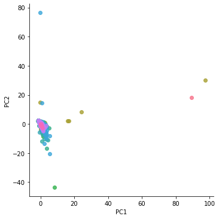
    


```python


# to Add a color bar which maps values to colors.
fig = plt.figure()
ax = fig.gca(projection='3d')
surf=ax.plot_trisurf(finalDf['PC2'], finalDf['PC1'], finalDf['TCHGS'], cmap=plt.cm.viridis, linewidth=0.2)
fig.colorbar( surf, shrink=0.5, aspect=5)
ax.view_init(30, 45)
plt.show()
```


    
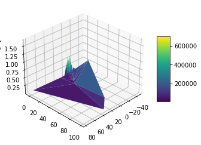
    


```python
#Proceed with Random Forest
from sklearn.ensemble import RandomForestRegressor
# Instantiate model with 1000 decision trees
#RandomForestRegressor(n_estimators=100, *, criterion='squared_error', max_depth=None, min_samples_split=2, min_samples_leaf=1, min_weight_fraction_leaf=0.0, max_features='auto', max_leaf_nodes=None, min_impurity_decrease=0.0, bootstrap=True, oob_score=False, n_jobs=None, random_state=None, verbose=0, warm_start=False, ccp_alpha=0.0, max_samples=None)[source]¶
rf = RandomForestRegressor(n_estimators = 500, random_state = 42,max_features="sqrt",oob_score=True)
# Train the model on training data

#will use the same data that was used with linear regression
rf.fit(X, y);

```


```python
#Get Importance of variables

feature_list = list(X.columns)
# Get numerical feature importances
importances = list(rf.feature_importances_)
# List of tuples with variable and importance
feature_importances = [(feature, round(importance, 3)) for feature, importance in zip(feature_list, importances)]
# Sort the feature importances by most important first
feature_importances = sorted(feature_importances, key = lambda x: x[1], reverse = True)
# Print out the feature and importances 
[print('Variable: {:20} Importance: {}'.format(*pair)) for pair in feature_importances];

#After lengt of stay, count of diagnosis, age, count of proceure... Specific procedures drive the cost and some diagnosis
#Of comorbidities only X58.XXXA looks of relative importance. Exposure to other specified factors, initial encounter
#8E0ZXY6 Isolation
#XW033E5 Redmisivir covid treatment
#XW13325 transfussion of plasma
#~50 features are important compared to more than 200 in dataset
```

    Variable: LOSDAYS              Importance: 0.338
    Variable: Count_OTHDIAG        Importance: 0.122
    Variable: Count_PROC           Importance: 0.102
    Variable: Age_Updated          Importance: 0.097
    Variable: Same_Diag            Importance: 0.018
    Variable: 3E04305              Importance: 0.017
    Variable: 8E0ZXY6              Importance: 0.012
    Variable: A41.9                Importance: 0.011
    Variable: 02HV33Z              Importance: 0.009
    Variable: A41.89               Importance: 0.008
    Variable: Y83.8                Importance: 0.008
    Variable: A41.81               Importance: 0.007
    Variable: XW033E5              Importance: 0.007
    Variable: 5A09557              Importance: 0.006
    Variable: 5A1945Z              Importance: 0.006
    Variable: 0BH17EZ              Importance: 0.005
    Variable: A41.02               Importance: 0.004
    Variable: X58.XXXA             Importance: 0.004
    Variable: Y95                  Importance: 0.004
    Variable: 5A09357              Importance: 0.004
    Variable: A02.1                Importance: 0.003
    Variable: A41.01               Importance: 0.003
    Variable: A41.51               Importance: 0.003
    Variable: A41.59               Importance: 0.003
    Variable: W19.XXXA             Importance: 0.003
    Variable: Y83.1                Importance: 0.003
    Variable: Y84.8                Importance: 0.003
    Variable: Y92.230              Importance: 0.003
    Variable: Y92.89               Importance: 0.003
    Variable: 02H633Z              Importance: 0.003
    Variable: 07DR3ZX              Importance: 0.003
    Variable: 0B9F8ZX              Importance: 0.003
    Variable: 0W9930Z              Importance: 0.003
    Variable: 0W9G3ZZ              Importance: 0.003
    Variable: 30233N1              Importance: 0.003
    Variable: 5A1935Z              Importance: 0.003
    Variable: 5A1D70Z              Importance: 0.003
    Variable: 5A1D90Z              Importance: 0.003
    Variable: XW13325              Importance: 0.003
    Variable: W18.30XA             Importance: 0.002
    Variable: Y83.0                Importance: 0.002
    Variable: Y92.009              Importance: 0.002
    Variable: Y92.239              Importance: 0.002
    Variable: Y93.89               Importance: 0.002
    Variable: 009U3ZX              Importance: 0.002
    Variable: 03HY32Z              Importance: 0.002
    Variable: 05H933Z              Importance: 0.002
    Variable: 05HB33Z              Importance: 0.002
    Variable: 05HC33Z              Importance: 0.002
    Variable: 05HM33Z              Importance: 0.002
    Variable: 05HY33Z              Importance: 0.002
    Variable: 0B9D8ZX              Importance: 0.002
    Variable: 0B9H8ZX              Importance: 0.002
    Variable: 0DB58ZX              Importance: 0.002
    Variable: 0DB68ZX              Importance: 0.002
    Variable: 0DH63UZ              Importance: 0.002
    Variable: 0FB03ZX              Importance: 0.002
    Variable: 0JPT3XZ              Importance: 0.002
    Variable: 0T9B70Z              Importance: 0.002
    Variable: 0W3P8ZZ              Importance: 0.002
    Variable: 0W993ZZ              Importance: 0.002
    Variable: 0W9B3ZZ              Importance: 0.002
    Variable: 5A0935A              Importance: 0.002
    Variable: 5A09457              Importance: 0.002
    Variable: 5A12012              Importance: 0.002
    Variable: B32T1ZZ              Importance: 0.002
    Variable: BW211ZZ              Importance: 0.002
    Variable: A40.0                Importance: 0.001
    Variable: A40.1                Importance: 0.001
    Variable: A40.8                Importance: 0.001
    Variable: A40.9                Importance: 0.001
    Variable: A41.1                Importance: 0.001
    Variable: A41.4                Importance: 0.001
    Variable: A41.50               Importance: 0.001
    Variable: A41.52               Importance: 0.001
    Variable: B37.7                Importance: 0.001
    Variable: R78.81               Importance: 0.001
    Variable: W01.0XXA             Importance: 0.001
    Variable: W06.XXXA             Importance: 0.001
    Variable: W18.30XD             Importance: 0.001
    Variable: W46.0XXA             Importance: 0.001
    Variable: Y71.2                Importance: 0.001
    Variable: Y82.8                Importance: 0.001
    Variable: Y83.3                Importance: 0.001
    Variable: Y84.1                Importance: 0.001
    Variable: Y84.6                Importance: 0.001
    Variable: Y90.0                Importance: 0.001
    Variable: Y90.1                Importance: 0.001
    Variable: Y92.238              Importance: 0.001
    Variable: Y92.9                Importance: 0.001
    Variable: 03HC33Z              Importance: 0.001
    Variable: 05HA33Z              Importance: 0.001
    Variable: 05HD33Z              Importance: 0.001
    Variable: 05PY33Z              Importance: 0.001
    Variable: 06H03DZ              Importance: 0.001
    Variable: 06HY33Z              Importance: 0.001
    Variable: 0B9G8ZX              Importance: 0.001
    Variable: 0B9M8ZX              Importance: 0.001
    Variable: 0BH18EZ              Importance: 0.001
    Variable: 0BJ08ZZ              Importance: 0.001
    Variable: 0DB78ZX              Importance: 0.001
    Variable: 0DB98ZX              Importance: 0.001
    Variable: 0DH67UZ              Importance: 0.001
    Variable: 0DJ07ZZ              Importance: 0.001
    Variable: 0DJ08ZZ              Importance: 0.001
    Variable: 0F798DZ              Importance: 0.001
    Variable: 0F9430Z              Importance: 0.001
    Variable: 0FC98ZZ              Importance: 0.001
    Variable: 0HBRXZZ              Importance: 0.001
    Variable: 0JH63XZ              Importance: 0.001
    Variable: 0S923ZX              Importance: 0.001
    Variable: 0T9030Z              Importance: 0.001
    Variable: 0T9130Z              Importance: 0.001
    Variable: 0W993ZX              Importance: 0.001
    Variable: 0W9B30Z              Importance: 0.001
    Variable: 0W9G30Z              Importance: 0.001
    Variable: 0W9G3ZX              Importance: 0.001
    Variable: 30233K1              Importance: 0.001
    Variable: 30233R1              Importance: 0.001
    Variable: 3E02340              Importance: 0.001
    Variable: 3E0333Z              Importance: 0.001
    Variable: 3E033XZ              Importance: 0.001
    Variable: 3E0F7SF              Importance: 0.001
    Variable: 3E1M39Z              Importance: 0.001
    Variable: 4A00X4Z              Importance: 0.001
    Variable: 4A023N7              Importance: 0.001
    Variable: 4A023N8              Importance: 0.001
    Variable: 4A02XM4              Importance: 0.001
    Variable: 4A03X5D              Importance: 0.001
    Variable: 4A10X4Z              Importance: 0.001
    Variable: B246YZZ              Importance: 0.001
    Variable: B246ZZ4              Importance: 0.001
    Variable: B24BZZ4              Importance: 0.001
    Variable: BW241ZZ              Importance: 0.001
    Variable: HZ2ZZZZ              Importance: 0.001
    Variable: A40.3                Importance: 0.0
    Variable: A41.2                Importance: 0.0
    Variable: A41.3                Importance: 0.0
    Variable: A41.53               Importance: 0.0
    Variable: B00.7                Importance: 0.0
    Variable: R57.1                Importance: 0.0
    Variable: R65.21               Importance: 0.0
    Variable: V00.148A             Importance: 0.0
    Variable: V03.10XA             Importance: 0.0
    Variable: V13.4XXA             Importance: 0.0
    Variable: V18.0XXA             Importance: 0.0
    Variable: V18.4XXA             Importance: 0.0
    Variable: V19.9XXA             Importance: 0.0
    Variable: V29.9XXA             Importance: 0.0
    Variable: V29.9XXS             Importance: 0.0
    Variable: V49.9XXS             Importance: 0.0
    Variable: V86.55XS             Importance: 0.0
    Variable: V86.99XS             Importance: 0.0
    Variable: V89.2XXA             Importance: 0.0
    Variable: W01.198A             Importance: 0.0
    Variable: W05.0XXA             Importance: 0.0
    Variable: W07.XXXA             Importance: 0.0
    Variable: W10.9XXA             Importance: 0.0
    Variable: W10.9XXD             Importance: 0.0
    Variable: W11.XXXA             Importance: 0.0
    Variable: W11.XXXD             Importance: 0.0
    Variable: W13.1XXD             Importance: 0.0
    Variable: W14.XXXA             Importance: 0.0
    Variable: W17.89XD             Importance: 0.0
    Variable: W18.09XA             Importance: 0.0
    Variable: W18.11XA             Importance: 0.0
    Variable: W18.12XA             Importance: 0.0
    Variable: W18.2XXA             Importance: 0.0
    Variable: W18.39XA             Importance: 0.0
    Variable: W19.XXXD             Importance: 0.0
    Variable: W22.8XXA             Importance: 0.0
    Variable: W25.XXXA             Importance: 0.0
    Variable: W31.9XXA             Importance: 0.0
    Variable: W34.00XS             Importance: 0.0
    Variable: W45.8XXA             Importance: 0.0
    Variable: W54.0XXA             Importance: 0.0
    Variable: W55.01XA             Importance: 0.0
    Variable: W55.03XA             Importance: 0.0
    Variable: W57.XXXA             Importance: 0.0
    Variable: W88.1XXA             Importance: 0.0
    Variable: X10.1XXA             Importance: 0.0
    Variable: X19.XXXA             Importance: 0.0
    Variable: X30.XXXA             Importance: 0.0
    Variable: X58.XXXD             Importance: 0.0
    Variable: X58.XXXS             Importance: 0.0
    Variable: X95.9XXD             Importance: 0.0
    Variable: X95.9XXS             Importance: 0.0
    Variable: Y08.89XA             Importance: 0.0
    Variable: Y09                  Importance: 0.0
    Variable: Y65.8                Importance: 0.0
    Variable: Y71.1                Importance: 0.0
    Variable: Y71.3                Importance: 0.0
    Variable: Y71.8                Importance: 0.0
    Variable: Y73.1                Importance: 0.0
    Variable: Y73.2                Importance: 0.0
    Variable: Y73.8                Importance: 0.0
    Variable: Y79.1                Importance: 0.0
    Variable: Y81.1                Importance: 0.0
    Variable: Y82.9                Importance: 0.0
    Variable: Y83.2                Importance: 0.0
    Variable: Y83.5                Importance: 0.0
    Variable: Y83.6                Importance: 0.0
    Variable: Y83.9                Importance: 0.0
    Variable: Y84.0                Importance: 0.0
    Variable: Y84.2                Importance: 0.0
    Variable: Y84.4                Importance: 0.0
    Variable: Y84.9                Importance: 0.0
    Variable: Y90.3                Importance: 0.0
    Variable: Y90.5                Importance: 0.0
    Variable: Y90.6                Importance: 0.0
    Variable: Y90.7                Importance: 0.0
    Variable: Y90.8                Importance: 0.0
    Variable: Y90.9                Importance: 0.0
    Variable: Y92.012              Importance: 0.0
    Variable: Y92.018              Importance: 0.0
    Variable: Y92.038              Importance: 0.0
    Variable: Y92.129              Importance: 0.0
    Variable: Y92.234              Importance: 0.0
    Variable: Y92.410              Importance: 0.0
    Variable: Y92.59               Importance: 0.0
    Variable: V43.62XA             Importance: 0.0
    Variable: V89.2XXS             Importance: 0.0
    Variable: W17.89XA             Importance: 0.0
    Variable: W23.0XXA             Importance: 0.0
    Variable: X50.1XXA             Importance: 0.0
    Variable: Y08.02XA             Importance: 0.0
    Variable: Y73.3                Importance: 0.0
    Variable: Y74.2                Importance: 0.0
    Variable: Y79.8                Importance: 0.0
    Variable: Y83.4                Importance: 0.0
    Variable: Y92.000              Importance: 0.0
    Variable: Y92.002              Importance: 0.0
    Variable: Y92.003              Importance: 0.0
    Variable: Y92.007              Importance: 0.0
    Variable: Y92.008              Importance: 0.0
    Variable: Y92.015              Importance: 0.0
    Variable: Y92.019              Importance: 0.0
    Variable: Y92.039              Importance: 0.0
    Variable: Y92.091              Importance: 0.0
    Variable: Y92.092              Importance: 0.0
    Variable: Y92.099              Importance: 0.0
    Variable: Y92.122              Importance: 0.0
    Variable: Y92.199              Importance: 0.0
    Variable: Y92.231              Importance: 0.0
    Variable: Y92.480              Importance: 0.0
    Variable: Y92.481              Importance: 0.0
    Variable: Y92.538              Importance: 0.0
    Variable: Y93.01               Importance: 0.0
    Variable: Y93.55               Importance: 0.0
    Variable: Y93.9                Importance: 0.0
    Variable: Y93.E1               Importance: 0.0
    Variable: Y93.G1               Importance: 0.0
    Variable: Y07.01               Importance: 0.0
    Variable: Y92.030              Importance: 0.0
    Variable: Y92.128              Importance: 0.0
    Variable: Y92.531              Importance: 0.0
    Variable: Y99.8                Importance: 0.0
    Variable: 009U30Z              Importance: 0.0
    Variable: 009U3ZZ              Importance: 0.0
    Variable: 009X3ZX              Importance: 0.0
    Variable: 00JU3ZZ              Importance: 0.0
    Variable: 02HP32Z              Importance: 0.0
    Variable: 02PY33Z              Importance: 0.0
    Variable: 02PYX3Z              Importance: 0.0
    Variable: 03HB33Z              Importance: 0.0
    Variable: 03HY33Z              Importance: 0.0
    Variable: 04HY32Z              Importance: 0.0
    Variable: 05H533Z              Importance: 0.0
    Variable: 05H633Z              Importance: 0.0
    Variable: 05HF33Z              Importance: 0.0
    Variable: 05HH33Z              Importance: 0.0
    Variable: 05HN33Z              Importance: 0.0
    Variable: 05HQ33Z              Importance: 0.0
    Variable: 05JY3ZZ              Importance: 0.0
    Variable: 06H033Z              Importance: 0.0
    Variable: 06HM33Z              Importance: 0.0
    Variable: 06HN33Z              Importance: 0.0
    Variable: 06L38CZ              Importance: 0.0
    Variable: 079P3ZX              Importance: 0.0
    Variable: 079T3ZX              Importance: 0.0
    Variable: 093K7ZZ              Importance: 0.0
    Variable: 09913ZZ              Importance: 0.0
    Variable: 0B21XFZ              Importance: 0.0
    Variable: 0B918ZX              Importance: 0.0
    Variable: 0B938ZZ              Importance: 0.0
    Variable: 0B948ZZ              Importance: 0.0
    Variable: 0B968ZZ              Importance: 0.0
    Variable: 0B978ZZ              Importance: 0.0
    Variable: 0B998ZZ              Importance: 0.0
    Variable: 0B9C8ZX              Importance: 0.0
    Variable: 0B9C8ZZ              Importance: 0.0
    Variable: 0B9F7ZX              Importance: 0.0
    Variable: 0B9F8ZZ              Importance: 0.0
    Variable: 0B9J7ZX              Importance: 0.0
    Variable: 0B9J8ZX              Importance: 0.0
    Variable: 0B9L8ZX              Importance: 0.0
    Variable: 0B9M8ZZ              Importance: 0.0
    Variable: 0B9P30Z              Importance: 0.0
    Variable: 0BB58ZX              Importance: 0.0
    Variable: 0BB78ZX              Importance: 0.0
    Variable: 0BBB8ZX              Importance: 0.0
    Variable: 0BBC3ZX              Importance: 0.0
    Variable: 0BBD3ZX              Importance: 0.0
    Variable: 0BBG3ZX              Importance: 0.0
    Variable: 0BBJ3ZX              Importance: 0.0
    Variable: 0BC38ZZ              Importance: 0.0
    Variable: 0BC78ZZ              Importance: 0.0
    Variable: 0BCB8ZZ              Importance: 0.0
    Variable: 0BD38ZX              Importance: 0.0
    Variable: 0BD58ZX              Importance: 0.0
    Variable: 0BD68ZX              Importance: 0.0
    Variable: 0BDB8ZX              Importance: 0.0
    Variable: 0BDC8ZX              Importance: 0.0
    Variable: 0BDD8ZX              Importance: 0.0
    Variable: 0BDF8ZX              Importance: 0.0
    Variable: 0BDL4ZX              Importance: 0.0
    Variable: 0BP1XDZ              Importance: 0.0
    Variable: 0C90XZX              Importance: 0.0
    Variable: 0CCM7ZZ              Importance: 0.0
    Variable: 0CJS8ZZ              Importance: 0.0
    Variable: 0D20XUZ              Importance: 0.0
    Variable: 0D2DXUZ              Importance: 0.0
    Variable: 0D738DZ              Importance: 0.0
    Variable: 0D738ZZ              Importance: 0.0
    Variable: 0D748ZZ              Importance: 0.0
    Variable: 0D758ZZ              Importance: 0.0
    Variable: 0D768DZ              Importance: 0.0
    Variable: 0D768ZZ              Importance: 0.0
    Variable: 0D778ZZ              Importance: 0.0
    Variable: 0D7P8ZZ              Importance: 0.0
    Variable: 0D9670Z              Importance: 0.0
    Variable: 0D9E80Z              Importance: 0.0
    Variable: 0D9J30Z              Importance: 0.0
    Variable: 0D9W30Z              Importance: 0.0
    Variable: 0DB38ZX              Importance: 0.0
    Variable: 0DB48ZX              Importance: 0.0
    Variable: 0DB68ZZ              Importance: 0.0
    Variable: 0DBB8ZX              Importance: 0.0
    Variable: 0DBE8ZX              Importance: 0.0
    Variable: 0DBF8ZX              Importance: 0.0
    Variable: 0DBG8ZX              Importance: 0.0
    Variable: 0DBH8ZX              Importance: 0.0
    Variable: 0DBK8ZX              Importance: 0.0
    Variable: 0DBK8ZZ              Importance: 0.0
    Variable: 0DBL8ZX              Importance: 0.0
    Variable: 0DBM8ZX              Importance: 0.0
    Variable: 0DBM8ZZ              Importance: 0.0
    Variable: 0DBN8ZX              Importance: 0.0
    Variable: 0DBN8ZZ              Importance: 0.0
    Variable: 0DBP8ZX              Importance: 0.0
    Variable: 0DC58ZZ              Importance: 0.0
    Variable: 0DC68ZZ              Importance: 0.0
    Variable: 0DD58ZX              Importance: 0.0
    Variable: 0DD68ZX              Importance: 0.0
    Variable: 0DH64UZ              Importance: 0.0
    Variable: 0DH68UZ              Importance: 0.0
    Variable: 0DH93UZ              Importance: 0.0
    Variable: 0DH97UZ              Importance: 0.0
    Variable: 0DHA3UZ              Importance: 0.0
    Variable: 0DHA7UZ              Importance: 0.0
    Variable: 0DJD8ZZ              Importance: 0.0
    Variable: 0DP58DZ              Importance: 0.0
    Variable: 0DP6XUZ              Importance: 0.0
    Variable: 0F20X0Z              Importance: 0.0
    Variable: 0F2BX0Z              Importance: 0.0
    Variable: 0F793DZ              Importance: 0.0
    Variable: 0F798ZZ              Importance: 0.0
    Variable: 0F7D8DZ              Importance: 0.0
    Variable: 0F9030Z              Importance: 0.0
    Variable: 0F903ZX              Importance: 0.0
    Variable: 0F903ZZ              Importance: 0.0
    Variable: 0F9130Z              Importance: 0.0
    Variable: 0F913ZX              Importance: 0.0
    Variable: 0F9230Z              Importance: 0.0
    Variable: 0F943ZZ              Importance: 0.0
    Variable: 0F9630Z              Importance: 0.0
    Variable: 0F9930Z              Importance: 0.0
    Variable: 0F9C80Z              Importance: 0.0
    Variable: 0FB13ZX              Importance: 0.0
    Variable: 0FBG3ZX              Importance: 0.0
    Variable: 0FBG8ZX              Importance: 0.0
    Variable: 0FP4X0Z              Importance: 0.0
    Variable: 0FPB8DZ              Importance: 0.0
    Variable: 0GB33ZX              Importance: 0.0
    Variable: 0H9NXZZ              Importance: 0.0
    Variable: 0HB8XZZ              Importance: 0.0
    Variable: 0HBAXZX              Importance: 0.0
    Variable: 0HBCXZX              Importance: 0.0
    Variable: 0HBCXZZ              Importance: 0.0
    Variable: 0HBHXZX              Importance: 0.0
    Variable: 0HBKXZZ              Importance: 0.0
    Variable: 0HBLXZX              Importance: 0.0
    Variable: 0HCMXZZ              Importance: 0.0
    Variable: 0HDGXZZ              Importance: 0.0
    Variable: 0HDKXZZ              Importance: 0.0
    Variable: 0HQ1XZZ              Importance: 0.0
    Variable: 0HQMXZZ              Importance: 0.0
    Variable: 0HTRXZZ              Importance: 0.0
    Variable: 0J2TXYZ              Importance: 0.0
    Variable: 0J9100Z              Importance: 0.0
    Variable: 0J983ZX              Importance: 0.0
    Variable: 0J993ZX              Importance: 0.0
    Variable: 0J9L0ZX              Importance: 0.0
    Variable: 0J9L3ZX              Importance: 0.0
    Variable: 0J9L3ZZ              Importance: 0.0
    Variable: 0J9N3ZZ              Importance: 0.0
    Variable: 0J9P3ZX              Importance: 0.0
    Variable: 0JB70ZX              Importance: 0.0
    Variable: 0JBG3ZZ              Importance: 0.0
    Variable: 0JBL3ZX              Importance: 0.0
    Variable: 0JCN0ZZ              Importance: 0.0
    Variable: 0JCQ0ZZ              Importance: 0.0
    Variable: 0JH60XZ              Importance: 0.0
    Variable: 0JHG3XZ              Importance: 0.0
    Variable: 0JHL3XZ              Importance: 0.0
    Variable: 0JPT0WZ              Importance: 0.0
    Variable: 0JPT0XZ              Importance: 0.0
    Variable: 0JPT3WZ              Importance: 0.0
    Variable: 0JPTXXZ              Importance: 0.0
    Variable: 0JPV3XZ              Importance: 0.0
    Variable: 0JPWXXZ              Importance: 0.0
    Variable: 0K2YX0Z              Importance: 0.0
    Variable: 0K9F30Z              Importance: 0.0
    Variable: 0K9G3ZZ              Importance: 0.0
    Variable: 0K9N30Z              Importance: 0.0
    Variable: 0K9N3ZZ              Importance: 0.0
    Variable: 0K9P30Z              Importance: 0.0
    Variable: 0K9P3ZZ              Importance: 0.0
    Variable: 0K9Q30Z              Importance: 0.0
    Variable: 0QSNXZZ              Importance: 0.0
    Variable: 0R9J3ZZ              Importance: 0.0
    Variable: 0R9M3ZX              Importance: 0.0
    Variable: 0R9N3ZZ              Importance: 0.0
    Variable: 0RBF3ZX              Importance: 0.0
    Variable: 0S903ZX              Importance: 0.0
    Variable: 0S9930Z              Importance: 0.0
    Variable: 0S993ZZ              Importance: 0.0
    Variable: 0S9B3ZZ              Importance: 0.0
    Variable: 0S9C3ZX              Importance: 0.0
    Variable: 0S9D3ZZ              Importance: 0.0
    Variable: 0SJC3ZZ              Importance: 0.0
    Variable: 0SWCX5Z              Importance: 0.0
    Variable: 0SWEXJZ              Importance: 0.0
    Variable: 0T25X0Z              Importance: 0.0
    Variable: 0T2BX0Z              Importance: 0.0
    Variable: 0T773DZ              Importance: 0.0
    Variable: 0T903ZX              Importance: 0.0
    Variable: 0T903ZZ              Importance: 0.0
    Variable: 0T913ZZ              Importance: 0.0
    Variable: 0T9330Z              Importance: 0.0
    Variable: 0T9430Z              Importance: 0.0
    Variable: 0T9B30Z              Importance: 0.0
    Variable: 0T9B80Z              Importance: 0.0
    Variable: 0TB03ZX              Importance: 0.0
    Variable: 0TB13ZX              Importance: 0.0
    Variable: 0TCB8ZZ              Importance: 0.0
    Variable: 0TJB8ZZ              Importance: 0.0
    Variable: 0TP97DZ              Importance: 0.0
    Variable: 0V903ZX              Importance: 0.0
    Variable: 0V953ZZ              Importance: 0.0
    Variable: 0W9B3ZX              Importance: 0.0
    Variable: 0W9D30Z              Importance: 0.0
    Variable: 0W9D3ZZ              Importance: 0.0
    Variable: 0W9F30Z              Importance: 0.0
    Variable: 0W9F3ZZ              Importance: 0.0
    Variable: 0W9G40Z              Importance: 0.0
    Variable: 0W9G4ZZ              Importance: 0.0
    Variable: 0W9H30Z              Importance: 0.0
    Variable: 0W9J30Z              Importance: 0.0
    Variable: 0W9J3ZX              Importance: 0.0
    Variable: 0W9L30Z              Importance: 0.0
    Variable: 0WP8X3Z              Importance: 0.0
    Variable: 0X9J0ZZ              Importance: 0.0
    Variable: 0X9K0ZZ              Importance: 0.0
    Variable: 0Y9C30Z              Importance: 0.0
    Variable: 0Y9H0ZZ              Importance: 0.0
    Variable: 2W3FX1Z              Importance: 0.0
    Variable: 30233H1              Importance: 0.0
    Variable: 30233L1              Importance: 0.0
    Variable: 30233P1              Importance: 0.0
    Variable: 30233S1              Importance: 0.0
    Variable: 30243K1              Importance: 0.0
    Variable: 30243N1              Importance: 0.0
    Variable: 30243R1              Importance: 0.0
    Variable: 3E013TZ              Importance: 0.0
    Variable: 3E0234Z              Importance: 0.0
    Variable: 3E03317              Importance: 0.0
    Variable: 3E0336Z              Importance: 0.0
    Variable: 3E033GC              Importance: 0.0
    Variable: 3E04317              Importance: 0.0
    Variable: 3E0436Z              Importance: 0.0
    Variable: 3E043XZ              Importance: 0.0
    Variable: 3E053XZ              Importance: 0.0
    Variable: 3E06317              Importance: 0.0
    Variable: 3E0D705              Importance: 0.0
    Variable: 3E0D73Z              Importance: 0.0
    Variable: 3E0DX05              Importance: 0.0
    Variable: 3E0DX3Z              Importance: 0.0
    Variable: 3E0F7GC              Importance: 0.0
    Variable: 3E0G76Z              Importance: 0.0
    Variable: 3E0G8GC              Importance: 0.0
    Variable: 3E0G8HZ              Importance: 0.0
    Variable: 3E0L3GC              Importance: 0.0
    Variable: 3E0R305              Importance: 0.0
    Variable: 3E1H78Z              Importance: 0.0
    Variable: 3E1U38X              Importance: 0.0
    Variable: 4A023N6              Importance: 0.0
    Variable: 4A133B1              Importance: 0.0
    Variable: 4A133B3              Importance: 0.0
    Variable: 4A1ZXQZ              Importance: 0.0
    Variable: 4B02XSZ              Importance: 0.0
    Variable: 4B02XTZ              Importance: 0.0
    Variable: 5A0945A              Importance: 0.0
    Variable: 5A0955A              Importance: 0.0
    Variable: 5A0955Z              Importance: 0.0
    Variable: 5A1223Z              Importance: 0.0
    Variable: 5A19054              Importance: 0.0
    Variable: 5A2204Z              Importance: 0.0
    Variable: B01BZZZ              Importance: 0.0
    Variable: B02010Z              Importance: 0.0
    Variable: B020ZZZ              Importance: 0.0
    Variable: B030Y0Z              Importance: 0.0
    Variable: B030YZZ              Importance: 0.0
    Variable: B2111ZZ              Importance: 0.0
    Variable: B2141ZZ              Importance: 0.0
    Variable: B22110Z              Importance: 0.0
    Variable: B2211ZZ              Importance: 0.0
    Variable: B244ZZ4              Importance: 0.0
    Variable: B245ZZ4              Importance: 0.0
    Variable: B246ZZZ              Importance: 0.0
    Variable: B24BYZZ              Importance: 0.0
    Variable: B24BZZZ              Importance: 0.0
    Variable: B31H1ZZ              Importance: 0.0
    Variable: B31T1ZZ              Importance: 0.0
    Variable: B3201ZZ              Importance: 0.0
    Variable: B3251ZZ              Importance: 0.0
    Variable: B3281ZZ              Importance: 0.0
    Variable: B32R1ZZ              Importance: 0.0
    Variable: B32S1ZZ              Importance: 0.0
    Variable: B32T0ZZ              Importance: 0.0
    Variable: B4001ZZ              Importance: 0.0
    Variable: B41D1ZZ              Importance: 0.0
    Variable: B4201ZZ              Importance: 0.0
    Variable: B42C1ZZ              Importance: 0.0
    Variable: B42F1ZZ              Importance: 0.0
    Variable: B51W1ZZ              Importance: 0.0
    Variable: B54MZZZ              Importance: 0.0
    Variable: B9221ZZ              Importance: 0.0
    Variable: BB241ZZ              Importance: 0.0
    Variable: BD11YZZ              Importance: 0.0
    Variable: BD13YZZ              Importance: 0.0
    Variable: BD1BYZZ              Importance: 0.0
    Variable: BF101ZZ              Importance: 0.0
    Variable: BF131ZZ              Importance: 0.0
    Variable: BP2W1ZZ              Importance: 0.0
    Variable: BQ2R1ZZ              Importance: 0.0
    Variable: BQ2S1ZZ              Importance: 0.0
    Variable: BQ30Y0Z              Importance: 0.0
    Variable: BQ31YZZ              Importance: 0.0
    Variable: BQ33Y0Z              Importance: 0.0
    Variable: BQ3LYZZ              Importance: 0.0
    Variable: BQ3MY0Z              Importance: 0.0
    Variable: BR201ZZ              Importance: 0.0
    Variable: BR2C1ZZ              Importance: 0.0
    Variable: BR30Y0Z              Importance: 0.0
    Variable: BR30YZZ              Importance: 0.0
    Variable: BR37Y0Z              Importance: 0.0
    Variable: BR39Y0Z              Importance: 0.0
    Variable: BR39YZZ              Importance: 0.0
    Variable: BR3FY0Z              Importance: 0.0
    Variable: BT141ZZ              Importance: 0.0
    Variable: BT1G1ZZ              Importance: 0.0
    Variable: BW111ZZ              Importance: 0.0
    Variable: BW2110Z              Importance: 0.0
    Variable: BW2410Z              Importance: 0.0
    Variable: BW2510Z              Importance: 0.0
    Variable: BW251ZZ              Importance: 0.0
    Variable: BW2810Z              Importance: 0.0
    Variable: BW2910Z              Importance: 0.0
    Variable: BW2F1ZZ              Importance: 0.0
    Variable: BW2G1ZZ              Importance: 0.0
    Variable: BW30Y0Z              Importance: 0.0
    Variable: BW30YZZ              Importance: 0.0
    Variable: BW3FY0Z              Importance: 0.0
    Variable: BW3GYZZ              Importance: 0.0
    Variable: C21G1ZZ              Importance: 0.0
    Variable: CB121ZZ              Importance: 0.0
    Variable: D0Y67ZZ              Importance: 0.0
    Variable: DB021ZZ              Importance: 0.0
    Variable: DF001ZZ              Importance: 0.0
    Variable: DP0B1ZZ              Importance: 0.0
    Variable: DW061ZZ              Importance: 0.0
    Variable: DWY27ZZ              Importance: 0.0
    Variable: F00ZJWZ              Importance: 0.0
    Variable: XW033F6              Importance: 0.0
    Variable: XW033H5              Importance: 0.0
    Variable: XW033N5              Importance: 0.0
    Variable: XW043E5              Importance: 0.0
    Variable: XW0DXR5              Importance: 0.0
    Variable: XW14325              Importance: 0.0
    


```python
# Predicting on training set . Want to calculate error of training , no need to predict at this time
y_pred = rf.predict(X)
# Evaluating the  error in Algorithm
from sklearn import metrics
print('Mean Absolute Error:', metrics.mean_absolute_error(y, y_pred))  
print('Mean Squared Error:', metrics.mean_squared_error(y, y_pred))  
print('Root Mean Squared Error:', np.sqrt(metrics.mean_squared_error(y, y_pred)))

#Root mean squared error in Linear regression was $32502  with  Random Forest is $13107
```

    Mean Absolute Error: 11757.750913514781
    Mean Squared Error: 347689675.72843415
    Root Mean Squared Error: 18646.43868754659
    


```python
#Use top 10 most important variables to check on difference on average among hospitals
Top10 = [a_tuple[0] for a_tuple in feature_importances][0:10]

#Add Facility_Name
Top10.extend(['Facility_Name','TCHGS'])
df[Top10].groupby('Facility_Name').mean()

#Probably have to check count of procedures vs count of diagnosis
#It looks like 8E0ZXY6 Isolation is an important factor... the more isolation the better outcome
```


<div>
<style scoped>
    .dataframe tbody tr th:only-of-type {
        vertical-align: middle;
    }

    .dataframe tbody tr th {
        vertical-align: top;
    }

    .dataframe thead th {
        text-align: right;
    }
</style>
<table border="1" class="dataframe">
  <thead>
    <tr style="text-align: right;">
      <th></th>
      <th>LOSDAYS</th>
      <th>Count_OTHDIAG</th>
      <th>Count_PROC</th>
      <th>Age_Updated</th>
      <th>Same_Diag</th>
      <th>3E04305</th>
      <th>8E0ZXY6</th>
      <th>A41.9</th>
      <th>02HV33Z</th>
      <th>A41.89</th>
      <th>TCHGS</th>
    </tr>
    <tr>
      <th>Facility_Name</th>
      <th></th>
      <th></th>
      <th></th>
      <th></th>
      <th></th>
      <th></th>
      <th></th>
      <th></th>
      <th></th>
      <th></th>
      <th></th>
    </tr>
  </thead>
  <tbody>
    <tr>
      <th>ADVENTHEALTH CARROLLWOOD Facility Profile</th>
      <td>6.711364</td>
      <td>19.927273</td>
      <td>0.886364</td>
      <td>64.290909</td>
      <td>0.397727</td>
      <td>0.000000</td>
      <td>0.000000</td>
      <td>0.395455</td>
      <td>0.086364</td>
      <td>0.343182</td>
      <td>83353.590909</td>
    </tr>
    <tr>
      <th>ADVENTHEALTH TAMPA Facility Profile</th>
      <td>7.599644</td>
      <td>21.599644</td>
      <td>1.058719</td>
      <td>65.276690</td>
      <td>0.357651</td>
      <td>0.000000</td>
      <td>0.000000</td>
      <td>0.537367</td>
      <td>0.048932</td>
      <td>0.216192</td>
      <td>95198.272242</td>
    </tr>
    <tr>
      <th>H LEE MOFFITT CANCER CENTER  RESEARCH INSTITUTE HOSPITAL Facility Profile</th>
      <td>7.133333</td>
      <td>20.662963</td>
      <td>1.100000</td>
      <td>60.785185</td>
      <td>0.370370</td>
      <td>0.011111</td>
      <td>0.000000</td>
      <td>0.662963</td>
      <td>0.059259</td>
      <td>0.044444</td>
      <td>84596.544444</td>
    </tr>
    <tr>
      <th>HCA FL WEST TAMPA HOSPITAL PART OF HCA FL SOUTH TAMPA HOSPITAL Facility Profile</th>
      <td>7.000000</td>
      <td>11.000000</td>
      <td>2.000000</td>
      <td>28.000000</td>
      <td>0.000000</td>
      <td>0.000000</td>
      <td>0.000000</td>
      <td>1.000000</td>
      <td>0.000000</td>
      <td>0.000000</td>
      <td>62814.000000</td>
    </tr>
    <tr>
      <th>HCA FLORIDA BRANDON HOSPITAL Facility Profile</th>
      <td>6.697420</td>
      <td>19.133698</td>
      <td>0.942924</td>
      <td>63.237686</td>
      <td>0.430023</td>
      <td>0.000000</td>
      <td>0.032056</td>
      <td>0.534011</td>
      <td>0.065676</td>
      <td>0.376075</td>
      <td>132318.188428</td>
    </tr>
    <tr>
      <th>HCA FLORIDA SOUTH TAMPA HOSPITAL Facility Profile</th>
      <td>7.532374</td>
      <td>17.791367</td>
      <td>0.575540</td>
      <td>63.956835</td>
      <td>0.392086</td>
      <td>0.000000</td>
      <td>0.035971</td>
      <td>0.550360</td>
      <td>0.028777</td>
      <td>0.287770</td>
      <td>135815.075540</td>
    </tr>
    <tr>
      <th>KINDRED HOSPITALBAY AREATAMPA Facility Profile</th>
      <td>8.000000</td>
      <td>22.166667</td>
      <td>0.333333</td>
      <td>71.000000</td>
      <td>0.000000</td>
      <td>0.000000</td>
      <td>0.000000</td>
      <td>0.333333</td>
      <td>0.166667</td>
      <td>0.000000</td>
      <td>68856.166667</td>
    </tr>
    <tr>
      <th>KINDRED HOSPITALCENTRAL TAMPA Facility Profile</th>
      <td>22.250000</td>
      <td>26.750000</td>
      <td>0.125000</td>
      <td>79.875000</td>
      <td>0.125000</td>
      <td>0.000000</td>
      <td>0.000000</td>
      <td>0.375000</td>
      <td>0.000000</td>
      <td>0.000000</td>
      <td>140317.375000</td>
    </tr>
    <tr>
      <th>SOUTH BAY HOSPITAL Facility Profile</th>
      <td>6.358173</td>
      <td>21.281250</td>
      <td>0.997596</td>
      <td>73.165865</td>
      <td>0.425481</td>
      <td>0.000000</td>
      <td>0.019231</td>
      <td>0.653846</td>
      <td>0.067308</td>
      <td>0.247596</td>
      <td>143272.615385</td>
    </tr>
    <tr>
      <th>SOUTH FLORIDA BAPTIST HOSPITAL Facility Profile</th>
      <td>7.100977</td>
      <td>21.892508</td>
      <td>1.993485</td>
      <td>66.739414</td>
      <td>0.452769</td>
      <td>0.000000</td>
      <td>0.263844</td>
      <td>0.605863</td>
      <td>0.087948</td>
      <td>0.143322</td>
      <td>63539.615635</td>
    </tr>
    <tr>
      <th>ST JOSEPHS HOSPITAL Facility Profile</th>
      <td>7.477578</td>
      <td>18.417040</td>
      <td>2.109865</td>
      <td>63.391629</td>
      <td>0.243647</td>
      <td>0.000000</td>
      <td>0.139761</td>
      <td>0.639013</td>
      <td>0.071001</td>
      <td>0.174888</td>
      <td>67476.677877</td>
    </tr>
    <tr>
      <th>ST JOSEPHS HOSPITAL NORTH Facility Profile</th>
      <td>6.515974</td>
      <td>18.132588</td>
      <td>1.825879</td>
      <td>70.226837</td>
      <td>0.388179</td>
      <td>0.000000</td>
      <td>0.226837</td>
      <td>0.547923</td>
      <td>0.039936</td>
      <td>0.284345</td>
      <td>65103.327476</td>
    </tr>
    <tr>
      <th>ST JOSEPHS HOSPITAL SOUTH Facility Profile</th>
      <td>5.892121</td>
      <td>16.993939</td>
      <td>1.957576</td>
      <td>65.878788</td>
      <td>0.364848</td>
      <td>0.000000</td>
      <td>0.168485</td>
      <td>0.591515</td>
      <td>0.060606</td>
      <td>0.253333</td>
      <td>59757.596364</td>
    </tr>
    <tr>
      <th>TAMPA GENERAL HOSPITAL Facility Profile</th>
      <td>8.358045</td>
      <td>23.635215</td>
      <td>2.012637</td>
      <td>59.636057</td>
      <td>0.058130</td>
      <td>0.000000</td>
      <td>0.111205</td>
      <td>0.438922</td>
      <td>0.032013</td>
      <td>0.265375</td>
      <td>118357.330244</td>
    </tr>
  </tbody>
</table>
</div>


```python
#Use proven methods to offer expanations. Use Shap Values
#https://towardsdatascience.com/mastering-model-explainability-in-python-4e578206e000
#https://shap.readthedocs.io/en/latest/example_notebooks/overviews/An%20introduction%20to%20explainable%20AI%20with%20Shapley%20values.html
#https://shap.readthedocs.io/en/latest/index.html

import shap
#f = lambda x: rf.predict(X)

#med = X.median().values.reshape((1,X.shape[1]))

explainer = shap.Explainer(rf)
                          
                           
shap_values = explainer.shap_values(X, approximate=True)


shap.summary_plot(shap_values,X)

#Shap does not work because of Numba needs NumPy 1.20 or less. Have to check 3.9.2
```


    
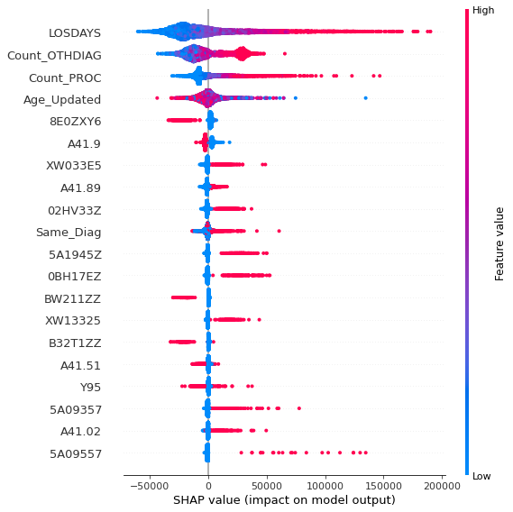
    


```python
#Evaluate specific records to check how features affect results

# the waterfall_plot shows how we get from shap_values.base_values to model.predict(X)[1651]

#1651 corresponds to Brandon Regional Hospital


#df.to_csv("C:/Users/figue/Documents/MIT_Data_Formats/Healthcare/Step_3_Analysis/data/temp_for_shap_871.csv")
#shap.plots._waterfall.waterfall_legacy 
#shap.plots.waterfall(shap_values[1651], max_display=14)

#shap.plots._waterfall.waterfall_legacy(shap_values[1651], max_display=14)

#shap.plots._waterfall.waterfall_legacy(explainer.expected_value[0], shap_values[0], X[0], max_display=14)

shap.plots._waterfall.waterfall_legacy(explainer.expected_value[0], shap_values[1181], max_display=14,feature_names = X.columns)

#Actual amount 117,000
```


    
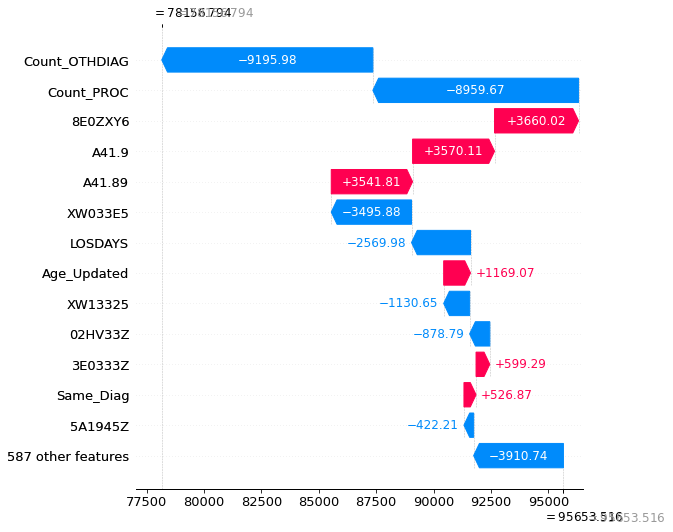
    


```python
#851 is St. Joseph

shap.plots._waterfall.waterfall_legacy(explainer.expected_value[0], shap_values[851], max_display=14,feature_names = X.columns)


```


    
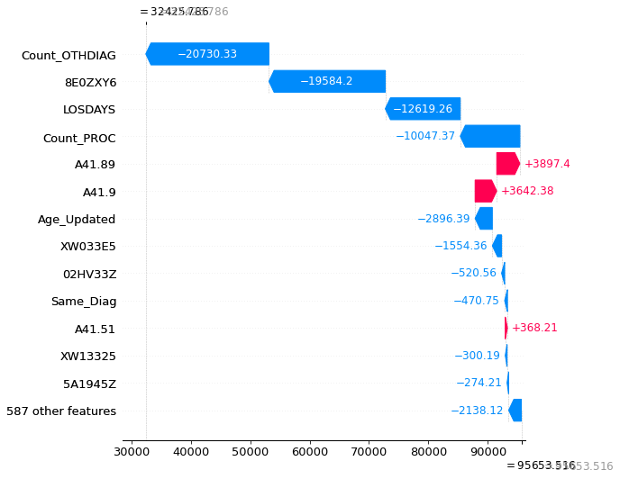
    


```python
#Will redo analysis but will exclude Kindred Hospitals. Exclude Moffit and concentrate on Major hospitals to validate what drives
#costs
df[["Facility_Name","MSDRG"]].groupby("Facility_Name").count()
#Will focus on the 4 hospitals with more than 1000 cases each
```


<div>
<style scoped>
    .dataframe tbody tr th:only-of-type {
        vertical-align: middle;
    }

    .dataframe tbody tr th {
        vertical-align: top;
    }

    .dataframe thead th {
        text-align: right;
    }
</style>
<table border="1" class="dataframe">
  <thead>
    <tr style="text-align: right;">
      <th></th>
      <th>MSDRG</th>
    </tr>
    <tr>
      <th>Facility_Name</th>
      <th></th>
    </tr>
  </thead>
  <tbody>
    <tr>
      <th>ADVENTHEALTH CARROLLWOOD Facility Profile</th>
      <td>440</td>
    </tr>
    <tr>
      <th>ADVENTHEALTH TAMPA Facility Profile</th>
      <td>1124</td>
    </tr>
    <tr>
      <th>H LEE MOFFITT CANCER CENTER  RESEARCH INSTITUTE HOSPITAL Facility Profile</th>
      <td>270</td>
    </tr>
    <tr>
      <th>HCA FL WEST TAMPA HOSPITAL PART OF HCA FL SOUTH TAMPA HOSPITAL Facility Profile</th>
      <td>1</td>
    </tr>
    <tr>
      <th>HCA FLORIDA BRANDON HOSPITAL Facility Profile</th>
      <td>1279</td>
    </tr>
    <tr>
      <th>HCA FLORIDA SOUTH TAMPA HOSPITAL Facility Profile</th>
      <td>278</td>
    </tr>
    <tr>
      <th>KINDRED HOSPITALBAY AREATAMPA Facility Profile</th>
      <td>6</td>
    </tr>
    <tr>
      <th>KINDRED HOSPITALCENTRAL TAMPA Facility Profile</th>
      <td>8</td>
    </tr>
    <tr>
      <th>SOUTH BAY HOSPITAL Facility Profile</th>
      <td>416</td>
    </tr>
    <tr>
      <th>SOUTH FLORIDA BAPTIST HOSPITAL Facility Profile</th>
      <td>307</td>
    </tr>
    <tr>
      <th>ST JOSEPHS HOSPITAL Facility Profile</th>
      <td>1338</td>
    </tr>
    <tr>
      <th>ST JOSEPHS HOSPITAL NORTH Facility Profile</th>
      <td>626</td>
    </tr>
    <tr>
      <th>ST JOSEPHS HOSPITAL SOUTH Facility Profile</th>
      <td>825</td>
    </tr>
    <tr>
      <th>TAMPA GENERAL HOSPITAL Facility Profile</th>
      <td>1187</td>
    </tr>
  </tbody>
</table>
</div>


```python
#create dataframe with the 4 hospitals and then create training data sets.

df_4major = df[(df['Facility_Name']=='ADVENTHEALTH TAMPA Facility Profile') | (df['Facility_Name']=='HCA FLORIDA BRANDON HOSPITAL Facility Profile') | (df['Facility_Name']=='ST JOSEPHS HOSPITAL Facility Profile') | (df['Facility_Name']=='TAMPA GENERAL HOSPITAL Facility Profile') ]

#specific columns for model
df_4major_model= df_4major[columns_lm]

#create feature and target df
X = df_4major_model.drop("TCHGS",axis=1)
y = df_4major_model["TCHGS"]


```


```python
#do a quick PCA to see if we can visualize difference between hospitals
x_scaled = StandardScaler().fit_transform(X)

pca = PCA(n_components=10)

principalComponents = pca.fit_transform(x_scaled)

principalDf = pd.DataFrame(data= principalComponents, columns = ['PC1','PC2','PC3','PC4','PC5','PC6','PC7','PC8','PC9','PC10'])

df_4major.reset_index(inplace=True)
#Concatenate with Hospital name
finalDf = pd.concat((principalDf,df_4major[['Facility_Name']]),axis=1,ignore_index=False)
#principalDf["PC1"]
#Have to provide  a color scheme


finalDf
```


<div>
<style scoped>
    .dataframe tbody tr th:only-of-type {
        vertical-align: middle;
    }

    .dataframe tbody tr th {
        vertical-align: top;
    }

    .dataframe thead th {
        text-align: right;
    }
</style>
<table border="1" class="dataframe">
  <thead>
    <tr style="text-align: right;">
      <th></th>
      <th>PC1</th>
      <th>PC2</th>
      <th>PC3</th>
      <th>PC4</th>
      <th>PC5</th>
      <th>PC6</th>
      <th>PC7</th>
      <th>PC8</th>
      <th>PC9</th>
      <th>PC10</th>
      <th>Facility_Name</th>
    </tr>
  </thead>
  <tbody>
    <tr>
      <th>0</th>
      <td>-0.150535</td>
      <td>-1.025769</td>
      <td>-0.221463</td>
      <td>0.398053</td>
      <td>0.253281</td>
      <td>0.317152</td>
      <td>0.193207</td>
      <td>0.297139</td>
      <td>0.821170</td>
      <td>-0.634755</td>
      <td>ST JOSEPHS HOSPITAL Facility Profile</td>
    </tr>
    <tr>
      <th>1</th>
      <td>-0.064059</td>
      <td>1.602322</td>
      <td>0.570024</td>
      <td>-0.810635</td>
      <td>-0.887882</td>
      <td>-0.728444</td>
      <td>0.527046</td>
      <td>-0.697276</td>
      <td>-0.960238</td>
      <td>0.523127</td>
      <td>ST JOSEPHS HOSPITAL Facility Profile</td>
    </tr>
    <tr>
      <th>2</th>
      <td>-0.064037</td>
      <td>-0.321859</td>
      <td>0.399840</td>
      <td>0.082504</td>
      <td>0.047169</td>
      <td>0.409564</td>
      <td>0.828509</td>
      <td>0.408566</td>
      <td>0.657596</td>
      <td>-1.200163</td>
      <td>ST JOSEPHS HOSPITAL Facility Profile</td>
    </tr>
    <tr>
      <th>3</th>
      <td>-0.183610</td>
      <td>-0.504334</td>
      <td>0.122179</td>
      <td>0.129874</td>
      <td>-0.067767</td>
      <td>0.003632</td>
      <td>0.866100</td>
      <td>0.406496</td>
      <td>0.876269</td>
      <td>-0.790975</td>
      <td>ST JOSEPHS HOSPITAL Facility Profile</td>
    </tr>
    <tr>
      <th>4</th>
      <td>-0.169027</td>
      <td>0.215382</td>
      <td>0.377941</td>
      <td>-0.133016</td>
      <td>-0.428879</td>
      <td>-0.166241</td>
      <td>0.996486</td>
      <td>0.100422</td>
      <td>0.437015</td>
      <td>-0.872531</td>
      <td>ST JOSEPHS HOSPITAL Facility Profile</td>
    </tr>
    <tr>
      <th>...</th>
      <td>...</td>
      <td>...</td>
      <td>...</td>
      <td>...</td>
      <td>...</td>
      <td>...</td>
      <td>...</td>
      <td>...</td>
      <td>...</td>
      <td>...</td>
      <td>...</td>
    </tr>
    <tr>
      <th>4923</th>
      <td>-0.162949</td>
      <td>0.074790</td>
      <td>0.240730</td>
      <td>-0.075755</td>
      <td>-0.288100</td>
      <td>-0.210998</td>
      <td>0.895523</td>
      <td>0.242857</td>
      <td>0.492369</td>
      <td>-0.677320</td>
      <td>TAMPA GENERAL HOSPITAL Facility Profile</td>
    </tr>
    <tr>
      <th>4924</th>
      <td>0.171515</td>
      <td>0.037135</td>
      <td>0.063870</td>
      <td>-0.484652</td>
      <td>-0.206443</td>
      <td>0.335213</td>
      <td>0.308459</td>
      <td>-0.201603</td>
      <td>0.252929</td>
      <td>0.368005</td>
      <td>TAMPA GENERAL HOSPITAL Facility Profile</td>
    </tr>
    <tr>
      <th>4925</th>
      <td>-0.104786</td>
      <td>-0.458875</td>
      <td>0.014106</td>
      <td>0.155540</td>
      <td>0.051202</td>
      <td>0.095256</td>
      <td>0.471123</td>
      <td>0.267144</td>
      <td>0.538718</td>
      <td>-0.553117</td>
      <td>TAMPA GENERAL HOSPITAL Facility Profile</td>
    </tr>
    <tr>
      <th>4926</th>
      <td>0.120388</td>
      <td>-1.289460</td>
      <td>-0.803426</td>
      <td>0.473267</td>
      <td>0.733727</td>
      <td>0.622033</td>
      <td>-1.689042</td>
      <td>-0.322035</td>
      <td>-0.531586</td>
      <td>0.908189</td>
      <td>TAMPA GENERAL HOSPITAL Facility Profile</td>
    </tr>
    <tr>
      <th>4927</th>
      <td>0.099257</td>
      <td>-0.177173</td>
      <td>-0.297260</td>
      <td>-0.031022</td>
      <td>0.118306</td>
      <td>0.119734</td>
      <td>-0.889753</td>
      <td>-0.518332</td>
      <td>-0.736533</td>
      <td>0.926587</td>
      <td>TAMPA GENERAL HOSPITAL Facility Profile</td>
    </tr>
  </tbody>
</table>
<p>4928 rows × 11 columns</p>
</div>


```python
#Plot with 2 principal componets
sns.lmplot( x="PC1", y="PC2", data=finalDf, fit_reg=False, hue='Facility_Name', legend=True)
#Most overlaps with Tampa General and Brandon Hospital showing outliers. Tampa General among both axis and Brandon along PC2
```


    <seaborn.axisgrid.FacetGrid at 0x1763e7a6b20>


    
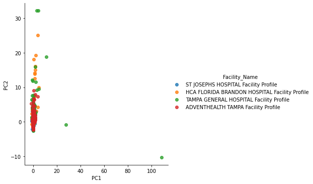
    


```python
#Create random Forest

#RandomForestRegressor(n_estimators=100, *, criterion='squared_error', max_depth=None, min_samples_split=2, min_samples_leaf=1, min_weight_fraction_leaf=0.0, max_features='auto', max_leaf_nodes=None, min_impurity_decrease=0.0, bootstrap=True, oob_score=False, n_jobs=None, random_state=None, verbose=0, warm_start=False, ccp_alpha=0.0, max_samples=None)[source]¶
rf = RandomForestRegressor(n_estimators = 500, random_state = 42,max_features="sqrt",oob_score=True)
# Train the model on training data

#will use the same data that was used with linear regression
rf.fit(X, y);
#Get Importance of variables

feature_list = list(X.columns)
# Get numerical feature importances
importances = list(rf.feature_importances_)
# List of tuples with variable and importance
feature_importances = [(feature, round(importance, 3)) for feature, importance in zip(feature_list, importances)]
# Sort the feature importances by most important first
feature_importances = sorted(feature_importances, key = lambda x: x[1], reverse = True)
# Print out the feature and importances 
[print('Variable: {:20} Importance: {}'.format(*pair)) for pair in feature_importances];

```

    Variable: LOSDAYS              Importance: 0.343
    Variable: Count_PROC           Importance: 0.12
    Variable: Count_OTHDIAG        Importance: 0.12
    Variable: Age_Updated          Importance: 0.092
    Variable: Same_Diag            Importance: 0.015
    Variable: A41.9                Importance: 0.011
    Variable: 02HV33Z              Importance: 0.009
    Variable: 8E0ZXY6              Importance: 0.009
    Variable: A41.89               Importance: 0.008
    Variable: XW033E5              Importance: 0.008
    Variable: 5A09557              Importance: 0.007
    Variable: 5A1945Z              Importance: 0.007
    Variable: 0BH17EZ              Importance: 0.006
    Variable: A41.02               Importance: 0.005
    Variable: Y95                  Importance: 0.005
    Variable: 0B9F8ZX              Importance: 0.005
    Variable: A41.51               Importance: 0.004
    Variable: A41.59               Importance: 0.004
    Variable: W19.XXXA             Importance: 0.004
    Variable: Y83.1                Importance: 0.004
    Variable: Y92.230              Importance: 0.004
    Variable: Y92.89               Importance: 0.004
    Variable: 0W9930Z              Importance: 0.004
    Variable: 0W9G3ZZ              Importance: 0.004
    Variable: 5A1D90Z              Importance: 0.004
    Variable: A41.01               Importance: 0.003
    Variable: Y83.0                Importance: 0.003
    Variable: Y84.8                Importance: 0.003
    Variable: Y93.89               Importance: 0.003
    Variable: 07DR3ZX              Importance: 0.003
    Variable: 0B9D8ZX              Importance: 0.003
    Variable: 0B9H8ZX              Importance: 0.003
    Variable: 0DH63UZ              Importance: 0.003
    Variable: 0W3P8ZZ              Importance: 0.003
    Variable: 30233N1              Importance: 0.003
    Variable: 5A09357              Importance: 0.003
    Variable: 5A0935A              Importance: 0.003
    Variable: 5A1935Z              Importance: 0.003
    Variable: 5A1D70Z              Importance: 0.003
    Variable: XW13325              Importance: 0.003
    Variable: A40.9                Importance: 0.002
    Variable: A41.52               Importance: 0.002
    Variable: A41.81               Importance: 0.002
    Variable: W18.30XA             Importance: 0.002
    Variable: W46.0XXA             Importance: 0.002
    Variable: X58.XXXA             Importance: 0.002
    Variable: Y83.8                Importance: 0.002
    Variable: Y92.009              Importance: 0.002
    Variable: Y92.239              Importance: 0.002
    Variable: 009U3ZX              Importance: 0.002
    Variable: 02H633Z              Importance: 0.002
    Variable: 03HC33Z              Importance: 0.002
    Variable: 03HY32Z              Importance: 0.002
    Variable: 05HB33Z              Importance: 0.002
    Variable: 05HM33Z              Importance: 0.002
    Variable: 05HY33Z              Importance: 0.002
    Variable: 0DB58ZX              Importance: 0.002
    Variable: 0DB68ZX              Importance: 0.002
    Variable: 0DJ08ZZ              Importance: 0.002
    Variable: 0F798DZ              Importance: 0.002
    Variable: 0FB03ZX              Importance: 0.002
    Variable: 0JPT3XZ              Importance: 0.002
    Variable: 0W993ZZ              Importance: 0.002
    Variable: 0W9B3ZZ              Importance: 0.002
    Variable: 4A00X4Z              Importance: 0.002
    Variable: 4A10X4Z              Importance: 0.002
    Variable: 5A12012              Importance: 0.002
    Variable: B24BZZ4              Importance: 0.002
    Variable: B32T1ZZ              Importance: 0.002
    Variable: BW211ZZ              Importance: 0.002
    Variable: A40.0                Importance: 0.001
    Variable: A40.1                Importance: 0.001
    Variable: A40.3                Importance: 0.001
    Variable: A40.8                Importance: 0.001
    Variable: A41.1                Importance: 0.001
    Variable: A41.4                Importance: 0.001
    Variable: A41.50               Importance: 0.001
    Variable: B37.7                Importance: 0.001
    Variable: W01.0XXA             Importance: 0.001
    Variable: W06.XXXA             Importance: 0.001
    Variable: W18.11XA             Importance: 0.001
    Variable: Y71.2                Importance: 0.001
    Variable: Y82.8                Importance: 0.001
    Variable: Y83.2                Importance: 0.001
    Variable: Y83.3                Importance: 0.001
    Variable: Y84.1                Importance: 0.001
    Variable: Y84.6                Importance: 0.001
    Variable: Y90.0                Importance: 0.001
    Variable: Y90.1                Importance: 0.001
    Variable: Y90.8                Importance: 0.001
    Variable: Y92.238              Importance: 0.001
    Variable: 05H933Z              Importance: 0.001
    Variable: 05HA33Z              Importance: 0.001
    Variable: 05HC33Z              Importance: 0.001
    Variable: 05HD33Z              Importance: 0.001
    Variable: 06HY33Z              Importance: 0.001
    Variable: 0B9M8ZX              Importance: 0.001
    Variable: 0BH18EZ              Importance: 0.001
    Variable: 0DB78ZX              Importance: 0.001
    Variable: 0DB98ZX              Importance: 0.001
    Variable: 0DH67UZ              Importance: 0.001
    Variable: 0DH97UZ              Importance: 0.001
    Variable: 0DJ07ZZ              Importance: 0.001
    Variable: 0DJD8ZZ              Importance: 0.001
    Variable: 0F9430Z              Importance: 0.001
    Variable: 0FC98ZZ              Importance: 0.001
    Variable: 0HBRXZZ              Importance: 0.001
    Variable: 0JH63XZ              Importance: 0.001
    Variable: 0S923ZX              Importance: 0.001
    Variable: 0T9030Z              Importance: 0.001
    Variable: 0T9130Z              Importance: 0.001
    Variable: 0TB13ZX              Importance: 0.001
    Variable: 0W993ZX              Importance: 0.001
    Variable: 0W9B30Z              Importance: 0.001
    Variable: 0W9G30Z              Importance: 0.001
    Variable: 0W9G3ZX              Importance: 0.001
    Variable: 30233K1              Importance: 0.001
    Variable: 30233R1              Importance: 0.001
    Variable: 3E02340              Importance: 0.001
    Variable: 3E0333Z              Importance: 0.001
    Variable: 3E033XZ              Importance: 0.001
    Variable: 3E0436Z              Importance: 0.001
    Variable: 3E043XZ              Importance: 0.001
    Variable: 4A023N7              Importance: 0.001
    Variable: 4A02XM4              Importance: 0.001
    Variable: 4A03X5D              Importance: 0.001
    Variable: 5A09457              Importance: 0.001
    Variable: B246ZZ4              Importance: 0.001
    Variable: B24BZZZ              Importance: 0.001
    Variable: BW241ZZ              Importance: 0.001
    Variable: HZ2ZZZZ              Importance: 0.001
    Variable: A02.1                Importance: 0.0
    Variable: A41.2                Importance: 0.0
    Variable: A41.3                Importance: 0.0
    Variable: A41.53               Importance: 0.0
    Variable: B00.7                Importance: 0.0
    Variable: R57.1                Importance: 0.0
    Variable: R65.21               Importance: 0.0
    Variable: R78.81               Importance: 0.0
    Variable: V00.148A             Importance: 0.0
    Variable: V03.10XA             Importance: 0.0
    Variable: V13.4XXA             Importance: 0.0
    Variable: V18.0XXA             Importance: 0.0
    Variable: V18.4XXA             Importance: 0.0
    Variable: V19.9XXA             Importance: 0.0
    Variable: V29.9XXA             Importance: 0.0
    Variable: V29.9XXS             Importance: 0.0
    Variable: V49.9XXS             Importance: 0.0
    Variable: V86.55XS             Importance: 0.0
    Variable: V86.99XS             Importance: 0.0
    Variable: V89.2XXA             Importance: 0.0
    Variable: W01.198A             Importance: 0.0
    Variable: W05.0XXA             Importance: 0.0
    Variable: W07.XXXA             Importance: 0.0
    Variable: W10.9XXA             Importance: 0.0
    Variable: W10.9XXD             Importance: 0.0
    Variable: W11.XXXA             Importance: 0.0
    Variable: W11.XXXD             Importance: 0.0
    Variable: W13.1XXD             Importance: 0.0
    Variable: W14.XXXA             Importance: 0.0
    Variable: W17.89XD             Importance: 0.0
    Variable: W18.09XA             Importance: 0.0
    Variable: W18.12XA             Importance: 0.0
    Variable: W18.2XXA             Importance: 0.0
    Variable: W18.30XD             Importance: 0.0
    Variable: W18.39XA             Importance: 0.0
    Variable: W19.XXXD             Importance: 0.0
    Variable: W22.8XXA             Importance: 0.0
    Variable: W25.XXXA             Importance: 0.0
    Variable: W31.9XXA             Importance: 0.0
    Variable: W34.00XS             Importance: 0.0
    Variable: W45.8XXA             Importance: 0.0
    Variable: W54.0XXA             Importance: 0.0
    Variable: W55.01XA             Importance: 0.0
    Variable: W55.03XA             Importance: 0.0
    Variable: W57.XXXA             Importance: 0.0
    Variable: W88.1XXA             Importance: 0.0
    Variable: X10.1XXA             Importance: 0.0
    Variable: X19.XXXA             Importance: 0.0
    Variable: X30.XXXA             Importance: 0.0
    Variable: X58.XXXD             Importance: 0.0
    Variable: X58.XXXS             Importance: 0.0
    Variable: X95.9XXD             Importance: 0.0
    Variable: X95.9XXS             Importance: 0.0
    Variable: Y08.89XA             Importance: 0.0
    Variable: Y09                  Importance: 0.0
    Variable: Y65.8                Importance: 0.0
    Variable: Y71.1                Importance: 0.0
    Variable: Y71.3                Importance: 0.0
    Variable: Y71.8                Importance: 0.0
    Variable: Y73.1                Importance: 0.0
    Variable: Y73.2                Importance: 0.0
    Variable: Y73.8                Importance: 0.0
    Variable: Y79.1                Importance: 0.0
    Variable: Y81.1                Importance: 0.0
    Variable: Y82.9                Importance: 0.0
    Variable: Y83.5                Importance: 0.0
    Variable: Y83.6                Importance: 0.0
    Variable: Y83.9                Importance: 0.0
    Variable: Y84.0                Importance: 0.0
    Variable: Y84.2                Importance: 0.0
    Variable: Y84.4                Importance: 0.0
    Variable: Y84.9                Importance: 0.0
    Variable: Y90.3                Importance: 0.0
    Variable: Y90.5                Importance: 0.0
    Variable: Y90.6                Importance: 0.0
    Variable: Y90.7                Importance: 0.0
    Variable: Y90.9                Importance: 0.0
    Variable: Y92.012              Importance: 0.0
    Variable: Y92.018              Importance: 0.0
    Variable: Y92.038              Importance: 0.0
    Variable: Y92.129              Importance: 0.0
    Variable: Y92.234              Importance: 0.0
    Variable: Y92.410              Importance: 0.0
    Variable: Y92.59               Importance: 0.0
    Variable: Y92.9                Importance: 0.0
    Variable: V43.62XA             Importance: 0.0
    Variable: V89.2XXS             Importance: 0.0
    Variable: W17.89XA             Importance: 0.0
    Variable: W23.0XXA             Importance: 0.0
    Variable: X50.1XXA             Importance: 0.0
    Variable: Y08.02XA             Importance: 0.0
    Variable: Y73.3                Importance: 0.0
    Variable: Y74.2                Importance: 0.0
    Variable: Y79.8                Importance: 0.0
    Variable: Y83.4                Importance: 0.0
    Variable: Y92.000              Importance: 0.0
    Variable: Y92.002              Importance: 0.0
    Variable: Y92.003              Importance: 0.0
    Variable: Y92.007              Importance: 0.0
    Variable: Y92.008              Importance: 0.0
    Variable: Y92.015              Importance: 0.0
    Variable: Y92.019              Importance: 0.0
    Variable: Y92.039              Importance: 0.0
    Variable: Y92.091              Importance: 0.0
    Variable: Y92.092              Importance: 0.0
    Variable: Y92.099              Importance: 0.0
    Variable: Y92.122              Importance: 0.0
    Variable: Y92.199              Importance: 0.0
    Variable: Y92.231              Importance: 0.0
    Variable: Y92.480              Importance: 0.0
    Variable: Y92.481              Importance: 0.0
    Variable: Y92.538              Importance: 0.0
    Variable: Y93.01               Importance: 0.0
    Variable: Y93.55               Importance: 0.0
    Variable: Y93.9                Importance: 0.0
    Variable: Y93.E1               Importance: 0.0
    Variable: Y93.G1               Importance: 0.0
    Variable: Y07.01               Importance: 0.0
    Variable: Y92.030              Importance: 0.0
    Variable: Y92.128              Importance: 0.0
    Variable: Y92.531              Importance: 0.0
    Variable: Y99.8                Importance: 0.0
    Variable: 009U30Z              Importance: 0.0
    Variable: 009U3ZZ              Importance: 0.0
    Variable: 009X3ZX              Importance: 0.0
    Variable: 00JU3ZZ              Importance: 0.0
    Variable: 02HP32Z              Importance: 0.0
    Variable: 02PY33Z              Importance: 0.0
    Variable: 02PYX3Z              Importance: 0.0
    Variable: 03HB33Z              Importance: 0.0
    Variable: 03HY33Z              Importance: 0.0
    Variable: 04HY32Z              Importance: 0.0
    Variable: 05H533Z              Importance: 0.0
    Variable: 05H633Z              Importance: 0.0
    Variable: 05HF33Z              Importance: 0.0
    Variable: 05HH33Z              Importance: 0.0
    Variable: 05HN33Z              Importance: 0.0
    Variable: 05HQ33Z              Importance: 0.0
    Variable: 05JY3ZZ              Importance: 0.0
    Variable: 05PY33Z              Importance: 0.0
    Variable: 06H033Z              Importance: 0.0
    Variable: 06H03DZ              Importance: 0.0
    Variable: 06HM33Z              Importance: 0.0
    Variable: 06HN33Z              Importance: 0.0
    Variable: 06L38CZ              Importance: 0.0
    Variable: 079P3ZX              Importance: 0.0
    Variable: 079T3ZX              Importance: 0.0
    Variable: 093K7ZZ              Importance: 0.0
    Variable: 09913ZZ              Importance: 0.0
    Variable: 0B21XFZ              Importance: 0.0
    Variable: 0B918ZX              Importance: 0.0
    Variable: 0B938ZZ              Importance: 0.0
    Variable: 0B948ZZ              Importance: 0.0
    Variable: 0B968ZZ              Importance: 0.0
    Variable: 0B978ZZ              Importance: 0.0
    Variable: 0B998ZZ              Importance: 0.0
    Variable: 0B9C8ZX              Importance: 0.0
    Variable: 0B9C8ZZ              Importance: 0.0
    Variable: 0B9F7ZX              Importance: 0.0
    Variable: 0B9F8ZZ              Importance: 0.0
    Variable: 0B9G8ZX              Importance: 0.0
    Variable: 0B9J7ZX              Importance: 0.0
    Variable: 0B9J8ZX              Importance: 0.0
    Variable: 0B9L8ZX              Importance: 0.0
    Variable: 0B9M8ZZ              Importance: 0.0
    Variable: 0B9P30Z              Importance: 0.0
    Variable: 0BB58ZX              Importance: 0.0
    Variable: 0BB78ZX              Importance: 0.0
    Variable: 0BBB8ZX              Importance: 0.0
    Variable: 0BBC3ZX              Importance: 0.0
    Variable: 0BBD3ZX              Importance: 0.0
    Variable: 0BBG3ZX              Importance: 0.0
    Variable: 0BBJ3ZX              Importance: 0.0
    Variable: 0BC38ZZ              Importance: 0.0
    Variable: 0BC78ZZ              Importance: 0.0
    Variable: 0BCB8ZZ              Importance: 0.0
    Variable: 0BD38ZX              Importance: 0.0
    Variable: 0BD58ZX              Importance: 0.0
    Variable: 0BD68ZX              Importance: 0.0
    Variable: 0BDB8ZX              Importance: 0.0
    Variable: 0BDC8ZX              Importance: 0.0
    Variable: 0BDD8ZX              Importance: 0.0
    Variable: 0BDF8ZX              Importance: 0.0
    Variable: 0BDL4ZX              Importance: 0.0
    Variable: 0BJ08ZZ              Importance: 0.0
    Variable: 0BP1XDZ              Importance: 0.0
    Variable: 0C90XZX              Importance: 0.0
    Variable: 0CCM7ZZ              Importance: 0.0
    Variable: 0CJS8ZZ              Importance: 0.0
    Variable: 0D20XUZ              Importance: 0.0
    Variable: 0D2DXUZ              Importance: 0.0
    Variable: 0D738DZ              Importance: 0.0
    Variable: 0D738ZZ              Importance: 0.0
    Variable: 0D748ZZ              Importance: 0.0
    Variable: 0D758ZZ              Importance: 0.0
    Variable: 0D768DZ              Importance: 0.0
    Variable: 0D768ZZ              Importance: 0.0
    Variable: 0D778ZZ              Importance: 0.0
    Variable: 0D7P8ZZ              Importance: 0.0
    Variable: 0D9670Z              Importance: 0.0
    Variable: 0D9E80Z              Importance: 0.0
    Variable: 0D9J30Z              Importance: 0.0
    Variable: 0D9W30Z              Importance: 0.0
    Variable: 0DB38ZX              Importance: 0.0
    Variable: 0DB48ZX              Importance: 0.0
    Variable: 0DB68ZZ              Importance: 0.0
    Variable: 0DBB8ZX              Importance: 0.0
    Variable: 0DBE8ZX              Importance: 0.0
    Variable: 0DBF8ZX              Importance: 0.0
    Variable: 0DBG8ZX              Importance: 0.0
    Variable: 0DBH8ZX              Importance: 0.0
    Variable: 0DBK8ZX              Importance: 0.0
    Variable: 0DBK8ZZ              Importance: 0.0
    Variable: 0DBL8ZX              Importance: 0.0
    Variable: 0DBM8ZX              Importance: 0.0
    Variable: 0DBM8ZZ              Importance: 0.0
    Variable: 0DBN8ZX              Importance: 0.0
    Variable: 0DBN8ZZ              Importance: 0.0
    Variable: 0DBP8ZX              Importance: 0.0
    Variable: 0DC58ZZ              Importance: 0.0
    Variable: 0DC68ZZ              Importance: 0.0
    Variable: 0DD58ZX              Importance: 0.0
    Variable: 0DD68ZX              Importance: 0.0
    Variable: 0DH64UZ              Importance: 0.0
    Variable: 0DH68UZ              Importance: 0.0
    Variable: 0DH93UZ              Importance: 0.0
    Variable: 0DHA3UZ              Importance: 0.0
    Variable: 0DHA7UZ              Importance: 0.0
    Variable: 0DP58DZ              Importance: 0.0
    Variable: 0DP6XUZ              Importance: 0.0
    Variable: 0F20X0Z              Importance: 0.0
    Variable: 0F2BX0Z              Importance: 0.0
    Variable: 0F793DZ              Importance: 0.0
    Variable: 0F798ZZ              Importance: 0.0
    Variable: 0F7D8DZ              Importance: 0.0
    Variable: 0F9030Z              Importance: 0.0
    Variable: 0F903ZX              Importance: 0.0
    Variable: 0F903ZZ              Importance: 0.0
    Variable: 0F9130Z              Importance: 0.0
    Variable: 0F913ZX              Importance: 0.0
    Variable: 0F9230Z              Importance: 0.0
    Variable: 0F943ZZ              Importance: 0.0
    Variable: 0F9630Z              Importance: 0.0
    Variable: 0F9930Z              Importance: 0.0
    Variable: 0F9C80Z              Importance: 0.0
    Variable: 0FB13ZX              Importance: 0.0
    Variable: 0FBG3ZX              Importance: 0.0
    Variable: 0FBG8ZX              Importance: 0.0
    Variable: 0FP4X0Z              Importance: 0.0
    Variable: 0FPB8DZ              Importance: 0.0
    Variable: 0GB33ZX              Importance: 0.0
    Variable: 0H9NXZZ              Importance: 0.0
    Variable: 0HB8XZZ              Importance: 0.0
    Variable: 0HBAXZX              Importance: 0.0
    Variable: 0HBCXZX              Importance: 0.0
    Variable: 0HBCXZZ              Importance: 0.0
    Variable: 0HBHXZX              Importance: 0.0
    Variable: 0HBKXZZ              Importance: 0.0
    Variable: 0HBLXZX              Importance: 0.0
    Variable: 0HCMXZZ              Importance: 0.0
    Variable: 0HDGXZZ              Importance: 0.0
    Variable: 0HDKXZZ              Importance: 0.0
    Variable: 0HQ1XZZ              Importance: 0.0
    Variable: 0HQMXZZ              Importance: 0.0
    Variable: 0HTRXZZ              Importance: 0.0
    Variable: 0J2TXYZ              Importance: 0.0
    Variable: 0J9100Z              Importance: 0.0
    Variable: 0J983ZX              Importance: 0.0
    Variable: 0J993ZX              Importance: 0.0
    Variable: 0J9L0ZX              Importance: 0.0
    Variable: 0J9L3ZX              Importance: 0.0
    Variable: 0J9L3ZZ              Importance: 0.0
    Variable: 0J9N3ZZ              Importance: 0.0
    Variable: 0J9P3ZX              Importance: 0.0
    Variable: 0JB70ZX              Importance: 0.0
    Variable: 0JBG3ZZ              Importance: 0.0
    Variable: 0JBL3ZX              Importance: 0.0
    Variable: 0JCN0ZZ              Importance: 0.0
    Variable: 0JCQ0ZZ              Importance: 0.0
    Variable: 0JH60XZ              Importance: 0.0
    Variable: 0JHG3XZ              Importance: 0.0
    Variable: 0JHL3XZ              Importance: 0.0
    Variable: 0JPT0WZ              Importance: 0.0
    Variable: 0JPT0XZ              Importance: 0.0
    Variable: 0JPT3WZ              Importance: 0.0
    Variable: 0JPTXXZ              Importance: 0.0
    Variable: 0JPV3XZ              Importance: 0.0
    Variable: 0JPWXXZ              Importance: 0.0
    Variable: 0K2YX0Z              Importance: 0.0
    Variable: 0K9F30Z              Importance: 0.0
    Variable: 0K9G3ZZ              Importance: 0.0
    Variable: 0K9N30Z              Importance: 0.0
    Variable: 0K9N3ZZ              Importance: 0.0
    Variable: 0K9P30Z              Importance: 0.0
    Variable: 0K9P3ZZ              Importance: 0.0
    Variable: 0K9Q30Z              Importance: 0.0
    Variable: 0QSNXZZ              Importance: 0.0
    Variable: 0R9J3ZZ              Importance: 0.0
    Variable: 0R9M3ZX              Importance: 0.0
    Variable: 0R9N3ZZ              Importance: 0.0
    Variable: 0RBF3ZX              Importance: 0.0
    Variable: 0S903ZX              Importance: 0.0
    Variable: 0S9930Z              Importance: 0.0
    Variable: 0S993ZZ              Importance: 0.0
    Variable: 0S9B3ZZ              Importance: 0.0
    Variable: 0S9C3ZX              Importance: 0.0
    Variable: 0S9D3ZZ              Importance: 0.0
    Variable: 0SJC3ZZ              Importance: 0.0
    Variable: 0SWCX5Z              Importance: 0.0
    Variable: 0SWEXJZ              Importance: 0.0
    Variable: 0T25X0Z              Importance: 0.0
    Variable: 0T2BX0Z              Importance: 0.0
    Variable: 0T773DZ              Importance: 0.0
    Variable: 0T903ZX              Importance: 0.0
    Variable: 0T903ZZ              Importance: 0.0
    Variable: 0T913ZZ              Importance: 0.0
    Variable: 0T9330Z              Importance: 0.0
    Variable: 0T9430Z              Importance: 0.0
    Variable: 0T9B30Z              Importance: 0.0
    Variable: 0T9B70Z              Importance: 0.0
    Variable: 0T9B80Z              Importance: 0.0
    Variable: 0TB03ZX              Importance: 0.0
    Variable: 0TCB8ZZ              Importance: 0.0
    Variable: 0TJB8ZZ              Importance: 0.0
    Variable: 0TP97DZ              Importance: 0.0
    Variable: 0V903ZX              Importance: 0.0
    Variable: 0V953ZZ              Importance: 0.0
    Variable: 0W9B3ZX              Importance: 0.0
    Variable: 0W9D30Z              Importance: 0.0
    Variable: 0W9D3ZZ              Importance: 0.0
    Variable: 0W9F30Z              Importance: 0.0
    Variable: 0W9F3ZZ              Importance: 0.0
    Variable: 0W9G40Z              Importance: 0.0
    Variable: 0W9G4ZZ              Importance: 0.0
    Variable: 0W9H30Z              Importance: 0.0
    Variable: 0W9J30Z              Importance: 0.0
    Variable: 0W9J3ZX              Importance: 0.0
    Variable: 0W9L30Z              Importance: 0.0
    Variable: 0WP8X3Z              Importance: 0.0
    Variable: 0X9J0ZZ              Importance: 0.0
    Variable: 0X9K0ZZ              Importance: 0.0
    Variable: 0Y9C30Z              Importance: 0.0
    Variable: 0Y9H0ZZ              Importance: 0.0
    Variable: 2W3FX1Z              Importance: 0.0
    Variable: 30233H1              Importance: 0.0
    Variable: 30233L1              Importance: 0.0
    Variable: 30233P1              Importance: 0.0
    Variable: 30233S1              Importance: 0.0
    Variable: 30243K1              Importance: 0.0
    Variable: 30243N1              Importance: 0.0
    Variable: 30243R1              Importance: 0.0
    Variable: 3E013TZ              Importance: 0.0
    Variable: 3E0234Z              Importance: 0.0
    Variable: 3E03317              Importance: 0.0
    Variable: 3E0336Z              Importance: 0.0
    Variable: 3E033GC              Importance: 0.0
    Variable: 3E04305              Importance: 0.0
    Variable: 3E04317              Importance: 0.0
    Variable: 3E053XZ              Importance: 0.0
    Variable: 3E06317              Importance: 0.0
    Variable: 3E0D705              Importance: 0.0
    Variable: 3E0D73Z              Importance: 0.0
    Variable: 3E0DX05              Importance: 0.0
    Variable: 3E0DX3Z              Importance: 0.0
    Variable: 3E0F7GC              Importance: 0.0
    Variable: 3E0F7SF              Importance: 0.0
    Variable: 3E0G76Z              Importance: 0.0
    Variable: 3E0G8GC              Importance: 0.0
    Variable: 3E0G8HZ              Importance: 0.0
    Variable: 3E0L3GC              Importance: 0.0
    Variable: 3E0R305              Importance: 0.0
    Variable: 3E1H78Z              Importance: 0.0
    Variable: 3E1M39Z              Importance: 0.0
    Variable: 3E1U38X              Importance: 0.0
    Variable: 4A023N6              Importance: 0.0
    Variable: 4A023N8              Importance: 0.0
    Variable: 4A133B1              Importance: 0.0
    Variable: 4A133B3              Importance: 0.0
    Variable: 4A1ZXQZ              Importance: 0.0
    Variable: 4B02XSZ              Importance: 0.0
    Variable: 4B02XTZ              Importance: 0.0
    Variable: 5A0945A              Importance: 0.0
    Variable: 5A0955A              Importance: 0.0
    Variable: 5A0955Z              Importance: 0.0
    Variable: 5A1223Z              Importance: 0.0
    Variable: 5A19054              Importance: 0.0
    Variable: 5A2204Z              Importance: 0.0
    Variable: B01BZZZ              Importance: 0.0
    Variable: B02010Z              Importance: 0.0
    Variable: B020ZZZ              Importance: 0.0
    Variable: B030Y0Z              Importance: 0.0
    Variable: B030YZZ              Importance: 0.0
    Variable: B2111ZZ              Importance: 0.0
    Variable: B2141ZZ              Importance: 0.0
    Variable: B22110Z              Importance: 0.0
    Variable: B2211ZZ              Importance: 0.0
    Variable: B244ZZ4              Importance: 0.0
    Variable: B245ZZ4              Importance: 0.0
    Variable: B246YZZ              Importance: 0.0
    Variable: B246ZZZ              Importance: 0.0
    Variable: B24BYZZ              Importance: 0.0
    Variable: B31H1ZZ              Importance: 0.0
    Variable: B31T1ZZ              Importance: 0.0
    Variable: B3201ZZ              Importance: 0.0
    Variable: B3251ZZ              Importance: 0.0
    Variable: B3281ZZ              Importance: 0.0
    Variable: B32R1ZZ              Importance: 0.0
    Variable: B32S1ZZ              Importance: 0.0
    Variable: B32T0ZZ              Importance: 0.0
    Variable: B4001ZZ              Importance: 0.0
    Variable: B41D1ZZ              Importance: 0.0
    Variable: B4201ZZ              Importance: 0.0
    Variable: B42C1ZZ              Importance: 0.0
    Variable: B42F1ZZ              Importance: 0.0
    Variable: B51W1ZZ              Importance: 0.0
    Variable: B54MZZZ              Importance: 0.0
    Variable: B9221ZZ              Importance: 0.0
    Variable: BB241ZZ              Importance: 0.0
    Variable: BD11YZZ              Importance: 0.0
    Variable: BD13YZZ              Importance: 0.0
    Variable: BD1BYZZ              Importance: 0.0
    Variable: BF101ZZ              Importance: 0.0
    Variable: BF131ZZ              Importance: 0.0
    Variable: BP2W1ZZ              Importance: 0.0
    Variable: BQ2R1ZZ              Importance: 0.0
    Variable: BQ2S1ZZ              Importance: 0.0
    Variable: BQ30Y0Z              Importance: 0.0
    Variable: BQ31YZZ              Importance: 0.0
    Variable: BQ33Y0Z              Importance: 0.0
    Variable: BQ3LYZZ              Importance: 0.0
    Variable: BQ3MY0Z              Importance: 0.0
    Variable: BR201ZZ              Importance: 0.0
    Variable: BR2C1ZZ              Importance: 0.0
    Variable: BR30Y0Z              Importance: 0.0
    Variable: BR30YZZ              Importance: 0.0
    Variable: BR37Y0Z              Importance: 0.0
    Variable: BR39Y0Z              Importance: 0.0
    Variable: BR39YZZ              Importance: 0.0
    Variable: BR3FY0Z              Importance: 0.0
    Variable: BT141ZZ              Importance: 0.0
    Variable: BT1G1ZZ              Importance: 0.0
    Variable: BW111ZZ              Importance: 0.0
    Variable: BW2110Z              Importance: 0.0
    Variable: BW2410Z              Importance: 0.0
    Variable: BW2510Z              Importance: 0.0
    Variable: BW251ZZ              Importance: 0.0
    Variable: BW2810Z              Importance: 0.0
    Variable: BW2910Z              Importance: 0.0
    Variable: BW2F1ZZ              Importance: 0.0
    Variable: BW2G1ZZ              Importance: 0.0
    Variable: BW30Y0Z              Importance: 0.0
    Variable: BW30YZZ              Importance: 0.0
    Variable: BW3FY0Z              Importance: 0.0
    Variable: BW3GYZZ              Importance: 0.0
    Variable: C21G1ZZ              Importance: 0.0
    Variable: CB121ZZ              Importance: 0.0
    Variable: D0Y67ZZ              Importance: 0.0
    Variable: DB021ZZ              Importance: 0.0
    Variable: DF001ZZ              Importance: 0.0
    Variable: DP0B1ZZ              Importance: 0.0
    Variable: DW061ZZ              Importance: 0.0
    Variable: DWY27ZZ              Importance: 0.0
    Variable: F00ZJWZ              Importance: 0.0
    Variable: XW033F6              Importance: 0.0
    Variable: XW033H5              Importance: 0.0
    Variable: XW033N5              Importance: 0.0
    Variable: XW043E5              Importance: 0.0
    Variable: XW0DXR5              Importance: 0.0
    Variable: XW14325              Importance: 0.0
    


```python
# Predicting on training set . Want to calculate error of training , no need to predict at this time
y_pred = rf.predict(X)
# Evaluating the  error in Algorithm

print('Mean Absolute Error:', metrics.mean_absolute_error(y, y_pred))  
print('Mean Squared Error:', metrics.mean_squared_error(y, y_pred))  
print('Root Mean Squared Error:', np.sqrt(metrics.mean_squared_error(y, y_pred)))
```

    Mean Absolute Error: 12073.234342248612
    Mean Squared Error: 323188820.3348546
    Root Mean Squared Error: 17977.453110350605
    


```python


#Use top 10 most important variables to check on difference on average among hospitals
Top10 = [a_tuple[0] for a_tuple in feature_importances][0:10]

#Add Facility_Name
Top10.extend(['Facility_Name','TCHGS'])
df_4major[Top10].groupby('Facility_Name').mean()

```


<div>
<style scoped>
    .dataframe tbody tr th:only-of-type {
        vertical-align: middle;
    }

    .dataframe tbody tr th {
        vertical-align: top;
    }

    .dataframe thead th {
        text-align: right;
    }
</style>
<table border="1" class="dataframe">
  <thead>
    <tr style="text-align: right;">
      <th></th>
      <th>LOSDAYS</th>
      <th>Count_PROC</th>
      <th>Count_OTHDIAG</th>
      <th>Age_Updated</th>
      <th>Same_Diag</th>
      <th>A41.9</th>
      <th>02HV33Z</th>
      <th>8E0ZXY6</th>
      <th>A41.89</th>
      <th>XW033E5</th>
      <th>TCHGS</th>
    </tr>
    <tr>
      <th>Facility_Name</th>
      <th></th>
      <th></th>
      <th></th>
      <th></th>
      <th></th>
      <th></th>
      <th></th>
      <th></th>
      <th></th>
      <th></th>
      <th></th>
    </tr>
  </thead>
  <tbody>
    <tr>
      <th>ADVENTHEALTH TAMPA Facility Profile</th>
      <td>7.599644</td>
      <td>1.058719</td>
      <td>21.599644</td>
      <td>65.276690</td>
      <td>0.357651</td>
      <td>0.537367</td>
      <td>0.048932</td>
      <td>0.000000</td>
      <td>0.216192</td>
      <td>0.077402</td>
      <td>95198.272242</td>
    </tr>
    <tr>
      <th>HCA FLORIDA BRANDON HOSPITAL Facility Profile</th>
      <td>6.697420</td>
      <td>0.942924</td>
      <td>19.133698</td>
      <td>63.237686</td>
      <td>0.430023</td>
      <td>0.534011</td>
      <td>0.065676</td>
      <td>0.032056</td>
      <td>0.376075</td>
      <td>0.172791</td>
      <td>132318.188428</td>
    </tr>
    <tr>
      <th>ST JOSEPHS HOSPITAL Facility Profile</th>
      <td>7.477578</td>
      <td>2.109865</td>
      <td>18.417040</td>
      <td>63.391629</td>
      <td>0.243647</td>
      <td>0.639013</td>
      <td>0.071001</td>
      <td>0.139761</td>
      <td>0.174888</td>
      <td>0.063528</td>
      <td>67476.677877</td>
    </tr>
    <tr>
      <th>TAMPA GENERAL HOSPITAL Facility Profile</th>
      <td>8.358045</td>
      <td>2.012637</td>
      <td>23.635215</td>
      <td>59.636057</td>
      <td>0.058130</td>
      <td>0.438922</td>
      <td>0.032013</td>
      <td>0.111205</td>
      <td>0.265375</td>
      <td>0.039596</td>
      <td>118357.330244</td>
    </tr>
  </tbody>
</table>
</div>


```python
explainer = shap.Explainer(rf)
                          
                           
shap_values = explainer.shap_values(X, approximate=True)


shap.summary_plot(shap_values,X)

#not all procedures or diagnosis are the same
#Export to review items for comparison
#df_4major.to_csv("C:/Users/figue/Documents/MIT_Data_Formats/Healthcare/Step_3_Analysis/data/temp_for_shap_871_4_major.csv")
```


    
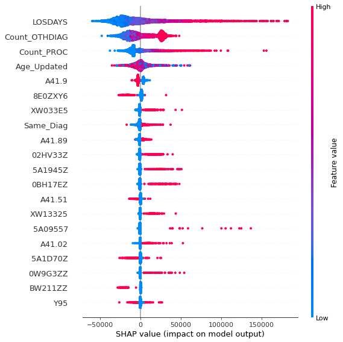
    


```python
#Compare records 235 St. Joseph, 478 Brandon Hospital and 3689 Tampa General


shap.plots._waterfall.waterfall_legacy(explainer.expected_value[0], shap_values[235], max_display=14,feature_names = X.columns)


```


    
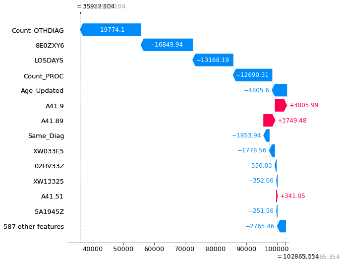
    


```python
shap.plots._waterfall.waterfall_legacy(explainer.expected_value[0], shap_values[478], max_display=14,feature_names = X.columns)

```


    
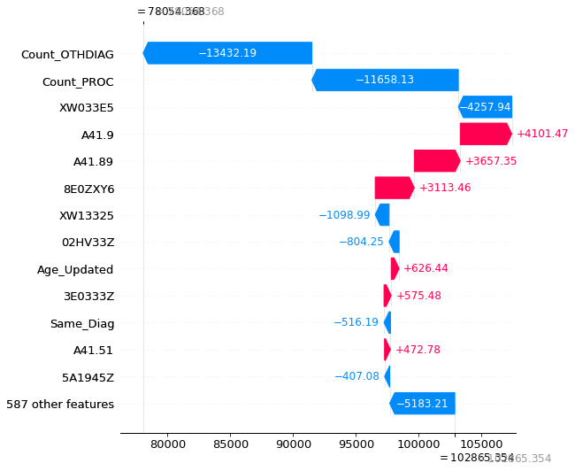
    


```python
shap.plots._waterfall.waterfall_legacy(explainer.expected_value[0], shap_values[3689], max_display=14,feature_names = X.columns)

```


    
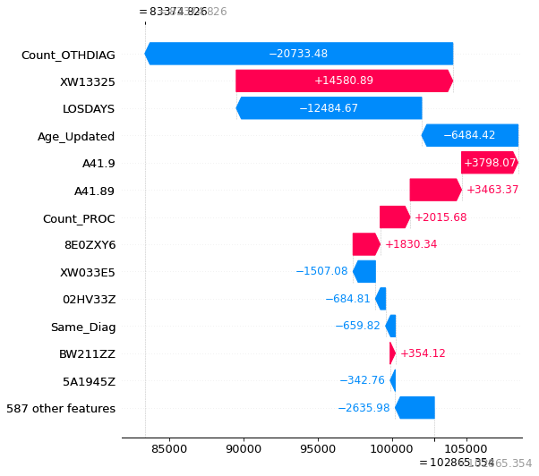
    


```python
#Diagnosis seems to be the most important. Will look at reduced diagnosis and see if they are better predictors
#Try to find which are driving the costs
#data_analysis[["OTHDIAG3_red","Facility_Name"]].groupby("OTHDIAG3_red").count()#412
#data_analysis[["OTHDIAG2_red","Facility_Name"]].groupby("OTHDIAG2_red").count() #290

#Figure out how many reduced diagnosis in total


# do something similar for OTHDIAG1 through 30. Reduced does not work have to do this for full diagnosis
list_OTHDIAG = df_4major.groupby("OTHDIAG1",as_index=False).agg({"Facility_Name":"count"})["OTHDIAG1"]
list_OTHDIAG
type(list_OTHDIAG)
#it is a series.. not a list
#conver to list
list_OTHDIAG=list_OTHDIAG.to_list()
list_OTHDIAG

#do a for loop to go from 2 to 30
#this will accumulate all reduced diagnosis. Have to do it for full diagnosis


for number in range(2,31):
    field_name = "OTHDIAG" + str(number)
    temp = df_4major.groupby(field_name,as_index=False).agg({"Facility_Name":"count"})[field_name]
    temp.to_list()
    list_OTHDIAG.extend(temp)


#eliminate duplicates from list and the blank items
#list comprenhension to remove what has already been in the list
#this does not work
#list_OTHDIAG = [i for n, i in enumerate(list_OTHDIAG) if i not in list_ECMMORB[:n]]
#this works conver to dictionary first and then conver back to list
list_OTHDIAG = list( dict.fromkeys(list_OTHDIAG) )


#now remove blank element
#list_OTHDIAG.remove(' ')
len(list_OTHDIAG)

#979 different diagnosis... should be able to handle the 4000 records


```


    3916


```python
#Will create new dataframe to flag diagnosis and find out which are the most expensive, for the same DRG
#Make a copy of df_4major

df_4major_copy = df_4major.copy(deep=True)

#initialize new columns to 0 in data abalysis

for DIAG in list_OTHDIAG:
    df_4major_copy[DIAG]=0


```


```python
df_4major_copy.head()
```


<div>
<style scoped>
    .dataframe tbody tr th:only-of-type {
        vertical-align: middle;
    }

    .dataframe tbody tr th {
        vertical-align: top;
    }

    .dataframe thead th {
        text-align: right;
    }
</style>
<table border="1" class="dataframe">
  <thead>
    <tr style="text-align: right;">
      <th></th>
      <th>level_0</th>
      <th>index</th>
      <th>Facility_Name</th>
      <th>SEX</th>
      <th>ETHNICITY</th>
      <th>RACE</th>
      <th>AGE</th>
      <th>CONDTN</th>
      <th>PAYER</th>
      <th>LOSDAYS</th>
      <th>...</th>
      <th>M19.079</th>
      <th>M79.606</th>
      <th>M84.58XS</th>
      <th>R40.0</th>
      <th>S31.20XA</th>
      <th>S51.811A</th>
      <th>T46.2X5A</th>
      <th>Z89.021</th>
      <th>Z89.521</th>
      <th>Z96.698</th>
    </tr>
  </thead>
  <tbody>
    <tr>
      <th>0</th>
      <td>378</td>
      <td>7523</td>
      <td>ST JOSEPHS HOSPITAL Facility Profile</td>
      <td>F</td>
      <td>E1</td>
      <td>5</td>
      <td>53</td>
      <td>P7</td>
      <td>D</td>
      <td>5</td>
      <td>...</td>
      <td>0</td>
      <td>0</td>
      <td>0</td>
      <td>0</td>
      <td>0</td>
      <td>0</td>
      <td>0</td>
      <td>0</td>
      <td>0</td>
      <td>0</td>
    </tr>
    <tr>
      <th>1</th>
      <td>379</td>
      <td>7544</td>
      <td>ST JOSEPHS HOSPITAL Facility Profile</td>
      <td>F</td>
      <td>E2</td>
      <td>5</td>
      <td>62</td>
      <td>P7</td>
      <td>D</td>
      <td>37</td>
      <td>...</td>
      <td>0</td>
      <td>0</td>
      <td>0</td>
      <td>0</td>
      <td>0</td>
      <td>0</td>
      <td>0</td>
      <td>0</td>
      <td>0</td>
      <td>0</td>
    </tr>
    <tr>
      <th>2</th>
      <td>380</td>
      <td>7571</td>
      <td>ST JOSEPHS HOSPITAL Facility Profile</td>
      <td>M</td>
      <td>E1</td>
      <td>5</td>
      <td>81</td>
      <td>P7</td>
      <td>A</td>
      <td>7</td>
      <td>...</td>
      <td>0</td>
      <td>0</td>
      <td>0</td>
      <td>0</td>
      <td>0</td>
      <td>0</td>
      <td>0</td>
      <td>0</td>
      <td>0</td>
      <td>0</td>
    </tr>
    <tr>
      <th>3</th>
      <td>381</td>
      <td>7597</td>
      <td>ST JOSEPHS HOSPITAL Facility Profile</td>
      <td>F</td>
      <td>E1</td>
      <td>7</td>
      <td>86</td>
      <td>P7</td>
      <td>B</td>
      <td>3</td>
      <td>...</td>
      <td>0</td>
      <td>0</td>
      <td>0</td>
      <td>0</td>
      <td>0</td>
      <td>0</td>
      <td>0</td>
      <td>0</td>
      <td>0</td>
      <td>0</td>
    </tr>
    <tr>
      <th>4</th>
      <td>382</td>
      <td>7602</td>
      <td>ST JOSEPHS HOSPITAL Facility Profile</td>
      <td>F</td>
      <td>E1</td>
      <td>5</td>
      <td>66</td>
      <td>P7</td>
      <td>B</td>
      <td>6</td>
      <td>...</td>
      <td>0</td>
      <td>0</td>
      <td>0</td>
      <td>0</td>
      <td>0</td>
      <td>0</td>
      <td>0</td>
      <td>0</td>
      <td>0</td>
      <td>0</td>
    </tr>
  </tbody>
</table>
<p>5 rows × 4644 columns</p>
</div>


```python
#now do for to add a 1 if a value is found in either one of the columns ECMORB1, ECMORB2, ECMORB3

#This takes a long time will save df_4major_copy


N = len(df_4major_copy)
#Save list of columns to use as reference
list_columns = df_4major_copy.columns

#assign 1 to the relevant columns, do an internal for loop to go over the 30 columns OTHDIAG1_red to OTHDIAG30_red
#for each one of the records
for i in range(N):
    #Loop to go through all relevant fields for other diagnosis
    for number in range(1,31):
        field_name = "OTHDIAG" + str(number)
        #have to check whether the field is populated. If it is populated find the position and update it to 1
        if (df_4major_copy[field_name].iat[i,] != ' ') | (df_4major_copy[field_name].iat[i,] != '') :
            position = [y for y,x in enumerate(list_columns) if x == df_4major_copy[field_name].iat[i,]]
            df_4major_copy.iat[i,position[0]]=1

#Up to this point good
df_4major_copy

df_4major_copy.to_csv("C:/Users/figue/Documents/MIT_Data_Formats/Healthcare/Step_3_Analysis/data/temp_for_shap_871_4_major_copy.csv")

#Can Load from existing file

#(df_4major_copy[list_OTHDIAG].apply(lambda x:sum(x))>100).sum()
#(df_4major_copy[list_OTHDIAG].apply(lambda x:sum(x))>10).sum()  - reduces the list by about 1/3

#list_princ_diag

##The codes are important so have to use OTHDIAG without the red. Information after the dot is important have to add that information
df_4major_copy
```


<div>
<style scoped>
    .dataframe tbody tr th:only-of-type {
        vertical-align: middle;
    }

    .dataframe tbody tr th {
        vertical-align: top;
    }

    .dataframe thead th {
        text-align: right;
    }
</style>
<table border="1" class="dataframe">
  <thead>
    <tr style="text-align: right;">
      <th></th>
      <th>level_0</th>
      <th>index</th>
      <th>Facility_Name</th>
      <th>SEX</th>
      <th>ETHNICITY</th>
      <th>RACE</th>
      <th>AGE</th>
      <th>CONDTN</th>
      <th>PAYER</th>
      <th>LOSDAYS</th>
      <th>...</th>
      <th>M19.079</th>
      <th>M79.606</th>
      <th>M84.58XS</th>
      <th>R40.0</th>
      <th>S31.20XA</th>
      <th>S51.811A</th>
      <th>T46.2X5A</th>
      <th>Z89.021</th>
      <th>Z89.521</th>
      <th>Z96.698</th>
    </tr>
  </thead>
  <tbody>
    <tr>
      <th>0</th>
      <td>378</td>
      <td>7523</td>
      <td>ST JOSEPHS HOSPITAL Facility Profile</td>
      <td>F</td>
      <td>E1</td>
      <td>5</td>
      <td>53</td>
      <td>P7</td>
      <td>D</td>
      <td>5</td>
      <td>...</td>
      <td>0</td>
      <td>0</td>
      <td>0</td>
      <td>0</td>
      <td>0</td>
      <td>0</td>
      <td>0</td>
      <td>0</td>
      <td>0</td>
      <td>0</td>
    </tr>
    <tr>
      <th>1</th>
      <td>379</td>
      <td>7544</td>
      <td>ST JOSEPHS HOSPITAL Facility Profile</td>
      <td>F</td>
      <td>E2</td>
      <td>5</td>
      <td>62</td>
      <td>P7</td>
      <td>D</td>
      <td>37</td>
      <td>...</td>
      <td>0</td>
      <td>0</td>
      <td>0</td>
      <td>0</td>
      <td>0</td>
      <td>0</td>
      <td>0</td>
      <td>0</td>
      <td>0</td>
      <td>0</td>
    </tr>
    <tr>
      <th>2</th>
      <td>380</td>
      <td>7571</td>
      <td>ST JOSEPHS HOSPITAL Facility Profile</td>
      <td>M</td>
      <td>E1</td>
      <td>5</td>
      <td>81</td>
      <td>P7</td>
      <td>A</td>
      <td>7</td>
      <td>...</td>
      <td>0</td>
      <td>0</td>
      <td>0</td>
      <td>0</td>
      <td>0</td>
      <td>0</td>
      <td>0</td>
      <td>0</td>
      <td>0</td>
      <td>0</td>
    </tr>
    <tr>
      <th>3</th>
      <td>381</td>
      <td>7597</td>
      <td>ST JOSEPHS HOSPITAL Facility Profile</td>
      <td>F</td>
      <td>E1</td>
      <td>7</td>
      <td>86</td>
      <td>P7</td>
      <td>B</td>
      <td>3</td>
      <td>...</td>
      <td>0</td>
      <td>0</td>
      <td>0</td>
      <td>0</td>
      <td>0</td>
      <td>0</td>
      <td>0</td>
      <td>0</td>
      <td>0</td>
      <td>0</td>
    </tr>
    <tr>
      <th>4</th>
      <td>382</td>
      <td>7602</td>
      <td>ST JOSEPHS HOSPITAL Facility Profile</td>
      <td>F</td>
      <td>E1</td>
      <td>5</td>
      <td>66</td>
      <td>P7</td>
      <td>B</td>
      <td>6</td>
      <td>...</td>
      <td>0</td>
      <td>0</td>
      <td>0</td>
      <td>0</td>
      <td>0</td>
      <td>0</td>
      <td>0</td>
      <td>0</td>
      <td>0</td>
      <td>0</td>
    </tr>
    <tr>
      <th>...</th>
      <td>...</td>
      <td>...</td>
      <td>...</td>
      <td>...</td>
      <td>...</td>
      <td>...</td>
      <td>...</td>
      <td>...</td>
      <td>...</td>
      <td>...</td>
      <td>...</td>
      <td>...</td>
      <td>...</td>
      <td>...</td>
      <td>...</td>
      <td>...</td>
      <td>...</td>
      <td>...</td>
      <td>...</td>
      <td>...</td>
      <td>...</td>
    </tr>
    <tr>
      <th>4923</th>
      <td>7995</td>
      <td>195502</td>
      <td>TAMPA GENERAL HOSPITAL Facility Profile</td>
      <td>F</td>
      <td>E2</td>
      <td>5</td>
      <td>85</td>
      <td>P7</td>
      <td>M</td>
      <td>2</td>
      <td>...</td>
      <td>0</td>
      <td>0</td>
      <td>0</td>
      <td>0</td>
      <td>0</td>
      <td>0</td>
      <td>0</td>
      <td>0</td>
      <td>0</td>
      <td>0</td>
    </tr>
    <tr>
      <th>4924</th>
      <td>7996</td>
      <td>195542</td>
      <td>TAMPA GENERAL HOSPITAL Facility Profile</td>
      <td>M</td>
      <td>E2</td>
      <td>3</td>
      <td>36</td>
      <td>P7</td>
      <td>A</td>
      <td>9</td>
      <td>...</td>
      <td>0</td>
      <td>0</td>
      <td>0</td>
      <td>0</td>
      <td>0</td>
      <td>0</td>
      <td>0</td>
      <td>0</td>
      <td>0</td>
      <td>0</td>
    </tr>
    <tr>
      <th>4925</th>
      <td>7997</td>
      <td>195549</td>
      <td>TAMPA GENERAL HOSPITAL Facility Profile</td>
      <td>M</td>
      <td>E2</td>
      <td>5</td>
      <td>71</td>
      <td>P7</td>
      <td>B</td>
      <td>8</td>
      <td>...</td>
      <td>0</td>
      <td>0</td>
      <td>0</td>
      <td>0</td>
      <td>0</td>
      <td>0</td>
      <td>0</td>
      <td>0</td>
      <td>0</td>
      <td>0</td>
    </tr>
    <tr>
      <th>4926</th>
      <td>7998</td>
      <td>195585</td>
      <td>TAMPA GENERAL HOSPITAL Facility Profile</td>
      <td>F</td>
      <td>E2</td>
      <td>3</td>
      <td>16</td>
      <td>P7</td>
      <td>D</td>
      <td>10</td>
      <td>...</td>
      <td>0</td>
      <td>0</td>
      <td>0</td>
      <td>0</td>
      <td>0</td>
      <td>0</td>
      <td>0</td>
      <td>0</td>
      <td>0</td>
      <td>0</td>
    </tr>
    <tr>
      <th>4927</th>
      <td>7999</td>
      <td>195609</td>
      <td>TAMPA GENERAL HOSPITAL Facility Profile</td>
      <td>M</td>
      <td>E2</td>
      <td>5</td>
      <td>1</td>
      <td>P7</td>
      <td>E</td>
      <td>7</td>
      <td>...</td>
      <td>0</td>
      <td>0</td>
      <td>0</td>
      <td>0</td>
      <td>0</td>
      <td>0</td>
      <td>0</td>
      <td>0</td>
      <td>0</td>
      <td>0</td>
    </tr>
  </tbody>
</table>
<p>4928 rows × 4644 columns</p>
</div>


```python


#will have to pick the most common...diagnosis

tempdf =(df_4major_copy[list_OTHDIAG].apply(lambda x:sum(x))>200).to_frame()
tempdf.reset_index(inplace=True)
#Choose only the ones that are true
list_OTHDIAG_red = tempdf[(tempdf[0]==True)]['index'].values.tolist()
#remove the space
list_OTHDIAG_red.remove(' ')
#Prepare dataframe for Random Forest

#columnlist = ['LOSDAYS','Count_PROC','Count_OTHDIAG','Age_Updated','Same_Diag']
columnlist = ['LOSDAYS','Age_Updated']
columnlist.extend(list_OTHDIAG_red)
columnlist.extend(list_princ_diag)
X_4_diag = df_4major_copy[columnlist]
y_4_diag = df_4major_copy['TCHGS']
X_4_diag
```


<div>
<style scoped>
    .dataframe tbody tr th:only-of-type {
        vertical-align: middle;
    }

    .dataframe tbody tr th {
        vertical-align: top;
    }

    .dataframe thead th {
        text-align: right;
    }
</style>
<table border="1" class="dataframe">
  <thead>
    <tr style="text-align: right;">
      <th></th>
      <th>LOSDAYS</th>
      <th>Age_Updated</th>
      <th>D62</th>
      <th>E43</th>
      <th>E78.5</th>
      <th>E83.51</th>
      <th>E87.1</th>
      <th>E87.2</th>
      <th>E87.5</th>
      <th>G92</th>
      <th>...</th>
      <th>A41.53</th>
      <th>A41.59</th>
      <th>A41.81</th>
      <th>A41.89</th>
      <th>A41.9</th>
      <th>B00.7</th>
      <th>B37.7</th>
      <th>R57.1</th>
      <th>R65.21</th>
      <th>R78.81</th>
    </tr>
  </thead>
  <tbody>
    <tr>
      <th>0</th>
      <td>5</td>
      <td>53</td>
      <td>0</td>
      <td>0</td>
      <td>1</td>
      <td>0</td>
      <td>0</td>
      <td>0</td>
      <td>0</td>
      <td>0</td>
      <td>...</td>
      <td>0</td>
      <td>0</td>
      <td>0</td>
      <td>0</td>
      <td>0</td>
      <td>0</td>
      <td>0</td>
      <td>0</td>
      <td>0</td>
      <td>0</td>
    </tr>
    <tr>
      <th>1</th>
      <td>37</td>
      <td>62</td>
      <td>0</td>
      <td>0</td>
      <td>0</td>
      <td>0</td>
      <td>0</td>
      <td>0</td>
      <td>1</td>
      <td>0</td>
      <td>...</td>
      <td>0</td>
      <td>0</td>
      <td>0</td>
      <td>0</td>
      <td>0</td>
      <td>0</td>
      <td>0</td>
      <td>0</td>
      <td>0</td>
      <td>0</td>
    </tr>
    <tr>
      <th>2</th>
      <td>7</td>
      <td>81</td>
      <td>0</td>
      <td>0</td>
      <td>0</td>
      <td>0</td>
      <td>0</td>
      <td>0</td>
      <td>0</td>
      <td>1</td>
      <td>...</td>
      <td>0</td>
      <td>0</td>
      <td>0</td>
      <td>0</td>
      <td>0</td>
      <td>0</td>
      <td>0</td>
      <td>0</td>
      <td>0</td>
      <td>0</td>
    </tr>
    <tr>
      <th>3</th>
      <td>3</td>
      <td>86</td>
      <td>0</td>
      <td>0</td>
      <td>1</td>
      <td>0</td>
      <td>0</td>
      <td>0</td>
      <td>0</td>
      <td>0</td>
      <td>...</td>
      <td>0</td>
      <td>0</td>
      <td>0</td>
      <td>0</td>
      <td>0</td>
      <td>0</td>
      <td>0</td>
      <td>0</td>
      <td>0</td>
      <td>0</td>
    </tr>
    <tr>
      <th>4</th>
      <td>6</td>
      <td>66</td>
      <td>1</td>
      <td>1</td>
      <td>0</td>
      <td>0</td>
      <td>0</td>
      <td>1</td>
      <td>0</td>
      <td>0</td>
      <td>...</td>
      <td>0</td>
      <td>0</td>
      <td>0</td>
      <td>0</td>
      <td>0</td>
      <td>0</td>
      <td>0</td>
      <td>0</td>
      <td>1</td>
      <td>0</td>
    </tr>
    <tr>
      <th>...</th>
      <td>...</td>
      <td>...</td>
      <td>...</td>
      <td>...</td>
      <td>...</td>
      <td>...</td>
      <td>...</td>
      <td>...</td>
      <td>...</td>
      <td>...</td>
      <td>...</td>
      <td>...</td>
      <td>...</td>
      <td>...</td>
      <td>...</td>
      <td>...</td>
      <td>...</td>
      <td>...</td>
      <td>...</td>
      <td>...</td>
      <td>...</td>
    </tr>
    <tr>
      <th>4923</th>
      <td>2</td>
      <td>85</td>
      <td>0</td>
      <td>0</td>
      <td>1</td>
      <td>0</td>
      <td>0</td>
      <td>1</td>
      <td>0</td>
      <td>0</td>
      <td>...</td>
      <td>0</td>
      <td>0</td>
      <td>0</td>
      <td>0</td>
      <td>0</td>
      <td>0</td>
      <td>0</td>
      <td>0</td>
      <td>0</td>
      <td>0</td>
    </tr>
    <tr>
      <th>4924</th>
      <td>9</td>
      <td>36</td>
      <td>0</td>
      <td>0</td>
      <td>0</td>
      <td>0</td>
      <td>0</td>
      <td>0</td>
      <td>0</td>
      <td>0</td>
      <td>...</td>
      <td>0</td>
      <td>0</td>
      <td>0</td>
      <td>0</td>
      <td>0</td>
      <td>0</td>
      <td>0</td>
      <td>0</td>
      <td>0</td>
      <td>0</td>
    </tr>
    <tr>
      <th>4925</th>
      <td>8</td>
      <td>71</td>
      <td>0</td>
      <td>0</td>
      <td>0</td>
      <td>0</td>
      <td>0</td>
      <td>0</td>
      <td>0</td>
      <td>0</td>
      <td>...</td>
      <td>0</td>
      <td>0</td>
      <td>0</td>
      <td>0</td>
      <td>0</td>
      <td>0</td>
      <td>0</td>
      <td>0</td>
      <td>0</td>
      <td>0</td>
    </tr>
    <tr>
      <th>4926</th>
      <td>10</td>
      <td>16</td>
      <td>0</td>
      <td>0</td>
      <td>0</td>
      <td>0</td>
      <td>0</td>
      <td>0</td>
      <td>0</td>
      <td>0</td>
      <td>...</td>
      <td>0</td>
      <td>0</td>
      <td>0</td>
      <td>0</td>
      <td>0</td>
      <td>0</td>
      <td>0</td>
      <td>0</td>
      <td>0</td>
      <td>0</td>
    </tr>
    <tr>
      <th>4927</th>
      <td>7</td>
      <td>1</td>
      <td>1</td>
      <td>0</td>
      <td>0</td>
      <td>0</td>
      <td>1</td>
      <td>1</td>
      <td>1</td>
      <td>0</td>
      <td>...</td>
      <td>0</td>
      <td>0</td>
      <td>0</td>
      <td>0</td>
      <td>0</td>
      <td>0</td>
      <td>0</td>
      <td>0</td>
      <td>1</td>
      <td>0</td>
    </tr>
  </tbody>
</table>
<p>4928 rows × 131 columns</p>
</div>


```python
tempdf =(df_4major_copy[list_OTHDIAG].apply(lambda x:sum(x))>100).to_frame()
tempdf.reset_index(inplace=True)
#Choose only the ones that are true
tempdf[(tempdf[0]==True)]['index'].values.tolist()

#find position of blank space
#[y for y,x in enumerate(list_OTHDIAG_red) if x == ' ']

list_OTHDIAG_red.remove(' ')
[y for y,x in enumerate(list_OTHDIAG_red) if x == ' ']
```


    ---------------------------------------------------------------------------

    ValueError                                Traceback (most recent call last)

    <ipython-input-126-c5454b5273f4> in <module>
          7 #[y for y,x in enumerate(list_OTHDIAG_red) if x == ' ']
          8 
    ----> 9 list_OTHDIAG_red.remove(' ')
         10 [y for y,x in enumerate(list_OTHDIAG_red) if x == ' ']
    

    ValueError: list.remove(x): x not in list


```python
#create random forest. Use 1000 iterations

#RandomForestRegressor(n_estimators=1000, *, criterion='squared_error', max_depth=None, min_samples_split=2, min_samples_leaf=1, min_weight_fraction_leaf=0.0, max_features='auto', max_leaf_nodes=None, min_impurity_decrease=0.0, bootstrap=True, oob_score=False, n_jobs=None, random_state=None, verbose=0, warm_start=False, ccp_alpha=0.0, max_samples=None)[source]¶
rf4 = RandomForestRegressor(n_estimators = 1000, random_state = 42,max_features="sqrt",oob_score=True)
# Train the model on training data

#will use the same data that was used with linear regression
rf4.fit(X_4_diag, y_4_diag);
#Get Importance of variables

feature_list = list(X_4_diag.columns)
# Get numerical feature importances
importances = list(rf4.feature_importances_)
# List of tuples with variable and importance
feature_importances = [(feature, round(importance, 3)) for feature, importance in zip(feature_list, importances)]
# Sort the feature importances by most important first
feature_importances = sorted(feature_importances, key = lambda x: x[1], reverse = True)
# Print out the feature and importances 
[print('Variable: {:20} Importance: {}'.format(*pair)) for pair in feature_importances];


```

    Variable: LOSDAYS              Importance: 0.301
    Variable: Age_Updated          Importance: 0.045
    Variable: D62                  Importance: 0.02
    Variable: E87.1                Importance: 0.018
    Variable: N17.0                Importance: 0.015
    Variable: G92                  Importance: 0.012
    Variable: J96.01               Importance: 0.012
    Variable: E43                  Importance: 0.011
    Variable: N17.9                Importance: 0.011
    Variable: E87.2                Importance: 0.01
    Variable: R65.20               Importance: 0.01
    Variable: E44.0                Importance: 0.01
    Variable: E87.6                Importance: 0.01
    Variable: E78.5                Importance: 0.009
    Variable: E87.5                Importance: 0.009
    Variable: J12.82               Importance: 0.009
    Variable: J44.0                Importance: 0.009
    Variable: R65.21               Importance: 0.009
    Variable: Z66                  Importance: 0.009
    Variable: D63.8                Importance: 0.009
    Variable: E83.39               Importance: 0.009
    Variable: R65.21               Importance: 0.009
    Variable: I13.0                Importance: 0.008
    Variable: N39.0                Importance: 0.008
    Variable: U07.1                Importance: 0.008
    Variable: Z20.822              Importance: 0.008
    Variable: Z20.828              Importance: 0.008
    Variable: D69.6                Importance: 0.008
    Variable: I10                  Importance: 0.008
    Variable: E66.01               Importance: 0.008
    Variable: F41.9                Importance: 0.008
    Variable: I11.0                Importance: 0.008
    Variable: J18.9                Importance: 0.007
    Variable: J96.21               Importance: 0.007
    Variable: K21.9                Importance: 0.007
    Variable: D64.9                Importance: 0.007
    Variable: E11.22               Importance: 0.007
    Variable: E11.65               Importance: 0.007
    Variable: E66.9                Importance: 0.007
    Variable: E86.0                Importance: 0.007
    Variable: E87.0                Importance: 0.007
    Variable: I25.10               Importance: 0.007
    Variable: K59.00               Importance: 0.007
    Variable: G47.33               Importance: 0.007
    Variable: Z79.899              Importance: 0.007
    Variable: G93.41               Importance: 0.006
    Variable: J69.0                Importance: 0.006
    Variable: Z79.4                Importance: 0.006
    Variable: E03.9                Importance: 0.006
    Variable: J90                  Importance: 0.006
    Variable: T38.0X5A             Importance: 0.006
    Variable: Z51.5                Importance: 0.006
    Variable: Z87.891              Importance: 0.006
    Variable: I48.0                Importance: 0.006
    Variable: Z79.01               Importance: 0.006
    Variable: E83.51               Importance: 0.005
    Variable: I48.91               Importance: 0.005
    Variable: J12.89               Importance: 0.005
    Variable: D72.810              Importance: 0.005
    Variable: F17.210              Importance: 0.005
    Variable: Z68.1                Importance: 0.005
    Variable: Z68.41               Importance: 0.005
    Variable: D50.9                Importance: 0.005
    Variable: F03.90               Importance: 0.005
    Variable: F17.200              Importance: 0.005
    Variable: F32.9                Importance: 0.005
    Variable: J44.9                Importance: 0.005
    Variable: Z79.82               Importance: 0.005
    Variable: I21.A1               Importance: 0.004
    Variable: I27.20               Importance: 0.004
    Variable: J44.1                Importance: 0.004
    Variable: J45.909              Importance: 0.004
    Variable: E11.9                Importance: 0.004
    Variable: I12.9                Importance: 0.004
    Variable: M19.90               Importance: 0.004
    Variable: N40.0                Importance: 0.004
    Variable: R73.9                Importance: 0.004
    Variable: D63.1                Importance: 0.004
    Variable: E83.42               Importance: 0.004
    Variable: G89.29               Importance: 0.004
    Variable: N18.30               Importance: 0.004
    Variable: N18.9                Importance: 0.004
    Variable: Z88.0                Importance: 0.004
    Variable: Z88.8                Importance: 0.004
    Variable: Z90.49               Importance: 0.004
    Variable: Z86.73               Importance: 0.004
    Variable: N18.6                Importance: 0.003
    Variable: Z86.718              Importance: 0.003
    Variable: B96.20               Importance: 0.003
    Variable: G93.40               Importance: 0.003
    Variable: I95.9                Importance: 0.003
    Variable: R00.0                Importance: 0.003
    Variable: E78.00               Importance: 0.003
    Variable: G40.909              Importance: 0.003
    Variable: R62.7                Importance: 0.003
    Variable: Z88.5                Importance: 0.003
    Variable: F02.80               Importance: 0.003
    Variable: I50.9                Importance: 0.003
    Variable: R13.10               Importance: 0.003
    Variable: Z79.51               Importance: 0.003
    Variable: Z88.1                Importance: 0.003
    Variable: I25.2                Importance: 0.003
    Variable: Z79.84               Importance: 0.003
    Variable: Z90.710              Importance: 0.003
    Variable: D72.829              Importance: 0.002
    Variable: Z78.1                Importance: 0.002
    Variable: Z79.02               Importance: 0.002
    Variable: A41.02               Importance: 0.002
    Variable: R57.1                Importance: 0.002
    Variable: A40.0                Importance: 0.001
    Variable: A40.1                Importance: 0.001
    Variable: A40.3                Importance: 0.001
    Variable: A41.59               Importance: 0.001
    Variable: A02.1                Importance: 0.0
    Variable: A40.8                Importance: 0.0
    Variable: A40.9                Importance: 0.0
    Variable: A41.01               Importance: 0.0
    Variable: A41.1                Importance: 0.0
    Variable: A41.2                Importance: 0.0
    Variable: A41.3                Importance: 0.0
    Variable: A41.4                Importance: 0.0
    Variable: A41.50               Importance: 0.0
    Variable: A41.51               Importance: 0.0
    Variable: A41.52               Importance: 0.0
    Variable: A41.53               Importance: 0.0
    Variable: A41.81               Importance: 0.0
    Variable: A41.89               Importance: 0.0
    Variable: A41.9                Importance: 0.0
    Variable: B00.7                Importance: 0.0
    Variable: B37.7                Importance: 0.0
    Variable: R78.81               Importance: 0.0
    


```python
#Explain the values
explainer = shap.Explainer(rf4)
                          
                           
shap_values = explainer.shap_values(X_4_diag, approximate=True)


shap.summary_plot(shap_values,X_4_diag)
```


    
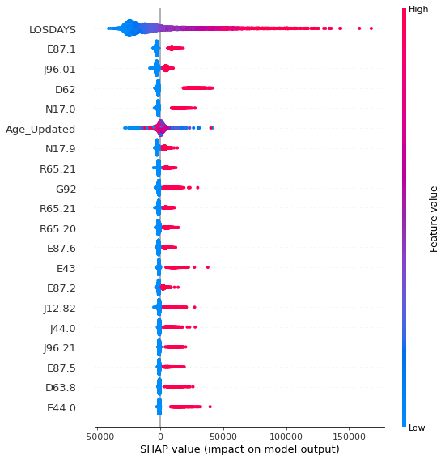
    


```python
#Look at the averages for the most important features


#Use top 10 most important variables to check on difference on average among hospitals
Top20 = [a_tuple[0] for a_tuple in feature_importances][0:20]

#Add Facility_Name
Top20.extend(['Facility_Name','TCHGS'])
df_4major_copy[Top20].groupby('Facility_Name').mean()

```


<div>
<style scoped>
    .dataframe tbody tr th:only-of-type {
        vertical-align: middle;
    }

    .dataframe tbody tr th {
        vertical-align: top;
    }

    .dataframe thead th {
        text-align: right;
    }
</style>
<table border="1" class="dataframe">
  <thead>
    <tr style="text-align: right;">
      <th></th>
      <th>LOSDAYS</th>
      <th>Age_Updated</th>
      <th>D62</th>
      <th>E87.1</th>
      <th>N17.0</th>
      <th>G92</th>
      <th>J96.01</th>
      <th>E43</th>
      <th>N17.9</th>
      <th>E87.2</th>
      <th>...</th>
      <th>E44.0</th>
      <th>E87.6</th>
      <th>E78.5</th>
      <th>E87.5</th>
      <th>J12.82</th>
      <th>J44.0</th>
      <th>R65.21</th>
      <th>Z66</th>
      <th>D63.8</th>
      <th>TCHGS</th>
    </tr>
    <tr>
      <th>Facility_Name</th>
      <th></th>
      <th></th>
      <th></th>
      <th></th>
      <th></th>
      <th></th>
      <th></th>
      <th></th>
      <th></th>
      <th></th>
      <th></th>
      <th></th>
      <th></th>
      <th></th>
      <th></th>
      <th></th>
      <th></th>
      <th></th>
      <th></th>
      <th></th>
      <th></th>
    </tr>
  </thead>
  <tbody>
    <tr>
      <th>ADVENTHEALTH TAMPA Facility Profile</th>
      <td>7.599644</td>
      <td>65.276690</td>
      <td>0.088078</td>
      <td>0.176157</td>
      <td>0.179715</td>
      <td>0.065836</td>
      <td>0.424377</td>
      <td>0.106762</td>
      <td>0.292705</td>
      <td>0.370996</td>
      <td>...</td>
      <td>0.020463</td>
      <td>0.320285</td>
      <td>0.341637</td>
      <td>0.130783</td>
      <td>0.104982</td>
      <td>0.129893</td>
      <td>0.221530</td>
      <td>0.283808</td>
      <td>0.082740</td>
      <td>95198.272242</td>
    </tr>
    <tr>
      <th>HCA FLORIDA BRANDON HOSPITAL Facility Profile</th>
      <td>6.697420</td>
      <td>63.237686</td>
      <td>0.035966</td>
      <td>0.289289</td>
      <td>0.038311</td>
      <td>0.154808</td>
      <td>0.441751</td>
      <td>0.068804</td>
      <td>0.456607</td>
      <td>0.260360</td>
      <td>...</td>
      <td>0.057076</td>
      <td>0.243159</td>
      <td>0.474590</td>
      <td>0.109461</td>
      <td>0.182174</td>
      <td>0.160281</td>
      <td>0.150899</td>
      <td>0.197811</td>
      <td>0.053948</td>
      <td>132318.188428</td>
    </tr>
    <tr>
      <th>ST JOSEPHS HOSPITAL Facility Profile</th>
      <td>7.477578</td>
      <td>63.391629</td>
      <td>0.035127</td>
      <td>0.210015</td>
      <td>0.104634</td>
      <td>0.186846</td>
      <td>0.334081</td>
      <td>0.029895</td>
      <td>0.365471</td>
      <td>0.346039</td>
      <td>...</td>
      <td>0.034380</td>
      <td>0.254858</td>
      <td>0.290732</td>
      <td>0.127803</td>
      <td>0.081465</td>
      <td>0.060538</td>
      <td>0.235426</td>
      <td>0.217489</td>
      <td>0.036622</td>
      <td>67476.677877</td>
    </tr>
    <tr>
      <th>TAMPA GENERAL HOSPITAL Facility Profile</th>
      <td>8.358045</td>
      <td>59.636057</td>
      <td>0.063184</td>
      <td>0.251896</td>
      <td>0.101938</td>
      <td>0.145746</td>
      <td>0.319292</td>
      <td>0.153328</td>
      <td>0.358888</td>
      <td>0.358045</td>
      <td>...</td>
      <td>0.057287</td>
      <td>0.172704</td>
      <td>0.332772</td>
      <td>0.131424</td>
      <td>0.105307</td>
      <td>0.062342</td>
      <td>0.249368</td>
      <td>0.204718</td>
      <td>0.101938</td>
      <td>118357.330244</td>
    </tr>
  </tbody>
</table>
<p>4 rows × 21 columns</p>
</div>


```python
#Compare records 235 St. Joseph, 478 Brandon Hospital and 3689 Tampa General


shap.plots._waterfall.waterfall_legacy(explainer.expected_value[0], shap_values[235], max_display=20,feature_names = X_4_diag.columns)

```


    
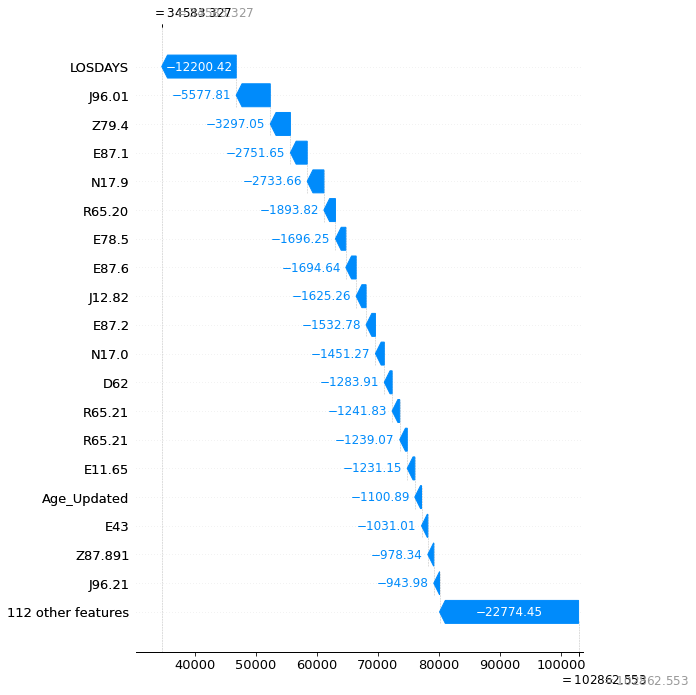
    


```python
#Compare records 235 St. Joseph, 478 Brandon Hospital and 3689 Tampa General


shap.plots._waterfall.waterfall_legacy(explainer.expected_value[0], shap_values[478], max_display=20,feature_names = X_4_diag.columns)

#E87.1 Does not make sense. I have to eliminate the blank
#Have to check https://www.cms.gov/medicare/physician-fee-schedule/search
# There is a different set of codes for billing?
```


    
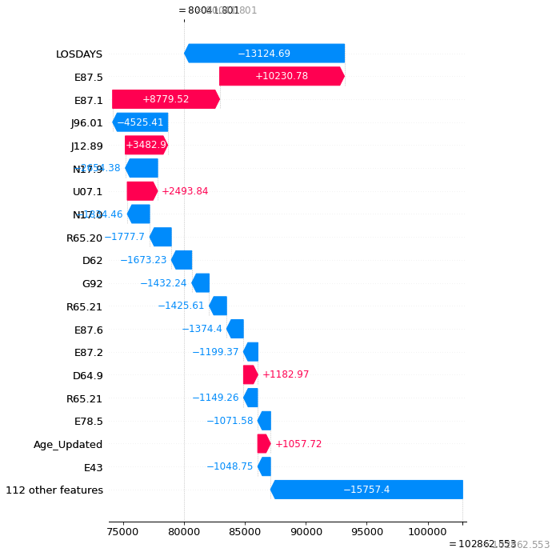
    


```python
#Billing is not driven exactly from diagnosis codes but let's see whether the most expensive ones are used regularly
#Check on averages but as well outliers.
#Then Moven to quality of care
#will use Patient Discharge Status
```


```python
#Compare records 235 St. Joseph, 478 Brandon Hospital and 3689 Tampa General


shap.plots._waterfall.waterfall_legacy(explainer.expected_value[0], shap_values[3689], max_display=20,feature_names = X_4_diag.columns)

```


    
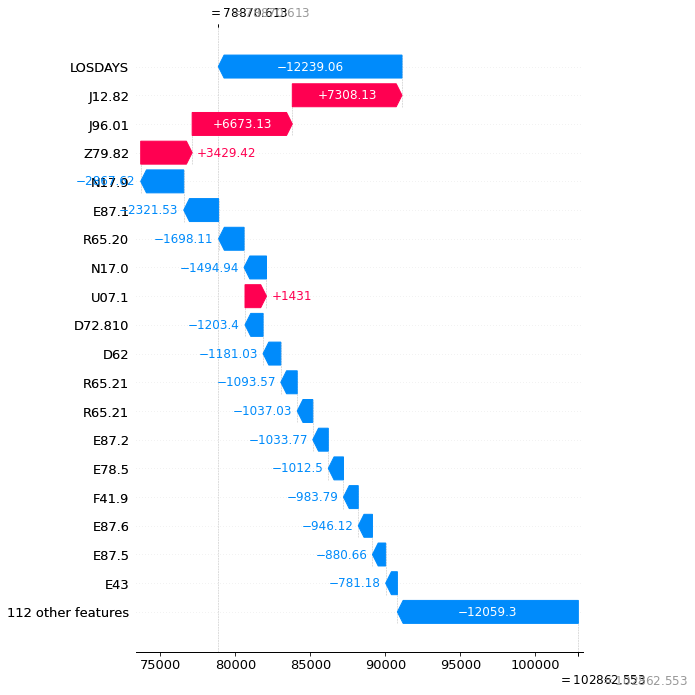
    


```python
#Group the information to find the DRGs that repeat 100 or more times in the dataset
#
#df[["Facility_Name","MSDRG"]].groupby("MSDRG").count()>=100
# this returns a list so I have to filter using a function
filter(lambda x: x.sum() > 2)
df[["Facility_Name","MSDRG"]].groupby("MSDRG").filter(lambda x: len(x["Facility_Name"]) >= 100)


#df.loc[df[["Facility_Name","MSDRG"]].groupby("MSDRG").count()>=100,["MSDRG"]]
```


```python
df_for_lm
#data_analysis["PRINDIAG"].iloc[i,]
#it looks like it is setting everything else to nan... which is not good. It should keep the values as they are
```


```python
temp_df.describe()


```


```python
import numpy as np
dff = pd.DataFrame({"A": np.arange(8), "B": list("aabbbbcc")})
dff
dff.groupby("B").filter(lambda x: len(x) > 2)
df[["Facility_Name","MSDRG"]]
df[["Facility_Name","MSDRG"]].groupby("MSDRG").filter(lambda x: len(x) > 1000)
df[["Facility_Name","PRINDIAG"]].groupby("PRINDIAG").filter(lambda x: len(x) > 1000)
```


```python

```
